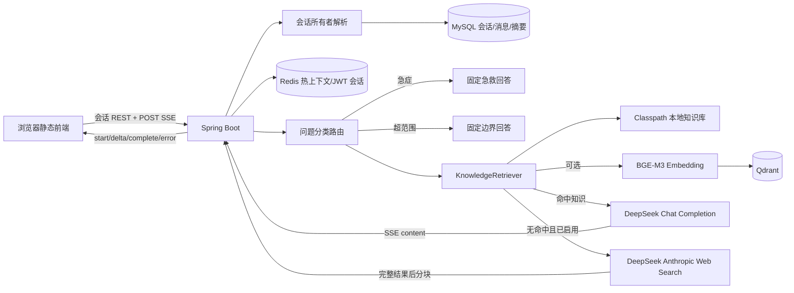

# RAG 知识助手完整使用说明书

> 适用项目：`alzheimers-voice-assistant`  
> 文档基线：2026-08-23 当前工作区代码  
> 覆盖范围：阿尔茨海默病科普助手、会话记忆、本地/向量 RAG、DeepSeek、联网回退、SSE 流式输出、持久化、日志和调试

## 1. 文档目的

本说明书用于研发、测试和运维人员理解并使用当前 RAG 知识助手。内容以现有代码为准，同时明确区分：

- 已经实现且可直接使用的能力；
- 自动降级后的实际行为；
- 当前尚未提供的调试或治理能力；
- 上线前必须处理的已知限制。

本助手是健康科普系统，不是医疗诊断系统。任何回答都不能替代医生诊断、处方或急救服务。

## 2. 当前功能总览

当前助手具备以下能力：

- 300 条内置阿尔茨海默病问答知识，分为疾病介绍、常见症状、应对方法三类，每类 100 条。
- 基于关键词的知识域路由，以及急症优先路由和超范围拒答。
- 本地轻量检索：关键词、问题包含关系和中文双字片段重叠评分。
- 可选向量检索：BGE-M3 Embedding + Qdrant，失败时降级到本地检索。
- 可选 DeepSeek 生成：严格携带检索知识和有界对话记忆。
- 可选 DeepSeek 联网搜索：仅在知识检索结果为空时触发。
- 多会话管理：新建、列表、查看和删除。
- 多轮上下文：每个会话最多 100 个用户轮次。
- 每 10 轮生成分段记忆和定长滚动摘要。
- MySQL 保存完整会话，Redis 缓存热上下文。
- 登录用户和匿名用户会话隔离。
- POST SSE 流式回答。
- 禁用模型 thinking，丢弃 `reasoning_content`，过滤 `<think>...</think>`。
- 保留旧版无状态、非流式 `/assistant/chat` 接口。

## 3. 总体架构



核心原则是：MySQL 是会话事实来源，Redis 只是性能缓存；本地 JSON 是知识事实来源，Qdrant 是可重建的向量索引。

## 4. 运行模式

### 4.1 本地基础模式

未启用 DeepSeek、Embedding 和 Qdrant 时：

1. 问题先经过分类路由。
2. 使用 `ad-faq.json` 做本地轻量检索。
3. 命中后直接返回最高分知识条目的答案。
4. 未命中时返回“暂时没有足够的可靠资料”。

这种模式不需要外部大模型，但回答不会根据多轮上下文重新组织；上下文仍会保存，只是本地知识答案本身是固定内容。

### 4.2 本地 RAG + DeepSeek 模式

启用 `DEEPSEEK_ENABLED=true` 并配置 API Key，但不启用向量检索时：

1. 本地轻量检索选出知识片段。
2. 将知识片段、滚动摘要、摘要后的最近对话和当前问题发送给 DeepSeek。
3. DeepSeek 依据检索片段组织回答。
4. DeepSeek 失败时直接返回最高分本地知识答案。

### 4.3 完整向量 RAG 模式

同时启用以下开关：

```dotenv
DEEPSEEK_ENABLED=true
RAG_VECTOR_ENABLED=true
RAG_EMBEDDING_ENABLED=true
RAG_VECTOR_BOOTSTRAP=true
```

系统使用 BGE-M3 生成向量并在 Qdrant 中按类别过滤、相似度检索。Qdrant 或 Embedding 请求异常时，Java 侧会降级到本地轻量检索。

启动预热会按每批最多 64 条生成知识向量，并在应用进入 ready 前完成索引校验或构建。

### 4.4 联网回退模式

联网搜索满足以下全部条件才会触发：

- 问题被分类为三种业务知识域之一；
- 当前检索器返回空知识列表；
- `DEEPSEEK_ENABLED=true`；
- `DEEPSEEK_WEB_SEARCH_ENABLED=true`；
- DeepSeek API Key 可用。

联网搜索不是本地答案的事实核验步骤，也不会在本地知识已经命中时执行。

## 5. 用户使用流程

### 5.1 页面入口

启动后访问：

```text
http://localhost:8080/
```

Spring Boot 直接托管 `backend/src/main/resources/static` 中的页面，无需单独启动前端开发服务器。

### 5.2 新建和切换会话

打开页面后，前端执行以下操作：

1. 查询当前所有者的会话列表。
2. 没有会话时自动创建“新对话”。
3. 用户可以点击“新对话”创建独立上下文。
4. 点击左侧会话标题切换历史。
5. 点击删除按钮删除会话、消息、摘要和对应 Redis 缓存。

第一轮完成后，会话标题自动取第一条问题的前 36 个字符。

### 5.3 匿名用户

匿名用户首次打开页面时，浏览器生成 UUID：

```text
localStorage.alzAssistantClientId
```

每次助手请求通过请求头发送：

```http
X-Assistant-Client-Id: <UUID>
```

服务端以 `owner_type=ANONYMOUS`、`owner_key=<UUID>` 保存。关闭页面不会删除 MySQL 历史、Redis 缓存或浏览器 UUID；同一浏览器再次打开时仍能看到历史。

### 5.4 登录用户

登录令牌保存在浏览器 `sessionStorage`，助手请求携带：

```http
Authorization: Bearer <JWT>
```

服务端同时校验 JWT 和 Redis 中的 `TOKEN:<token>` 登录会话，然后以 `owner_type=USER`、`owner_key=<username>` 保存。

登录对话和匿名对话相互独立，当前没有匿名历史自动迁移到登录账号的功能。

### 5.5 轮次限制

- 一轮定义为一条用户消息和一条助手消息。
- 每个会话最多 100 个用户轮次。
- 第 101 轮返回 HTTP 409，提示新建对话。
- 生成失败时会保存一条错误助手消息，该轮仍计入 100 轮。
- 同一会话同一时间只允许生成一条回答。

## 6. 业务路由逻辑

### 6.1 输入校验

- 空问题：HTTP 400。
- 问题超过 500 字：HTTP 400。
- 会话不存在或不属于当前所有者：HTTP 400。
- 会话正在生成或达到轮次上限：HTTP 409。

### 6.2 路由类别

| 类别 | 含义 | 后续处理 |
|---|---|---|
| `EMERGENCY` | 突发语言障碍、口角歪斜、单侧无力、意识异常、自伤/伤人等 | 不做 RAG，立即返回固定急救提示 |
| `OUT_OF_SCOPE` | 未检测到阿尔茨海默病或认知健康信号 | 不做 RAG，返回范围边界 |
| `INTRODUCTION` | 定义、病因、风险、遗传、分期等 | 进入对应类别知识检索 |
| `SYMPTOMS` | 忘事、语言、迷路、性格、生活能力等 | 进入对应类别知识检索 |
| `COPING` | 就医、检查、治疗、风险管理和照护等 | 进入对应类别知识检索 |

急症信号优先级最高。普通类别按命中信号数量选择，置信度为规则分数，不是医学概率。

## 7. 单轮完整数据链

### 7.1 准备阶段

1. `AssistantConversationController` 解析请求所有者。
2. `AssistantConversationService.prepareTurn` 校验问题和会话归属。
3. MySQL 原子更新会话：
   - 状态从 `IDLE` 改为 `GENERATING`；
   - `user_turn_count + 1`；
   - 写入 `generation_started_at`。
4. 如果锁已超过默认 180 秒，可由新请求回收。
5. 从 Redis 读取 `ASSISTANT:MEMORY:<conversationId>`；缓存缺失或异常时从 MySQL 重建。
6. 将本轮用户消息写入 `assistant_message`。

### 7.2 分类和检索阶段

1. `KeywordAdQuestionRouter` 对当前问题分类。
2. 急症或超范围问题直接进入固定回答。
3. 普通问题调用 `KnowledgeRetriever.retrieve`。
4. `QdrantKnowledgeRetriever` 是 `@Primary` 实现：
   - 向量关闭时直接调用本地检索；
   - 向量开启时使用启动阶段已经预热完成的 collection 检索；
   - Qdrant/Embedding 异常时回退本地检索；
   - 正常查询但没有达到阈值时返回空列表。
5. 检索结果最多为 `RAG_TOP_K` 条，代码将范围限制在 1～8 条。

### 7.3 Prompt 组装

DeepSeek Chat Completion 的消息结构包含：

- system：医疗边界、急症规则、只依据知识片段、抵抗提示注入等规则；
- user：分类知识域、对话滚动摘要、摘要后的对话、检索知识和当前问题。

对话记忆被明确标注为“仅用于理解指代，不是医学事实来源”；与检索知识冲突时以检索知识为准。

### 7.4 回答生成和流式输出

新会话接口返回 `text/event-stream`：

| 事件 | 内容 |
|---|---|
| `start` | `conversationId`、`turnNo`、`maxTurns` |
| `delta` | `content` 正文增量 |
| `complete` | 完整回答 DTO 和最新会话摘要 |
| `error` | 安全化后的错误信息 |

响应头包含：

```http
Cache-Control: no-cache, no-transform
X-Accel-Buffering: no
Content-Type: text/event-stream
```

只有“本地/向量知识命中 + DeepSeek Chat Completion”是上游真正的逐 token SSE。以下情况是先得到完整答案，再由 Java 每 24 个字符模拟分块：

- 急症固定回答；
- 超范围固定回答；
- 本地知识降级答案；
- DeepSeek Anthropic 联网搜索结果。

### 7.5 完成和保存阶段

1. 过滤后的完整助手正文写入 `assistant_message`。
2. 标题、intent、urgent、行动建议、医疗声明和来源一并保存。
3. 会话状态恢复为 `IDLE`，删除热缓存。
4. 向浏览器发送 `complete`。
5. 有界异步线程池刷新上下文缓存，并在需要时生成摘要。

## 8. 上下文记忆逻辑

### 8.1 为什么不发送全部 100 轮

正常状态下，模型只接收：

```text
滚动摘要
+ 摘要完成点之后的已完成对话
+ 当前问题
+ 当前 RAG 检索知识
```

默认每 10 轮摘要一次，因此通常只携带最多 9 个未摘要的历史轮次，而不是全部 100 轮。

如果摘要线程池、数据库更新长期失败，摘要完成点可能滞后，Prompt 中的未摘要历史会变多。当前没有独立的 token 预算器做第二层截断，这是上线前需要补强的边界。

### 8.2 每 10 轮摘要

摘要处理过程：

1. 从 `summary_up_to_turn + 1` 开始寻找下一个完整 10 轮块。
2. 对每轮用户内容最多保留约 140 字、助手内容最多保留约 220 字，形成确定性分段摘要。
3. 分段摘要写入 `assistant_memory`，便于审计和重建。
4. DeepSeek 可用时，将旧滚动摘要和新增 10 轮合并为新摘要。
5. DeepSeek 不可用或摘要调用失败时，使用本地拼接压缩。
6. 滚动摘要限制为默认 1800 字符。
7. 更新 `assistant_conversation.summary_up_to_turn`。

摘要模型调用发生在消息事务提交后，不会长期占用数据库事务。

### 8.3 Redis 热缓存

键格式：

```text
ASSISTANT:MEMORY:<conversationId>
```

值为 JSON 化的 `ConversationContext`，包含滚动摘要和未摘要的完整轮次。默认 TTL 为 1440 分钟。

Redis 读写异常会被忽略并回退 MySQL，不影响会话事实数据。关闭网页不会主动清缓存；删除会话会删除对应缓存。

## 9. 知识检索实现

### 9.1 本地知识库

文件位置：

```text
backend/src/main/resources/knowledge/ad-faq.json
```

当前规模：

| 类别 | 数量 |
|---|---:|
| `INTRODUCTION` | 100 |
| `SYMPTOMS` | 100 |
| `COPING` | 100 |
| 合计 | 300 |

单条文档格式：

```json
{
  "id": "K01",
  "category": "INTRODUCTION",
  "question": "什么是阿尔茨海默病？",
  "answer": "……",
  "keywords": ["定义", "阿尔茨海默病"],
  "actionSuggestions": ["了解早期迹象"],
  "sources": [
    {"title": "资料名称", "url": "https://example.org"}
  ]
}
```

本地检索仅在路由选定的类别内评分：

- 同类别基础分：10；
- 当前问题与知识问题相互包含：+30；
- 每命中一个关键词：+8；
- 中文双字片段重叠：每个 +2，最多 +20；
- 默认最低分：16。

仅“属于同类别”只能得到 10 分，不能被当作有效命中。

### 9.2 Qdrant 向量检索

向量文本由以下内容拼接：

```text
知识域 + 问题 + 答案 + 关键词
```

索引行为：

- collection 默认名：`alz_ad_knowledge`；
- distance：Cosine；
- point ID：知识文档 ID 的稳定 UUID；
- payload：完整 `KnowledgeDocument` 和知识/模型索引版本指纹；
- 创建 `category` keyword payload index；
- 查询时按路由类别过滤；
- 默认相似度阈值：0.72；
- 返回条数最大 8。

`RAG_VECTOR_WARMUP_ENABLED=true` 时，Spring Boot 的启动 Runner 会在 readiness 之前校验索引。知识内容、文档数量和 Embedding 模型均未变化时直接复用已有 points；否则在启动阶段按每批最多 64 条重新生成并 upsert。

### 9.3 Embedding 服务

Python 服务提供 OpenAI 风格接口：

```text
GET  /health
POST /v1/embeddings
```

默认模型为 `BAAI/bge-m3`，使用归一化向量。单次请求限制：

- 1～64 个文本；
- 每个文本非空且不超过 4000 字符；
- 可通过 `RAG_EMBEDDING_API_KEY` 开启 Bearer 校验。

## 10. DeepSeek 与联网搜索

### 10.1 普通回答

接口：

```text
POST <DEEPSEEK_BASE_URL>/chat/completions
```

关键请求参数：

```json
{
  "thinking": {"type": "disabled"},
  "stream": true,
  "max_tokens": 700
}
```

模型未启用、API Key 为空、知识为空或请求失败时，返回本地最高分知识答案。

### 10.2 联网搜索

接口：

```text
POST <DEEPSEEK_ANTHROPIC_BASE_URL>/v1/messages
```

使用 Anthropic 兼容协议的 `web_search_20250305` 工具，搜索次数限制在 1～5，默认 3。若返回 `pause_turn`，代码会携带上一轮工具结果继续请求一次。

系统递归提取响应中的 HTTP/HTTPS URL，去重后最多返回 8 个来源。

所有联网回答都会追加“未经本系统医学审核”的警示。

### 10.3 不输出思考过程

系统使用三层防护：

1. 请求参数关闭 thinking；
2. SSE 解析只读取 `choices[0].delta.content`，忽略 `reasoning_content`；
3. `StreamingThinkFilter` 跨分片过滤 `<think>...</think>`，保存前再次执行完整内容过滤。

过滤只保证不展示已识别的推理字段/标签，不代表模型内部没有执行推理。

## 11. API 使用说明

### 11.1 无状态兼容接口

```http
POST /assistant/chat
Content-Type: application/json

{"message":"阿尔茨海默病有哪些早期表现？"}
```

特点：非流式、不保存会话、不使用上下文，主要用于兼容和快速调试。

### 11.2 辅助接口

```text
GET /assistant/topics
GET /assistant/screening-guide
```

### 11.3 新建会话

```http
POST /assistant/conversations
X-Assistant-Client-Id: 11111111-1111-4111-8111-111111111111
Content-Type: application/json

{"title":"家属照护咨询"}
```

标题可以省略。

### 11.4 会话列表和详情

```text
GET /assistant/conversations
GET /assistant/conversations/{conversationId}
```

详情包含会话状态和全部历史消息。每条助手消息包含正文、intent、紧急标记、行动建议、医疗声明和来源。

### 11.5 删除会话

```text
DELETE /assistant/conversations/{conversationId}
```

成功返回 204，并通过数据库级联删除消息和摘要。

### 11.6 流式发送

```http
POST /assistant/conversations/{conversationId}/messages/stream
Accept: text/event-stream
Content-Type: application/json
X-Assistant-Client-Id: 11111111-1111-4111-8111-111111111111

{"message":"刚才说的情况应该挂什么科？"}
```

使用 curl 调试：

```powershell
curl.exe -N `
  -H "X-Assistant-Client-Id: 11111111-1111-4111-8111-111111111111" `
  -H "Accept: text/event-stream" `
  -H "Content-Type: application/json" `
  --data '{"message":"阿尔茨海默病是什么？"}' `
  http://localhost:8080/assistant/conversations/<conversationId>/messages/stream
```

## 12. 数据保存方式

### 12.1 MySQL

迁移文件：

```text
deploy/mysql/migrations/V004__assistant_conversation_memory.sql
```

现有数据库需要手工执行该迁移；项目当前没有 Flyway 自动执行 V004。

| 表 | 保存内容 |
|---|---|
| `assistant_conversation` | 所有者、标题、轮数、滚动摘要、摘要完成点、生成锁和时间 |
| `assistant_message` | 用户/助手原文、标题、intent、urgent 和 JSON 元数据 |
| `assistant_memory` | 每 10 轮的确定性分段摘要 |

删除 `assistant_conversation` 会级联删除其消息和摘要。

### 12.2 Redis

| 键 | 作用 | 默认有效期 |
|---|---|---:|
| `ASSISTANT:MEMORY:<conversationId>` | 滚动摘要和未摘要对话 | 1440 分钟 |
| `TOKEN:<jwt>` | 登录会话角色 | 登录逻辑设置并由助手续期到 30 分钟 |
| `USER_TOKEN:<username>` | 用户当前登录 token | 30 分钟 |

Redis 不是完整对话的持久化位置。

### 12.3 浏览器

| 存储 | 内容 | 关闭页面后的行为 |
|---|---|---|
| `localStorage` | 匿名助手 UUID | 保留 |
| `sessionStorage` | JWT、用户名、角色 | 浏览器会话结束后清除 |

### 12.4 知识和向量

- 本地知识：随应用资源保存在 `ad-faq.json`，打包进入 JAR。
- Docker Qdrant：保存到命名卷 `qdrant-data`。
- `start.ps1` 启动的原生 Qdrant：保存到 `data/runtime/qdrant-storage`。
- Redis Docker 数据：开启 AOF，保存到命名卷 `redis-data`。

## 13. 配置参考

### 13.1 DeepSeek

| 环境变量 | 默认值 | 说明 |
|---|---|---|
| `DEEPSEEK_ENABLED` | `false` | 是否启用模型回答 |
| `DEEPSEEK_API_KEY` | 空 | DeepSeek Key |
| `DEEPSEEK_BASE_URL` | `https://api.deepseek.com` | Chat Completion 地址 |
| `DEEPSEEK_ANTHROPIC_BASE_URL` | `https://api.deepseek.com/anthropic` | 联网搜索兼容地址 |
| `DEEPSEEK_MODEL` | `deepseek-v4-flash` | 模型名 |
| `DEEPSEEK_MAX_TOKENS` | `700` | 回答 token 上限 |
| `DEEPSEEK_CONNECT_TIMEOUT_MS` | `3000` | 连接超时 |
| `DEEPSEEK_READ_TIMEOUT_MS` | `20000` | 读取超时 |
| `DEEPSEEK_WEB_SEARCH_ENABLED` | `false` | 是否启用联网回退 |
| `DEEPSEEK_WEB_SEARCH_MAX_USES` | `3` | 搜索次数，代码限制 1～5 |

### 13.2 检索

| 环境变量 | 默认值 | 说明 |
|---|---|---|
| `RAG_TOP_K` | `4` | 知识返回数，代码限制 1～8 |
| `RAG_LOCAL_MIN_SCORE` | `16` | 本地最低评分，代码最低允许 11 |
| `RAG_VECTOR_ENABLED` | `false` | 是否使用 Qdrant |
| `QDRANT_BASE_URL` | `http://127.0.0.1:6333` | Qdrant HTTP 地址 |
| `QDRANT_API_KEY` | 空 | Qdrant API Key |
| `QDRANT_COLLECTION` | `alz_ad_knowledge` | collection 名称 |
| `RAG_VECTOR_SCORE_THRESHOLD` | `0.72` | 相似度阈值 |
| `RAG_VECTOR_BOOTSTRAP` | `true` | 是否自动创建/更新索引 |
| `RAG_VECTOR_WARMUP_ENABLED` | `true` | 是否在应用进入 ready 前验证/构建向量索引 |
| `RAG_EMBEDDING_ENABLED` | `false` | 是否调用 Embedding |
| `RAG_EMBEDDING_BASE_URL` | `http://127.0.0.1:7997/v1` | Embedding API 根地址 |
| `RAG_EMBEDDING_MODEL` | `BAAI/bge-m3` | Embedding 模型 |
| `RAG_EMBEDDING_DEVICE` | `cpu` | Python 推理设备 |
| `RAG_EMBEDDING_BATCH_SIZE` | `16` | 模型内部 batch size |

### 13.3 会话记忆

| 环境变量 | 默认值 | 说明 |
|---|---:|---|
| `RAG_MEMORY_MAX_TURNS` | 100 | 每个会话最大轮数，代码上限 100 |
| `RAG_MEMORY_SUMMARY_INTERVAL` | 10 | 分段摘要间隔 |
| `RAG_MEMORY_SUMMARY_MAX_CHARS` | 1800 | 滚动摘要字符上限 |
| `RAG_MEMORY_CACHE_TTL_MINUTES` | 1440 | Redis 热上下文 TTL |
| `RAG_MEMORY_GENERATION_TIMEOUT_SECONDS` | 180 | 生成锁回收时间 |
| `RAG_MEMORY_SUMMARY_CONCURRENCY` | 2 | 摘要线程数，代码限制 1～4 |
| `RAG_MEMORY_SUMMARY_QUEUE_CAPACITY` | 100 | 摘要等待队列容量 |

## 14. 启动与初始化

### 14.1 数据库迁移

首次使用会话功能前执行：

```sql
SOURCE deploy/mysql/migrations/V004__assistant_conversation_memory.sql;
```

全新数据库使用 `deploy/mysql/init.sql` 时已经包含这些表。

### 14.2 一键启动

在项目根目录运行：

```powershell
powershell.exe -NoProfile -ExecutionPolicy Bypass -File .\start.ps1
```

输入有效 DeepSeek Key 后，脚本会为当前进程启用 DeepSeek、联网搜索、向量检索、Embedding 和 Qdrant 启动预热。浏览器只会在 `/actuator/health/readiness` 返回成功后打开。Key 不会写回 `.env`。

### 14.3 手工依赖检查

```powershell
Invoke-RestMethod http://127.0.0.1:7997/health
Invoke-RestMethod http://127.0.0.1:6333/collections
Invoke-RestMethod http://localhost:8080/actuator/health
```

## 15. 日志与监控

### 15.1 日志落点

使用 `start.ps1` 时：

| 组件 | 日志位置 |
|---|---|
| Spring Boot | 当前启动 PowerShell 控制台；脚本没有重定向到文件 |
| 原生 Qdrant | `data/runtime/logs/qdrant.out.log`、`qdrant.err.log` |
| Embedding | `data/runtime/logs/embedding.out.log`、`embedding.err.log` |
| Docker Qdrant | `docker compose logs qdrant` |

### 15.2 当前 RAG 日志事件

Java 已记录：

- DeepSeek 普通调用失败及本地降级；
- DeepSeek 流式调用失败；
- 摘要模型失败及本地压缩降级；
- DeepSeek 联网搜索失败；
- Embedding 调用失败；
- Qdrant 检索、collection 或向量初始化失败；
- Qdrant 索引就绪的 collection、文档数和维度；
- category index 已存在的 debug 日志。

Embedding 服务会记录生成异常和返回数量不匹配。

### 15.3 当前日志盲区

以下情况目前被代码静默忽略或没有结构化日志：

- Redis 热上下文读写异常；
- SSE 客户端断开后的详细堆栈；
- 异步摘要任务队列拒绝或任务异常；
- 每次请求的路由类别、检索文档 ID、分数和最终降级路径；
- Prompt token、首字延迟、总生成耗时和联网搜索耗时。

因此不能仅凭“接口返回成功”判断向量检索是否实际生效。

### 15.4 Actuator

当前暴露：

```text
GET /actuator/health
GET /actuator/info
GET /actuator/metrics
GET /actuator/metrics/{metricName}
```

当前没有 RAG 专用 HealthIndicator 或指标，Actuator health 不会完整验证 DeepSeek、Qdrant、Embedding、摘要线程池和知识库质量。

## 16. 调试接口和排查方法

### 16.1 快速验证业务回答

```powershell
$body = @{ message = '阿尔茨海默病有哪些早期表现？' } | ConvertTo-Json
Invoke-RestMethod -Method Post `
  -Uri http://localhost:8080/assistant/chat `
  -ContentType application/json `
  -Body $body
```

该接口适合验证分类、检索、DeepSeek 和联网降级，但不能验证记忆持久化。

### 16.2 验证 Embedding

```powershell
$body = @{
  model = 'BAAI/bge-m3'
  input = @('记忆下降应该挂什么科')
} | ConvertTo-Json

Invoke-RestMethod -Method Post `
  -Uri http://127.0.0.1:7997/v1/embeddings `
  -ContentType application/json `
  -Body $body
```

### 16.3 验证 Qdrant

```powershell
Invoke-RestMethod http://127.0.0.1:6333/collections
Invoke-RestMethod http://127.0.0.1:6333/collections/alz_ad_knowledge
```

重点检查 collection 是否存在、points 数量是否接近 300、向量维度是否正确。

### 16.4 验证 MySQL 保存

```sql
SELECT id,owner_type,owner_key,title,user_turn_count,summary_up_to_turn,generation_status,updated_at
FROM assistant_conversation
ORDER BY updated_at DESC;

SELECT conversation_id,turn_no,role,title,intent,urgent,created_at
FROM assistant_message
WHERE conversation_id = '<conversationId>'
ORDER BY turn_no,role;

SELECT conversation_id,from_turn,to_turn,CHAR_LENGTH(summary),created_at
FROM assistant_memory
WHERE conversation_id = '<conversationId>'
ORDER BY from_turn;
```

### 16.5 验证 Redis 热缓存

```text
GET ASSISTANT:MEMORY:<conversationId>
TTL ASSISTANT:MEMORY:<conversationId>
```

刚完成回答时缓存会先删除，再由异步任务重建；短时间查询不到不一定是故障。

### 16.6 当前不存在的调试接口

当前没有以下应用级接口：

- `/assistant/debug/retrieve`：返回路由、文档 ID 和检索分数；
- `/assistant/debug/prompt`：展示脱敏后的 Prompt 组成；
- `/assistant/debug/memory`：展示滚动摘要和 Redis/MySQL 来源；
- RAG 依赖聚合 readiness；
- 手工触发指定会话补摘要或重建 Qdrant 索引。

生产环境不应直接暴露完整 Prompt 或用户健康对话。若后续添加这些接口，应限制为管理员、脱敏并记录审计日志。

## 17. 故障与降级矩阵

| 故障 | 当前行为 | 用户看到的结果 |
|---|---|---|
| DeepSeek 未启用或调用失败 | 使用最高分本地知识答案 | 仍可回答，但上下文组织能力下降 |
| Embedding 失败 | Qdrant 层回退本地轻量检索 | 通常仍可回答 |
| Qdrant 连接/初始化异常 | 回退本地轻量检索 | 通常仍可回答 |
| Qdrant 正常但无结果 | 返回空知识，尝试联网搜索 | 联网回答或“资料不足” |
| 联网搜索失败 | 返回知识不可用回答 | 明确提示无法可靠回答 |
| 摘要模型失败 | 使用确定性本地压缩 | 多轮记忆继续工作 |
| Redis 热上下文失败 | 从 MySQL 重建 | 响应可能变慢，历史不丢失 |
| MySQL 失败 | 会话创建/发送/保存失败 | 接口错误，无法保证历史 |
| SSE 客户端断开 | 尝试保存错误助手消息并释放锁 | 页面显示连接中断；服务端轮次可能已计数 |
| 同一会话并发发送 | MySQL 原子锁拒绝第二条 | HTTP 409 |

## 18. 边界和已知限制

### 18.1 首次启动预热耗时

当前知识库有 300 条。首次启用新版本启动预热时，旧索引还没有版本指纹，因此会重新生成一次全部知识向量；CPU 模式可能需要几十秒。

Java Embedding 客户端按每批最多 64 条请求，成功后把知识内容与 Embedding 模型共同计算出的 SHA-256 版本写入 Qdrant payload。后续启动版本匹配时跳过向量生成，只做轻量的数量和版本检查。

若知识文件或 `RAG_EMBEDDING_MODEL` 发生变化，启动预热会自动重新 upsert。预热失败时应用启动失败，不会以“向量模式已启用但实际退回本地检索”的状态对外 ready。

### 18.2 医疗边界

- 不诊断、排除或治疗阿尔茨海默病。
- 不提供处方、具体药物剂量或停药建议。
- 语音筛查和在线对话不能替代正规医疗评估。
- 急症信号优先建议拨打 120。
- 风险分类和路由置信度不是疾病概率。

### 18.3 知识质量边界

- JSON 中的来源字段不等于内容已完成医学审核。
- 当前资料同时包含权威机构、海外机构和补充来源，发布日和有效性需持续复核。
- 模型引用 `[Kxx]` 依赖提示词约束，不是程序级强校验。
- 联网资料只做来源提取，没有自动事实一致性或医学审核流程。

### 18.4 记忆和隐私边界

- 匿名对话也会持久化到 MySQL。
- 关闭网页不会删除匿名历史或 Redis 缓存。
- 当前没有匿名对话自动过期、数据保留策略或“一键清除全部数据”接口。
- 会话内容可能包含健康信息，生产环境需要补充加密、访问审计、保留期限和用户授权。
- 匿名 UUID 本质上是浏览器持有的访问标识，不应写入日志或分享。

### 18.5 技术边界

- 会话列表最多返回最近 100 个会话，没有分页。
- 会话详情一次返回全部消息，最多约 200 条，没有分页。
- 没有前端改名接口，虽然 Mapper 中存在未使用的 rename 方法。
- 没有 Prompt token 预算器；摘要滞后时上下文可能扩大。
- 联网搜索并非真正的浏览器逐 token 流。
- JWT 无效在会话控制器中目前通常映射为 HTTP 400，而不是标准 401。
- 没有自动数据库迁移框架。

## 19. 代码逻辑索引

| 文件 | 职责 |
|---|---|
| `controller/AssistantController.java` | 旧版无状态助手、topics、screening guide |
| `controller/AssistantConversationController.java` | 会话 CRUD、POST SSE、事件编码 |
| `service/impl/RagAssistantServiceImpl.java` | 业务编排、路由分支、RAG/联网/本地降级、响应 DTO |
| `assistant/KeywordAdQuestionRouter.java` | 关键词分类、急症优先 |
| `assistant/ClasspathKnowledgeRetriever.java` | JSON 加载和本地评分 |
| `assistant/QdrantKnowledgeRetriever.java` | Qdrant bootstrap、查询和本地降级 |
| `assistant/HttpEmbeddingClient.java` | OpenAI 风格 Embedding 客户端 |
| `assistant/HttpDeepSeekClient.java` | DeepSeek 普通/流式回答、摘要、联网搜索 |
| `assistant/StreamingThinkFilter.java` | 跨 SSE 分片过滤 think 块 |
| `assistant/memory/ConversationOwnerResolver.java` | 登录/匿名所有者解析和隔离 |
| `assistant/memory/AssistantConversationService.java` | 轮次、持久化、上下文、摘要和 Redis 缓存 |
| `assistant/memory/*Mapper.java` | MyBatis SQL 和会话原子锁 |
| `config/AssistantAsyncConfig.java` | 摘要有界线程池 |
| `static/app.js` | 浏览器会话列表、UUID、SSE 解析和流式渲染 |
| `screening-service/app/embedding_main.py` | BGE-M3 Embedding HTTP 服务 |
| `knowledge/ad-faq.json` | 300 条本地知识 |

## 20. 知识库维护

### 20.1 修改流程

1. 修改 `backend/src/main/resources/knowledge/ad-faq.json`。
2. 确保 ID 唯一、类别合法、字段完整。
3. 运行知识库测试。
4. 重新构建并重启 Spring Boot，使 classpath 资源生效。
5. 向量模式下重新启动 Java 进程；版本指纹变化会触发启动预热和 Qdrant points 更新。

已有批量生成脚本：

```powershell
powershell.exe -NoProfile -ExecutionPolicy Bypass -File .\scripts\generate-ad-faq.ps1
```

该脚本会机械重建扩展问题，运行前应确认不会覆盖人工修订。

### 20.2 测试

```powershell
Set-Location .\backend
.\mvnw.cmd test
```

当前测试覆盖知识数量/字段、本地检索阈值、分类路由、DeepSeek 联网解析、SSE reasoning 过滤、100 轮上限和 10 轮摘要持久化等关键行为。

## 21. 推荐的上线前检查表

- [ ] 已执行 V004 数据库迁移并验证三张表。
- [ ] 已修复 300 条知识对 Embedding 64 条请求上限的问题。
- [ ] 已确认 Qdrant collection points 数量和向量维度。
- [ ] 已为 MySQL、Redis、Qdrant 设置备份和恢复策略。
- [ ] 已设置匿名/登录会话的数据保留期限和删除入口。
- [ ] 已为助手接口增加限流、请求大小和并发保护监控。
- [ ] 已为 RAG 增加路由、命中文档、降级路径和延迟指标。
- [ ] 已增加 Qdrant、Embedding、DeepSeek 的聚合 readiness。
- [ ] 已确认反向代理对 SSE 配置 `proxy_buffering off`。
- [ ] 已完成医学内容、来源有效性和高风险回答评审。
- [ ] 已确认日志不记录 JWT、匿名 UUID、完整 Prompt 和健康隐私内容。
- [ ] 已配置 HTTPS、密钥托管和最小权限数据库账号。

## 22. 快速判断“当前到底走了哪条链路”

现有系统没有逐请求链路调试字段，只能结合配置、返回 intent 和日志判断：

| 返回 intent | 大致链路 |
|---|---|
| `emergency` | 急症固定回答 |
| `out_of_scope` | 范围边界固定回答 |
| `rag_introduction` / `rag_symptoms` / `rag_coping` | 知识已命中；可能是 DeepSeek 组织，也可能是本地答案降级 |
| `web_introduction` / `web_symptoms` / `web_coping` | 本地/向量知识为空，联网搜索成功 |
| `knowledge_unavailable` | 知识为空且联网不可用/失败 |
| `generation_error` | 会话流式生成或保存失败 |

`rag_*` 本身不能证明 Qdrant 或 DeepSeek 已成功使用。要可靠区分，需要后续增加结构化 trace 字段，例如 `retriever=local|qdrant`、`generator=deepseek|local`、`fallbackReason` 和检索文档 ID。
