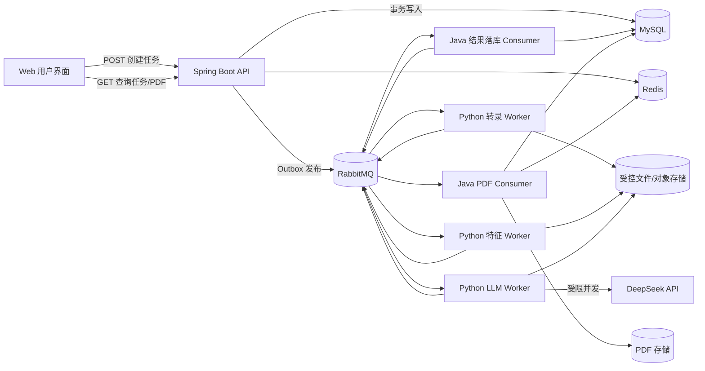
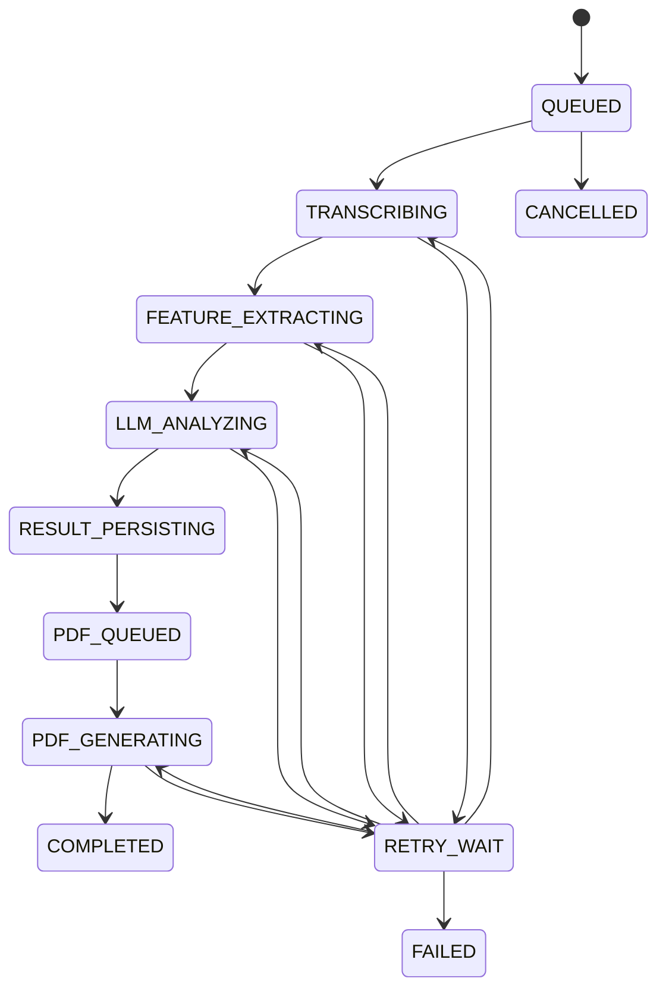

# 音频 AI 筛查异步化、多线程与 RabbitMQ 并发改造方案

## 1. 文档目标

本文针对当前项目的音频筛查链路，设计一套可持久化、可恢复、支持多用户并发的后台异步处理方案。

目标用户流程如下：

1. 用户上传或选择一条已有音频。
2. 用户点击“AI 检测”。
3. 系统立即返回“任务已受理”，用户可以关闭页面或退出登录。
4. 后台依次完成音质检查、音频转录、特征提取、大模型分析、结果入库和 PDF 生成。
5. 用户稍后再次登录，可以查看任务状态并下载已经生成的 PDF。

本文只给出架构和落地设计，不直接修改当前业务代码。

## 2. 当前实现与主要问题

当前调用链为：

```text
浏览器 await HTTP 响应
  -> AudioController
  -> PythonServiceImpl
  -> RestTemplate.postForEntity()
  -> Flask /api/diagnosis
  -> 音质分析
  -> Whisper 转录
  -> MFCC 提取
  -> 语义特征提取
  -> DeepSeek 请求
  -> Java 保存 diagnosis_report
  -> 用户再主动调用接口生成 PDF
```

主要问题：

- Java 使用阻塞式 `RestTemplate`，一次筛查会长期占用 Tomcat 请求线程，当前读取超时为 120 秒。
- Python 端在同一个请求内串行执行全部阶段，没有任务队列、重试队列和持久化进度。
- 前端必须等待整个分析完成；关闭页面后没有可靠的任务查询体验。
- PDF 内容目前由浏览器把转录和报告重新提交给后端，服务端没有把 PDF 自动生成纳入可信后台流程。
- `diagnosis_report` 保存前采用“先查询再插入”，并发请求下仍可能发生竞态，只能依靠唯一索引最终拦截。
- 当前“每个用户最多保留 10 条报告”的“统计、删除最旧记录、插入新记录”不是一个可靠的并发保留策略。
- 音频删除与正在运行的筛查任务之间没有协调，任务执行过程中音频可能被删除。
- Redis 已经存在，但目前主要用于登录态、计数和少量列表缓存，没有承担筛查状态加速、限流或分布式协调。

## 3. 设计原则

### 3.1 异步边界放在任务受理之后

HTTP 接口只负责鉴权、校验、创建任务和可靠投递，不执行 Whisper、特征提取、大模型调用或 PDF 生成。

正常情况下，创建任务接口应在数百毫秒内返回 `202 Accepted`。

### 3.2 MySQL 是任务状态的最终真相源

- RabbitMQ 是传输和削峰组件，不是业务数据库。
- Redis 是缓存、限流和短期协调组件，不是任务状态的唯一存储。
- 即使 Redis 数据全部丢失，仍然可以从 MySQL 恢复任务列表和最终报告。
- 即使消费者重启或消息重复投递，也不能重复生成业务结果。

### 3.3 接受“至少一次投递”，通过幂等获得正确结果

RabbitMQ 的可靠消费无法承诺端到端严格“只执行一次”。方案采用：

```text
至少一次消息投递 + 数据库唯一约束 + 消费记录 + 状态条件更新 = 业务结果等效一次
```

每个消费者都必须允许同一 `eventId` 或 `taskId + stage` 被重复接收。

### 3.4 使用有界并发和背压

- 禁止使用无界线程池、无界内存队列或不受控的 `CompletableFuture.supplyAsync()`。
- RabbitMQ listener、Java PDF 线程池、Python Whisper worker 和 DeepSeek 并发数分别配置。
- 慢环节通过 RabbitMQ 堆积，不把压力传回 HTTP 线程，也不无限增加本机线程。

### 3.5 大消息和敏感数据不在队列中传递

RabbitMQ 消息只携带任务标识、阶段、受控的存储引用和必要摘要。

音频二进制、完整转录、完整特征和完整大模型报告应存入数据库或受控对象存储。不要将音频 Base64 或完整健康数据塞入消息体、Redis或日志。

## 4. 目标架构



建议部署单元：

- `backend-api`：Spring Boot HTTP API、任务查询、Outbox Publisher、结果和 PDF 消费者。
- `screening-api`：保留 Python 健康检查接口；旧同步 `/api/diagnosis` 在迁移期使用，最终下线。
- `screening-transcription-worker`：Whisper 转录。
- `screening-feature-worker`：音质、MFCC 和语义特征处理。
- `screening-llm-worker`：调用 DeepSeek 并形成结构化筛查结果。
- RabbitMQ、Redis、MySQL。
- 开发环境可共享本地目录；多节点或生产环境建议使用 MinIO/S3 兼容对象存储。

## 5. 完整业务时序

### 5.1 任务受理

1. 用户调用 `POST /api/v1/audios/{audioId}/screenings`。
2. Java 校验 JWT、角色、音频归属、知情同意、文件存在性和任务限流。
3. 校验同一音频是否已有活动任务或已经有最终结果。
4. 在同一个 MySQL 事务中：
   - 插入 `screening_task`，状态为 `QUEUED`。
   - 插入 `outbox_event`，事件为 `screening.requested.v1`。
5. 事务提交后立即返回 `202 Accepted` 和 `taskId`。
6. Outbox Publisher 将事件可靠发送到 RabbitMQ，收到 publisher confirm 后把 Outbox 标记为已发布。

不要采用“先写数据库，再直接 `rabbitTemplate.convertAndSend()`”的裸双写方式，否则可能出现数据库已创建任务但消息未发送的问题。

### 5.2 Python 分阶段处理

1. 转录 Worker 收到 `screening.requested.v1`。
2. 校验音频引用和 checksum，执行质量预检及 Whisper 转录。
3. 将转录结果写入持久化结果存储。
4. 确认下一阶段消息已经被 RabbitMQ 接收后，再 ACK 当前消息。
5. 特征 Worker 收到 `screening.transcription.completed.v1`，提取 MFCC 和语义特征。
6. LLM Worker 收到 `screening.features.completed.v1`，读取转录及特征，受限并发调用 DeepSeek。
7. LLM Worker 持久化结果并发布 `screening.analysis.completed.v1`。

如果暂时不希望 Python 直接访问 MySQL，可以使用按任务隔离的 JSON artifact：

```text
screening-artifacts/{taskId}/transcription.json
screening-artifacts/{taskId}/features.json
screening-artifacts/{taskId}/analysis.json
```

写入必须采用“临时文件 + 原子重命名”，并保存 SHA-256。多节点环境必须改为共享对象存储，不能依赖某台机器的本地盘。

### 5.3 Java 保存结果与自动生成 PDF

1. Java 结果消费者收到 `screening.analysis.completed.v1`。
2. 验证 `taskId`、用户、音频、schema 版本、artifact checksum 和任务当前阶段。
3. 在数据库事务中幂等写入 `diagnosis_report`，更新任务为 `PDF_QUEUED`，并写入 `pdf.requested.v1` Outbox 事件。
4. PDF Consumer 收到消息后，从 `diagnosis_report` 读取可信数据生成 PDF，不接受浏览器提交的报告正文。
5. PDF 先写入临时文件，成功关闭后原子移动到正式路径。
6. 在事务中幂等写入 `pdf_report`，将任务更新为 `COMPLETED`。
7. 删除或刷新 Redis 任务缓存。

至此用户是否在线、原 JWT 是否过期，都不影响任务继续执行。

## 6. 任务状态机

建议将“任务执行状态”与当前 `diagnosis_report.screening_status` 分离。前者描述技术流程，后者继续表达医疗筛查结果是否完整或需要复核。



推荐状态：

| 状态 | 含义 | 建议展示文案 |
|---|---|---|
| `QUEUED` | 已受理，等待 Worker | 已进入队列 |
| `TRANSCRIBING` | Whisper 正在转录 | 正在识别语音 |
| `FEATURE_EXTRACTING` | 音质、MFCC、语义特征 | 正在提取特征 |
| `LLM_ANALYZING` | 正在请求大模型 | 正在生成筛查分析 |
| `RESULT_PERSISTING` | Java 正在验证和保存结果 | 正在保存结果 |
| `PDF_QUEUED` | PDF 已进入队列 | 等待生成报告 |
| `PDF_GENERATING` | Java 正在生成 PDF | 正在生成 PDF |
| `COMPLETED` | 结果和 PDF 均可用 | 报告已完成 |
| `RETRY_WAIT` | 暂时失败，等待自动重试 | 系统正在重试 |
| `FAILED` | 达到重试上限或永久错误 | 处理失败，请重试或联系客服 |
| `CANCEL_REQUESTED` | 用户请求取消 | 正在取消 |
| `CANCELLED` | 后续阶段不再执行 | 已取消 |

任务进度建议只使用阶段对应的粗粒度值，例如 5、20、50、75、90、100。不要向用户承诺精确剩余时间。

所有状态更新使用条件更新或乐观锁，例如：

```sql
UPDATE screening_task
SET status = 'FEATURE_EXTRACTING', version = version + 1, updated_at = NOW()
WHERE id = :taskId AND status = 'TRANSCRIBING' AND version = :expectedVersion;
```

更新行数为 0 时，消费者应重新读取任务状态；不能直接覆盖已经完成、失败或取消的状态。

## 7. RabbitMQ 拓扑

### 7.1 Exchange 和队列

使用 durable topic exchange：

```text
alz.screening.events.x
```

建议队列：

| 队列 | Routing key | 消费者 | 初始并发 |
|---|---|---|---:|
| `alz.screening.transcription.q` | `screening.requested.v1` | Python Whisper | 每个模型/GPU 1 |
| `alz.screening.feature.q` | `screening.transcription.completed.v1` | Python 特征处理 | 2～4 |
| `alz.screening.llm.q` | `screening.features.completed.v1` | Python DeepSeek | 2～4 |
| `alz.screening.result.java.q` | `screening.analysis.completed.v1` | Java 结果入库 | 2～4 |
| `alz.screening.status.java.q` | `screening.#` | Java 状态投影 | 2 |
| `alz.pdf.generate.java.q` | `pdf.requested.v1` | Java PDF | 1～2 |

生产环境优先使用 RabbitMQ quorum queues。开发环境可先使用 durable classic queues。

每个主队列都配置对应的 retry queue 和 DLQ，例如：

```text
alz.screening.llm.retry.10s.q
alz.screening.llm.retry.60s.q
alz.screening.llm.retry.300s.q
alz.screening.llm.dlq
```

retry queue 通过 TTL 和 dead-letter exchange 将消息送回主队列。这样无需依赖 RabbitMQ 延迟消息插件。

### 7.2 统一消息信封

所有 Java/Python 消息使用普通 JSON，不使用 Celery 私有消息协议，以保持 Spring AMQP 与 Python 的互操作性。

建议事件目录：

| 事件 | 生产者 | 主要消费者 | 作用 |
|---|---|---|---|
| `screening.requested.v1` | Java Outbox | 转录 Worker、状态投影 | 创建筛查任务 |
| `screening.transcription.started.v1` | 转录 Worker | 状态投影 | 更新为转录中 |
| `screening.transcription.completed.v1` | 转录 Worker | 特征 Worker、状态投影 | 提供转录 artifact |
| `screening.features.started.v1` | 特征 Worker | 状态投影 | 更新为特征处理中 |
| `screening.features.completed.v1` | 特征 Worker | LLM Worker、状态投影 | 提供特征 artifact |
| `screening.llm.started.v1` | LLM Worker | 状态投影 | 更新为大模型分析中 |
| `screening.analysis.completed.v1` | LLM Worker | Java 结果消费者、状态投影 | 提供最终分析 artifact |
| `screening.stage.retrying.v1` | 各 Worker | 状态投影 | 更新重试次数和下次时间 |
| `screening.stage.failed.v1` | 各 Worker | 状态投影、告警 | 标记永久失败 |
| `pdf.requested.v1` | Java Outbox | PDF Consumer | 请求生成 PDF |
| `pdf.started.v1` | PDF Consumer | 状态投影 | 更新为 PDF 生成中 |
| `pdf.completed.v1` | PDF Consumer | 状态投影、缓存刷新 | 标记任务完成 |
| `pdf.failed.v1` | PDF Consumer | 状态投影、告警 | PDF 达到重试上限 |

状态投影不能假设不同消费者发布的事件严格全局有序。更新时必须根据允许的状态迁移、事件时间和数据库 `version` 做单调推进，迟到的 `started` 事件不能把已经完成的任务改回运行中。

```json
{
  "eventId": "8ab6f06e-...",
  "eventType": "screening.features.completed.v1",
  "schemaVersion": 1,
  "taskId": "5ebdf1cb-...",
  "userId": 123,
  "audioId": 456,
  "traceId": "9e4701a5-...",
  "attempt": 1,
  "occurredAt": "2026-08-20T10:00:00Z",
  "payload": {
    "artifactUri": "screening-artifacts/5ebdf1cb/features.json",
    "sha256": "..."
  }
}
```

约束：

- `eventType` 含版本号，字段演进时新增 v2，不静默改变旧结构。
- 不在消息中传 JWT、API Key、音频 Base64 或完整报告。
- 消息体建议控制在 64 KB 内。
- 使用 `eventId` 去重，使用 `taskId` 关联全链路。
- RabbitMQ `correlationId` 设置为 `taskId`，日志使用 `traceId`。
- 阶段完成事件使用确定性 `eventId`，可由 `taskId + stage + schemaVersion` 生成 UUIDv5；重放同一阶段时事件 ID 不变。

### 7.3 可靠发布和消费

Java Publisher：

- 开启 publisher confirms 和 publisher returns。
- Outbox 轮询器只读取未发布记录，批量发送。
- 收到 confirm 后更新 `published_at`。
- 定时清理已经发布且超过保留期的 Outbox。

消费者：

- 使用手动 ACK 或容器受控 ACK。
- 业务结果持久化且下一阶段消息可靠发布后，才能 ACK。
- 进程在“处理完成但 ACK 前”崩溃时消息会重投，因此必须幂等。
- Python Worker 发现本阶段 artifact 已存在时，仍需以相同的确定性 `eventId` 重新发布下一阶段事件并等待 publisher confirm，然后才能 ACK 当前消息。不能只因 artifact 已存在就直接 ACK。
- 如果进程在下一事件已经 confirm、当前消息 ACK 前崩溃，下一事件可能重复；由下游依据确定性 `eventId` 去重。
- 不可恢复错误直接进入 DLQ；暂时错误进入带退避的 retry queue。
- `prefetch` 初始设为 1，确认资源稳定后再按单任务内存消耗调高。

## 8. 数据库改造

建议新增迁移 `V003__async_screening_tasks.sql`。以下为逻辑设计，正式实施时需结合当前 MySQL 版本验证 DDL。

### 8.1 `screening_task`

建议字段：

| 字段 | 类型示例 | 说明 |
|---|---|---|
| `id` | `CHAR(36)` | 对外任务 ID，UUID |
| `user_id` | `BIGINT` | 任务所有者 |
| `audio_record_id` | `BIGINT` | 关联音频记录 |
| `audio_name` | `VARCHAR(255)` | 冗余快照，便于兼容现有表 |
| `idempotency_key` | `VARCHAR(128)` | 防重复提交 |
| `status` | `VARCHAR(32)` | 技术状态 |
| `current_stage` | `VARCHAR(32)` | 当前阶段 |
| `progress` | `TINYINT` | 0～100 |
| `model_version` | `VARCHAR(128)` | 本次任务固定的模型配置版本 |
| `attempt_count` | `INT` | 当前阶段尝试次数 |
| `version` | `BIGINT` | 乐观锁版本 |
| `error_code` | `VARCHAR(64)` | 可公开的稳定错误码 |
| `error_message` | `VARCHAR(500)` | 脱敏后的用户可读说明 |
| `requested_at` | `DATETIME(3)` | 创建时间 |
| `started_at` | `DATETIME(3)` | 首次执行时间 |
| `completed_at` | `DATETIME(3)` | 完成时间 |
| `updated_at` | `DATETIME(3)` | 最后更新时间 |

索引与约束：

- `UNIQUE(user_id, idempotency_key)`：同一用户相同提交键只创建一次任务。
- `INDEX(user_id, requested_at)`：用户任务列表。
- `INDEX(status, updated_at)`：恢复卡住的任务、运营查询。
- `FOREIGN KEY(audio_record_id)`：关联 `audio_record`。
- MVP 建议同一音频只允许一份最终筛查结果；如以后支持重新分析，需要引入 `run_no` 或 `model_version` 维度，并同步修改现有 `diagnosis_report.audio_name` 唯一约束。

不能只依赖 Redis 锁防止重复提交；数据库唯一约束才是最终防线。

### 8.2 `screening_task_artifact`

用于保存各阶段的受控引用和摘要：

| 字段 | 说明 |
|---|---|
| `task_id` | 任务 ID |
| `artifact_type` | `TRANSCRIPTION`、`FEATURES`、`ANALYSIS` |
| `storage_uri` | 受控存储 URI，不接受任意外部 URL |
| `sha256` | 完整性校验 |
| `content_version` | 结构版本 |
| `created_at` | 创建时间 |

唯一约束：`UNIQUE(task_id, artifact_type, content_version)`。

如果数据规模较小，也可以把转录、特征 JSON 和分析结果直接保存在该表；但大字段应与高频任务状态查询分开。

### 8.3 `outbox_event`

建议字段：

- `event_id`，主键。
- `aggregate_type`、`aggregate_id`。
- `event_type`、`schema_version`。
- `payload` JSON。
- `status`：`NEW`、`PUBLISHING`、`PUBLISHED`、`FAILED`。
- `attempt_count`、`next_attempt_at`。
- `created_at`、`published_at`。

### 8.4 `consumed_event`

用于消费者去重：

```text
consumer_name + event_id -> processed_at
```

`UNIQUE(consumer_name, event_id)`。消费者业务更新和消费记录应在同一个本地数据库事务中提交。

Python Worker 如果不访问 Java 的 MySQL，可在自身轻量持久化库或 artifact manifest 中维护阶段去重；不能只用进程内 `set()`。

### 8.5 现有表调整

- `diagnosis_report` 增加 `screening_task_id` 并建立唯一索引。
- `pdf_report` 增加 `screening_task_id`、`file_sha256`、`file_size`。
- PDF 文件名改为由服务端生成，例如 `{taskId}_report.pdf`，禁止使用未经规范化的用户输入拼路径。
- 保留 `diagnosis_report.audio_name` 和 `pdf_report.audio_name` 用于兼容旧查询。
- 当前每用户最多 10 份报告的清理由同步写入逻辑移到定时保留任务；删除时按用户加数据库锁或使用确定的单条 SQL，避免并发删除错误记录。

## 9. Redis 设计

Redis 只保存可重建数据和协调信息。

建议 key：

| Key | 数据结构 | 用途 | TTL 建议 |
|---|---|---|---|
| `screening:task:{taskId}` | Hash/JSON | 状态查询缓存 | 活动任务持续续期，完成后 7 天 |
| `screening:user:{userId}:active` | Set | 用户活动任务索引 | 24 小时并续期 |
| `screening:audio:{audioId}:lock` | String | 防止短时间重复创建 | 10～30 秒 |
| `ratelimit:screening:user:{userId}` | String/Hash | 用户令牌桶 | 随窗口过期 |
| `ratelimit:screening:ip:{ip}` | String/Hash | IP 令牌桶 | 随窗口过期 |
| `breaker:deepseek:{provider}` | Hash | 可选的集群级熔断状态 | 1～5 分钟 |

规则：

- 查询采用 cache-aside：先查 Redis，未命中则查 MySQL并回填。
- 状态变化时更新或删除缓存；缓存写失败不能导致数据库事务回滚。
- Redis 不保存完整音频、完整转录或 PDF。
- Redis 锁只降低重复概率，不能代替唯一索引和幂等消费。

## 10. Java 后端多线程设计

### 10.1 不使用普通 `@Async` 充当持久任务队列

`@Async` 任务位于 JVM 内存中。应用重启、部署或崩溃时任务会丢失，因此不能用它承载完整筛查流程。

Java 中的线程池用于：

- RabbitMQ listener 的有界并发消费。
- PDF 生成。
- Outbox 短任务发布。
- 必要的短时 I/O 后处理。

### 10.2 建议线程池隔离

不要让 PDF、消息发布和普通 HTTP 请求共享同一个执行器。

初始配置建议：

| 执行单元 | 并发/线程 | 队列容量 | 说明 |
|---|---:|---:|---|
| HTTP/Tomcat | 100 左右，压测后调整 | accept queue 100 左右 | 接口已快速返回，不需要盲目扩大 |
| Outbox Publisher | 1～2 | 100 | 批量发布、publisher confirm |
| 结果入库 listener | 2～4 | 由 RabbitMQ 承担 | DB 事务短小 |
| 状态投影 listener | 2 | 由 RabbitMQ 承担 | 幂等更新和缓存刷新 |
| PDF Worker | 1～2 | 20～50 | iText CPU、字体和文件 I/O 隔离 |

Spring AMQP listener container 本身已经提供消费者并发。不要在 listener 内再次把相同工作扔进另一个线程池后立刻 ACK，否则会破坏消息可靠性。

所有自定义执行器必须：

- 显式设置 core/max/queue capacity。
- 使用可识别的线程名前缀。
- 暴露 active count、queue size 和 rejected count 指标。
- 明确拒绝策略；对 RabbitMQ 消费优先降低消费并发或暂停消费，不静默丢任务。
- 在应用关闭时停止拉取消息，等待正在处理的任务在限定时间内完成，然后正常关闭连接。

### 10.3 数据库连接池联动

Java consumer 总并发不能超过数据库连接池可承受范围。

可采用以下起始约束：

```text
HTTP 需要的峰值数据库连接
+ 结果消费者并发
+ PDF 消费者并发
+ Outbox 并发
+ 管理余量
< Hikari maximumPoolSize
```

不要把线程数设为远高于数据库连接数，否则线程只会阻塞等待连接。

## 11. Python Worker 并发设计

三个阶段的资源特点不同，必须分别限流。

### 11.1 Whisper 转录

- `faster-whisper`/CTranslate2 本身可能使用原生线程，不能简单把 Flask 线程数当作模型并发数。
- 当前 `large-v2 + CPU + int8` 内存和 CPU 消耗较高，初始建议一个 Worker 进程只处理一个任务。
- GPU 部署时初始配置为“每张 GPU 一个消费者，prefetch=1”，再根据显存和实测吞吐调整。
- CPU 部署可增加 Worker 进程，但必须同时限制 CTranslate2、OpenMP、BLAS 的内部线程数，避免 `进程数 × 库线程数` 造成过度抢占。
- 模型在 Worker 启动时预热，不在第一条用户任务中临时下载模型。
- 多进程会各自加载模型，需要先核算内存/显存，不能盲目按 CPU 核数启动。

### 11.2 特征提取

- 音质检查、librosa、MFCC 属于 CPU/文件 I/O 混合任务。
- 初始可用 2～4 个独立 Worker 进程，prefetch=1。
- 对同一 WAV 避免重复全量读取；可在一次解码后复用采样数据，或产生标准化中间 WAV。
- 使用独立进程比把 CPU 密集逻辑全部放进 Python 线程池更可控。

### 11.3 DeepSeek 调用

- 使用异步 HTTP 客户端或 `AsyncOpenAI`，配合连接池和 `asyncio.Semaphore`。
- 初始并发建议 2～4；最终值取决于 API 账户配额、平均响应时间和 429 比例。
- 设置连接、读取和整体超时。
- 遇到 429 时尊重 `Retry-After`，不能立即并发重试。
- API Key 缺失或鉴权失败属于配置错误，应打开熔断器并报警，不进行高频重试。

### 11.4 Python 消费实现选择

推荐使用普通 AMQP JSON 协议：

- Java：Spring AMQP。
- Python：`aio-pika` 或 `pika`。
- 异步 LLM Worker 优先 `aio-pika`。
- Whisper/特征 Worker 可以使用阻塞消费循环配合独立进程。

不建议直接让 Java 发布 Celery 私有任务格式，因为这会增加跨语言协议耦合。如果以后所有编排都迁到 Python 内部，才考虑 Celery Canvas。

## 12. 限流、隔离、熔断和降级

### 12.1 API 限流

推荐在 Java 接口使用 Redis 支持的分布式令牌桶，例如 Bucket4j 与 Redis/Lettuce 集成。所有实例共享额度。

初始策略建议：

| 维度 | 建议限制 | 超限响应 |
|---|---:|---|
| 单用户提交筛查 | 2 次/分钟，突发 2 | `429 Too Many Requests` |
| 单用户活动任务 | 最多 2 个 | `409 Conflict` 或 `429` |
| 单音频活动任务 | 1 个 | 返回已有 `taskId`，不重复创建 |
| 单 IP 提交 | 10 次/分钟 | `429` |
| 单用户状态查询 | 60 次/分钟 | `429`，同时返回 `Retry-After` |
| 系统全局受理 | 根据队列深度动态控制 | `503 Service Unavailable` |

管理员不能默认无限制；可以拥有单独的较高配额。

限流 key 使用认证后的 `userId`，IP 只作为辅助。反向代理环境必须只信任受控代理传入的真实 IP 头。

### 12.2 并发隔离 Bulkhead

- Whisper、特征、LLM、PDF 使用不同队列和消费者并发。
- LLM 超时不能占满 Whisper Worker。
- PDF 堆积不能阻止分析结果入库。
- Java 对 RabbitMQ、Redis、MySQL 的连接池分别设置上限。

### 12.3 熔断

异步架构中，熔断重点不是让 HTTP 请求快速失败，而是防止故障服务被持续打爆。

DeepSeek 熔断建议：

- 统计最近时间窗口中的连接失败、超时、429 和 5xx。
- 连续配置错误或高失败率时打开熔断器，暂停从 LLM 主队列取新任务。
- 熔断期间消息保留在 RabbitMQ，任务状态显示 `RETRY_WAIT`。
- 半开状态只放行少量探测请求。
- 成功率恢复后逐步恢复消费并发，避免瞬时洪峰。

RabbitMQ 发布侧：

- 连接失败时 Outbox 保留事件并退避重试。
- RabbitMQ 不可用时，如果数据库仍可用，可继续创建有限数量的任务；超过待发布 Outbox 阈值后停止受理并返回 `503`。
- `/actuator/health/readiness` 应在 RabbitMQ 长期不可用或 Outbox 严重积压时反映降级状态。

Redis 故障：

- 状态查询回退 MySQL。
- 限流可采用单实例保守本地限流作为降级，或暂时拒绝新筛查；不能完全放开流量。
- Redis 故障不影响已入 RabbitMQ 的后台任务继续运行。

### 12.4 重试分类

| 阶段 | 可重试错误 | 不应重试 | 建议次数 |
|---|---|---|---:|
| 转录 | 临时文件系统错误、Worker 异常退出 | 文件不存在、格式不支持、质量永久不合格 | 2～3 |
| 特征 | 临时 I/O、进程崩溃 | 数据损坏、特征结构不合法 | 2～3 |
| DeepSeek | 超时、429、部分 5xx | 401/403、请求结构错误 | 3～5 |
| 结果入库 | 数据库临时不可用、死锁 | schema 不兼容、结果校验失败 | 3 |
| PDF | 临时文件锁、存储暂时不可用 | 字体配置缺失、非法结果数据 | 3 |

退避使用指数增长并加入随机抖动，例如 10 秒、60 秒、300 秒。永久失败消息进入 DLQ，同时把任务更新为 `FAILED` 并记录稳定错误码。

## 13. 幂等、竞态和一致性

### 13.1 用户重复点击

- 前端点击后立即禁用按钮只能改善体验，不能作为并发保护。
- 客户端生成 `Idempotency-Key`，重试同一次请求时复用。
- 后端通过 `UNIQUE(user_id, idempotency_key)` 返回同一个 `taskId`。
- 同一音频已有活动任务时，直接返回现有任务，不再发送消息。

### 13.2 消息重复投递

每个消费者按以下顺序处理：

1. 检查 `consumed_event` 或阶段 manifest。
2. 检查任务当前状态是否允许执行本阶段。
3. 执行业务并以确定性路径写入结果。
4. 原子保存业务结果和去重记录。
5. 使用确定性 `eventId` 可靠发布或重发下一事件，并等待 publisher confirm。
6. ACK 当前消息。

重复消息如果发现阶段已经完成，不再调用 DeepSeek或重复生成报告，但仍要确保相同的下一阶段事件已经得到 publisher confirm，之后才能 ACK。

### 13.3 音频删除

默认策略：

- 音频存在活动任务时，删除接口返回 `409 Conflict`，并告知用户先取消任务。
- 用户发起取消后将任务设为 `CANCEL_REQUESTED`。
- 每个 Worker 在开始昂贵阶段前检查取消状态。
- 已经发出的 DeepSeek HTTP 请求通常无法可靠撤回；完成后检查取消状态并丢弃结果。
- 任务进入 `CANCELLED` 后，再由后台清理音频、artifact、诊断记录和 PDF。

不要在任务运行中直接删除底层 WAV 文件。

### 13.4 PDF 原子性

- PDF 使用 `{taskId}.pdf.tmp` 写入。
- 完整关闭并计算 checksum 后原子移动为 `{taskId}_report.pdf`。
- 数据库唯一约束保证同一任务只有一条 PDF 记录。
- 重复消费时如果正式文件和 checksum 均匹配，直接视为成功。
- 文件存在但数据库无记录，或数据库有记录但文件缺失，交给定时 reconciliation job 修复或报警。

## 14. API 改造

### 14.1 创建任务

```http
POST /api/v1/audios/{audioId}/screenings
Authorization: Bearer ...
Idempotency-Key: 56008e52-...
```

响应：

```http
HTTP/1.1 202 Accepted
Location: /api/v1/screenings/5ebdf1cb-...
Retry-After: 5
```

```json
{
  "taskId": "5ebdf1cb-...",
  "audioId": 456,
  "status": "QUEUED",
  "progress": 0,
  "message": "筛查任务已受理，可以退出页面，后台将继续处理。"
}
```

### 14.2 查询单个任务

```http
GET /api/v1/screenings/{taskId}
```

```json
{
  "taskId": "5ebdf1cb-...",
  "audioId": 456,
  "status": "PDF_GENERATING",
  "stage": "PDF",
  "progress": 90,
  "requestedAt": "2026-08-20T18:00:00+08:00",
  "updatedAt": "2026-08-20T18:02:20+08:00",
  "result": null,
  "links": {
    "self": "/api/v1/screenings/5ebdf1cb-..."
  }
}
```

完成后 `links` 增加报告详情和 PDF 下载地址。接口必须校验任务属于当前用户，不能只凭 taskId 返回健康数据。

### 14.3 用户任务列表

```http
GET /api/v1/screenings?status=active&page=0&size=20
```

用户登录后页面同时加载：

- 活动任务。
- 最近完成任务。
- 已完成 PDF。

### 14.4 失败任务重试

```http
POST /api/v1/screenings/{taskId}/retry
Idempotency-Key: ...
```

只允许任务所有者重试 `FAILED` 任务。重试应从失败阶段继续，除非 artifact 校验失败才回退到更早阶段。

### 14.5 取消任务

```http
DELETE /api/v1/screenings/{taskId}
```

活动任务返回 `202` 并进入 `CANCEL_REQUESTED`；完成任务不能通过此接口隐式删除医疗记录，应继续走明确的数据删除流程。

### 14.6 旧接口迁移

- `POST /audio/screening/{audioId}`：迁移期改为创建异步任务并返回 202。
- `GET /audio/diagnosis/{audioId}`：停止执行同步分析，可改为查询该音频最近任务或返回迁移提示。
- `POST /audio/pdf/save`：废弃。PDF 只能由后台读取服务端可信结果生成。
- 保留 `/audio/pdf/list` 和下载接口，但建议新增按 `taskId` 查询的 v1 API。

## 15. 前端体验改造

用户点击“AI 检测”后：

1. 接口返回 202，页面显示“已进入后台处理，可以安全退出”。
2. 将 `taskId` 记录到页面状态，但不依赖浏览器保存任务真实性。
3. 当前页面可每 5～10 秒轮询任务状态，并遵循服务端 `Retry-After`。
4. 页面隐藏或用户退出时停止轮询，不影响后台任务。
5. 再次登录后，从任务列表接口恢复所有活动任务和已完成报告。
6. 任务完成后 PDF 自动出现在报告列表，不再显示“手动保存 PDF”。

后续可增加 SSE/WebSocket 通知，但不是第一阶段必需条件。轮询更容易部署和恢复，足以满足“退出后再次登录查看”的需求。

## 16. 安全与隐私

- DeepSeek API Key、RabbitMQ 密码和数据库密码只从环境变量或密钥管理服务读取，不能写入仓库配置默认值。
- RabbitMQ 使用独立 vhost 和最小权限账号；生产环境启用 TLS。
- Worker 只能读取允许的音频存储前缀，不能接受消息中的任意绝对路径或外部 URL。
- artifact URI 必须经过白名单解析，并校验 taskId 与 checksum。
- 日志只记录 taskId、阶段、耗时和稳定错误码，不记录完整转录、报告、手机号或 API Key。
- MySQL、对象存储、备份和 RabbitMQ 持久化磁盘需要静态加密；服务间使用 TLS。
- 明确保留期，后台清理任务应同步删除音频、artifact、转录、报告和 PDF。
- DLQ 中也不能放完整健康数据，因为 DLQ 往往保留时间更长。
- PDF 生成内容全部来自服务端数据库，不能信任浏览器回传的报告正文。

## 17. 可观测性与运维

### 17.1 必要指标

RabbitMQ：

- 各队列 ready/unacked 数量。
- oldest message age。
- publish confirm 失败和 return 数量。
- retry、redelivery 和 DLQ 数量。

任务：

- 每个状态的任务数。
- 各阶段成功率、失败率、p50/p95/p99 时延。
- 端到端“创建到 PDF 完成”时延。
- 卡住任务数量和最长更新时间。

资源：

- Java 线程池 active、queue、rejected。
- Hikari 活跃连接和等待线程。
- Python Worker RSS、CPU、GPU/显存、模型加载时间。
- DeepSeek 429、超时、token 使用量和熔断状态。
- PDF 生成耗时和存储错误。

### 17.2 日志和追踪

- 所有日志携带 `taskId`、`eventId`、`traceId`、`stage`、`attempt`。
- Java 使用 MDC；Python 使用结构化日志上下文。
- 错误日志记录异常类型和脱敏信息，不记录消息完整 payload。
- 后续可接入 OpenTelemetry，将 HTTP、RabbitMQ 和外部 LLM 调用串成一条 trace。

### 17.3 卡住任务恢复

增加 reconciliation job，定期处理：

- `QUEUED` 但长时间没有发布事件的任务：检查 Outbox 并重新发布。
- 某阶段超过预期时长且没有活跃消息的任务：重新投递或标记失败。
- 已完成分析但无 PDF 的任务：补发 `pdf.requested.v1`。
- PDF 记录与文件不一致：修复或报警。

恢复动作同样需要幂等，不能创建重复报告。

## 18. 配置建议

建议新增环境变量，默认值需通过压测调整：

```dotenv
RABBITMQ_HOST=localhost
RABBITMQ_PORT=5672
RABBITMQ_VHOST=/alz
RABBITMQ_USERNAME=alz_app
RABBITMQ_PASSWORD=

SCREENING_RESULT_CONCURRENCY=2
SCREENING_STATUS_CONCURRENCY=2
PDF_WORKER_CONCURRENCY=1
PDF_EXECUTOR_QUEUE_CAPACITY=20

WHISPER_WORKER_CONCURRENCY=1
FEATURE_WORKER_CONCURRENCY=2
LLM_WORKER_CONCURRENCY=2
RABBIT_PREFETCH=1

SCREENING_USER_RATE_PER_MINUTE=2
SCREENING_USER_MAX_ACTIVE=2
SCREENING_IP_RATE_PER_MINUTE=10
SCREENING_MAX_QUEUE_DEPTH=1000

DEEPSEEK_CONNECT_TIMEOUT_SECONDS=3
DEEPSEEK_READ_TIMEOUT_SECONDS=90
DEEPSEEK_MAX_RETRIES=4
```

配置原则：

- 线程数和消费者数是容量上限，不是越大越好。
- Whisper 并发由 CPU、RAM、GPU 和模型大小决定。
- LLM 并发由 API 配额和 429 率决定。
- PDF 并发由 CPU、字体加载和磁盘能力决定。
- 每次调整都以队列等待时间、资源利用率和错误率为依据。

## 19. 依赖和代码模块建议

Java Maven 增加：

- `spring-boot-starter-amqp`：RabbitMQ 发布和消费。
- `spring-boot-starter-actuator`：健康检查与指标。
- Micrometer 对应监控 registry。
- Resilience4j Spring Boot 集成：适用于同步依赖、bulkhead 和部分熔断场景。
- Bucket4j 的 Redis/Lettuce 集成：分布式 API 限流。
- 数据库迁移工具建议引入 Flyway，统一执行 `deploy/mysql/migrations`。

建议 Java 包结构：

```text
com.alz.screening.api
com.alz.screening.application
com.alz.screening.domain
com.alz.screening.persistence
com.alz.screening.messaging
com.alz.screening.outbox
com.alz.screening.pdf
com.alz.screening.resilience
```

Python 增加：

- AMQP 客户端：`aio-pika` 或 `pika`。
- 异步 LLM HTTP 客户端复用现有 OpenAI SDK的异步客户端。
- 重试库可选，但最终重试时序由 RabbitMQ retry queue 承担。
- 结构化配置和事件 schema 校验。

建议 Python 结构：

```text
screening-service/app/messaging/
screening-service/app/workers/transcription.py
screening-service/app/workers/features.py
screening-service/app/workers/llm.py
screening-service/app/artifacts/
screening-service/app/contracts/
```

## 20. 分阶段迁移计划

### 阶段 0：基线与安全整理

- 将所有密钥从配置默认值移出，仅通过环境变量注入。
- 为现有同步链路增加端到端耗时、错误率和并发基线。
- 确认 MySQL 迁移管理方式。
- 明确音频、转录、报告和 PDF 的保留期限。

验收：仓库中没有真实密钥，现有功能测试通过，能够看到同步链路基线指标。

### 阶段 1：任务模型和异步 API

- 新增 `screening_task`、Outbox、消费去重和 artifact 表。
- 新增创建任务、状态查询、列表、取消和重试 API。
- 接口立即返回 202。
- 前端改为任务列表和轮询体验。

验收：用户退出再登录仍能看到任务；重复点击得到同一个任务。

### 阶段 2：RabbitMQ 与单体 Python Consumer

- 引入 RabbitMQ、Spring AMQP、publisher confirms、DLQ。
- Python 先实现一个组合 Consumer，内部仍按原顺序完成全部阶段。
- Java 接收最终结果并自动发布 PDF 任务。

这是降低迁移风险的中间态：先验证可靠消息、幂等和离线用户体验，再拆阶段。

验收：重启 Java/Python 后任务不丢；重复投递不重复生成报告。

### 阶段 3：拆分 Python 阶段和资源隔离

- 拆分转录、特征、LLM 队列和 Worker。
- 引入 artifact 持久化、checksum 和阶段状态投影。
- 分别设置并发、prefetch、超时和 retry queue。

验收：DeepSeek 故障不会阻塞转录队列；各阶段可以独立扩容。

### 阶段 4：后台 PDF 与旧接口下线

- Java PDF Consumer 自动生成 PDF。
- PDF 只读取服务端结果。
- 删除前端“手动保存 PDF”流程。
- 下线同步诊断接口和旧 `/audio/pdf/save`。

验收：从点击 AI 检测到 PDF 可下载全程无需保持浏览器在线。

### 阶段 5：限流、熔断、压测和生产化

- 增加分布式限流、动态准入、熔断、监控和报警。
- RabbitMQ 生产环境改用 quorum queues 和 TLS。
- 多节点存储改为 MinIO/S3。
- 完成容量和故障演练。

验收：达到目标并发时无任务丢失，故障恢复后队列能够受控消化。

## 21. 测试与验收清单

### 21.1 功能测试

- 创建任务返回 202，响应中有 taskId 和 Location。
- 用户退出后任务继续，重新登录可见。
- PDF 自动生成且只能被所属用户下载。
- 同一 Idempotency-Key 多次请求返回同一任务。
- 同一音频并发点击不会产生多份结果。
- 用户不能读取其他用户的任务、转录、报告或 PDF。

### 21.2 可靠性测试

- 创建任务后 RabbitMQ 暂时不可用，Outbox 恢复后成功补发。
- Consumer 在处理完成、ACK 前被杀死，重投后不重复调用下游或生成重复结果。
- Redis 清空后任务仍可从 MySQL 查询。
- DeepSeek 返回 429、超时和 5xx 时按策略重试。
- DeepSeek 401/403 时快速失败、熔断并报警。
- Java 在 PDF 写到临时文件时崩溃，恢复后能安全重试。
- 音频删除与任务并发时不会产生悬挂数据或越权文件。
- DLQ 消息可以经人工确认后安全重放。

### 21.3 并发与容量测试

至少覆盖 10、50、100 个用户同时提交任务，观察：

- HTTP 创建任务 p95。
- RabbitMQ 各阶段队列长度和 oldest message age。
- Whisper 吞吐、内存/显存峰值。
- DeepSeek 429 比例和平均响应时间。
- Java DB 连接池等待时间。
- PDF Worker 队列和磁盘 I/O。
- 端到端完成时间和失败率。

目标不是让 100 个 Whisper 任务同时运行，而是让 100 个用户都能可靠提交，并由系统按资源能力有序处理。

## 22. 推荐的首版容量参数

在单机开发环境下可以从以下值开始：

```text
Java 结果消费者：2
Java PDF 消费者：1
Python Whisper：1
Python 特征 Worker：2
Python LLM 并发：2
RabbitMQ prefetch：1
单用户活动任务：2
单用户提交速率：2/分钟
```

这些值只是安全起点。必须使用当前机器上的 `large-v2` 模型、真实音频时长和真实 DeepSeek响应进行压测后调整。

## 23. 最终建议

首版不要同时完成所有复杂度。推荐实施顺序是：

1. 先完成任务表、202 API、Outbox、RabbitMQ、幂等和自动 PDF。
2. Python 第一版可以保持单个组合 Consumer，先实现可靠后台运行。
3. 可靠链路稳定后，再把转录、特征和 DeepSeek 拆成独立队列与 Worker。
4. 最后根据压测结果调整并发、限流、熔断和部署规模。

这种顺序既能尽快实现“用户可以退出、稍后查看 PDF”，也避免一次性拆分过多组件导致难以定位一致性问题。
