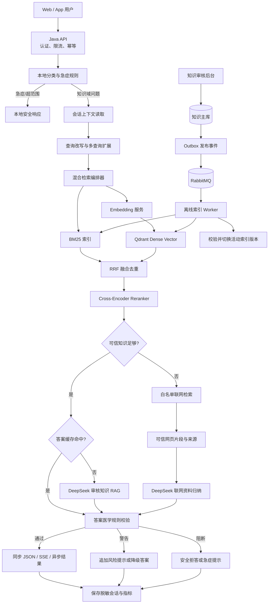
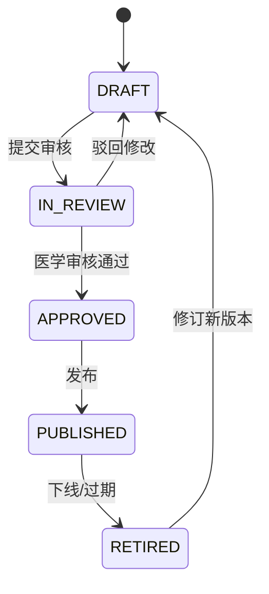
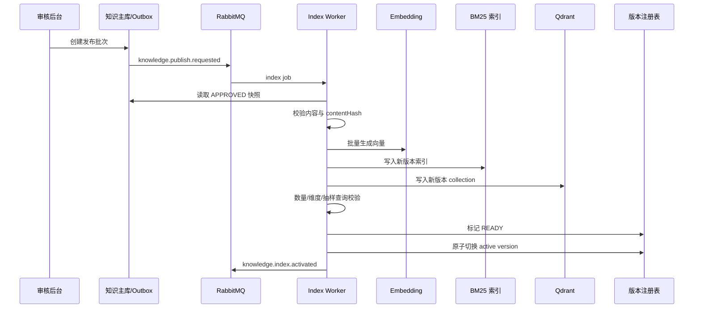
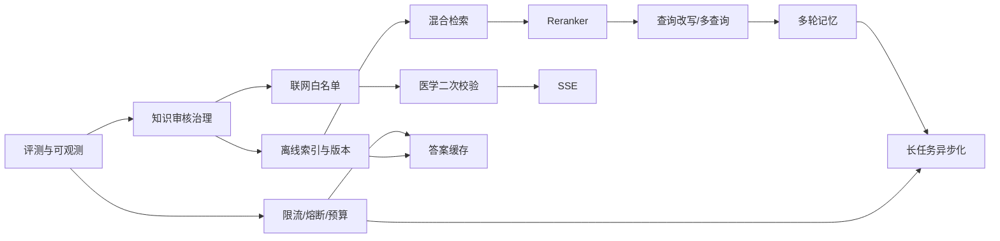

# 智能助手 RAG 增强与生产化演进设计

## 1. 文档定位

本文针对当前智能助手尚未实现的能力，给出面向后续迭代的总体规划和技术设计。

本文是未来方案，不表示相关功能已经上线。当前实际链路以 [智能助手-RAG与大模型数据链路原理.md](智能助手-RAG与大模型数据链路原理.md) 为准。

规划范围包括：

1. BM25 与向量混合检索。
2. Cross-Encoder reranker。
3. 多轮对话记忆。
4. 查询改写和多查询扩展。
5. 联网搜索域名白名单。
6. 搜索结果内容的二次医学规则校验。
7. 聊天接口限流、熔断和调用预算。
8. 答案缓存。
9. 知识后台审核和在线更新。
10. 独立离线索引任务。
11. Qdrant readiness 和索引版本管理。
12. 流式回答。
13. 聊天链路消息队列异步化。

## 2. 建设目标

### 2.1 业务目标

- 提高口语化、缩写、同义词和复杂问题的知识召回率。
- 降低“检索到了相近内容，但并不能回答问题”的错误命中率。
- 支持有边界的多轮追问，减少用户重复描述。
- 对联网资料实施来源约束、医学风险检查和可追溯记录。
- 在高并发或外部服务异常时保护 Java、Embedding、Qdrant 和 DeepSeek。
- 支持知识内容审核、发布、回滚和无停机更新。
- 支持流式交互以及可退出页面的后台长任务。

### 2.2 非目标

本阶段不把助手建设成能够自主执行任意操作的通用 Agent，也不允许模型：

- 自主修改审核知识库。
- 自动把联网答案沉淀为正式医学知识。
- 读取与本次问答无关的用户病历、音频或筛查报告。
- 直接作出疾病诊断、处方、剂量或停药决定。
- 绕过急症规则、权限、预算或人工审核流程。

### 2.3 设计原则

```text
安全规则优先于检索和生成
审核知识优先于联网资料
检索、生成、校验相互独立
所有外部调用都有超时、限流、熔断和降级
在线查询不负责建索引
发布新索引必须可验证、可切换、可回滚
异步化用于长任务，不强制替代所有实时聊天
```

## 3. 当前基线与主要问题

当前链路已经具备本地分类、急症拦截、轻量检索、Qdrant dense vector 检索、DeepSeek RAG、无本地答案后的联网搜索和失败降级。

主要待解决问题如下：

| 问题 | 当前影响 | 规划能力 |
|---|---|---|
| 只依赖 dense vector | 专有名词、数字、缩写和关键词可能召回不稳定 | BM25 + dense 混合检索 |
| 直接使用向量 Top-K | 同分类近似问题可能被错误排在前面 | Cross-Encoder reranker |
| 每轮互相独立 | “它有哪些症状”等指代无法解析 | 多轮记忆、查询改写 |
| 单个原始查询 | 表述不清时召回不足 | 多查询扩展 |
| 联网来源只做 URL 合法性检查 | 可能引用低可信域名 | 白名单检索与来源策略 |
| 主要依靠 Prompt 约束医学风险 | 存在生成后风险遗漏 | 服务端二次校验 |
| 无入口保护和预算 | 并发尖峰可能放大外部调用 | 限流、熔断、预算 |
| 相同问题重复生成 | 延迟和费用增加 | 版本感知答案缓存 |
| FAQ 文件随包发布 | 内容更新依赖重新部署 | 审核后台、在线发布 |
| 首次用户请求懒建索引 | 首次请求慢且失败面大 | 离线索引任务 |
| collection 无发布版本 | 难以校验和回滚 | readiness、版本、别名切换 |
| 非流式同步响应 | 用户长时间看不到进度 | SSE 流式回答 |
| 请求线程承载整个长流程 | 长研究任务不适合页面退出 | RabbitMQ 异步任务 |

## 4. 目标总体架构



### 4.1 组件职责

| 组件 | 建议职责 |
|---|---|
| Java API | 认证、参数校验、分类、安全分流、限流、预算、流程编排、响应协议 |
| Redis | 限流计数、短期会话、答案缓存、任务状态、分布式锁、预算计数 |
| 关系数据库 | 知识正文、审核记录、会话元数据、任务记录、版本记录、审计日志 |
| Qdrant | 审核知识的 dense vector 索引和 metadata filter |
| BM25 引擎 | 关键词、数字、缩写和精确术语召回；建议 OpenSearch，早期可用 Lucene 验证 |
| Embedding 服务 | 查询和知识向量化，不承担业务决策 |
| Reranker 服务 | 对候选问题与知识正文做成对相关性排序 |
| DeepSeek | 查询改写、基于证据生成、必要时归纳联网材料 |
| RabbitMQ | 知识发布、建索引、缓存失效和可选长任务问答 |
| 索引 Worker | 批量读取已审核知识、生成双索引、校验和发布版本 |
| 医学安全校验器 | 生成后规则检查、引用检查、风险分级和阻断 |

## 5. 在线问答目标流程

### 5.1 请求前置处理

1. 校验登录用户、输入长度、请求体和 `requestId`。
2. 按用户、IP 和租户执行分层限流。
3. 执行当前本地分类器和急症拦截。
4. 急症和超范围问题仍然本地立即返回，不进入记忆、检索或模型调用。
5. 对允许进入 RAG 的请求预占本次调用预算。

### 5.2 检索与生成

1. 从会话存储读取最近有效上下文和历史摘要。
2. 将本轮问题改写成可独立理解的检索问题。
3. 必要时扩展出最多 2 个补充查询，原问题始终保留。
4. 并行执行 BM25 与 dense vector 检索。
5. 使用 RRF 融合、按知识 ID 去重，形成候选集。
6. 使用 Cross-Encoder 对候选集重新排序。
7. 根据 rerank 分数、证据覆盖率和知识状态判断是否可以本地回答。
8. 本地证据充足时执行版本感知缓存查询；未命中则调用 DeepSeek RAG。
9. 本地证据不足时进入白名单联网检索，而不是无依据自由生成。
10. 对生成答案执行医学规则和引用一致性校验。
11. 通过 JSON、SSE 或后台任务结果返回。
12. 记录脱敏指标并结算实际预算。

### 5.3 失败原则

- 查询改写失败：使用用户原始问题。
- BM25 或 Qdrant 单路失败：使用仍然健康的另一路并降低置信度。
- 两路均失败：使用当前 Classpath 轻量检索作为最终本地降级。
- Reranker 失败：使用 RRF 排序结果。
- DeepSeek 本地生成失败：返回最高可信审核知识的标准答案。
- 白名单联网失败：返回知识不足，不进行自由生成。
- 二次安全校验失败：阻断风险内容，返回安全模板。

## 6. BM25 与向量混合检索

### 6.1 设计目的

Dense vector 擅长语义相似，BM25 擅长精确词、疾病名称、量表名称、数字、药品名和缩写。两者组合可以减少单路检索盲区。

### 6.2 推荐实现

生产目标建议使用：

```text
Qdrant：dense vector
OpenSearch：BM25
Java HybridKnowledgeRetriever：并行调用、融合、去重
```

如果当前数据仍只有几十条，可先用 Java Lucene 验证 BM25 效果，但接口应保持一致，避免以后替换检索引擎时修改业务服务。

建议抽象：

```java
interface CandidateRetriever {
    List<RetrievalCandidate> retrieve(RetrievalQuery query, int limit);
}

interface CandidateFusion {
    List<RetrievalCandidate> fuse(
        List<RetrievalCandidate> dense,
        List<RetrievalCandidate> lexical,
        int limit
    );
}
```

### 6.3 候选召回与融合

初始参数建议作为评测起点，而不是直接视为生产最优值：

```text
BM25 Top-N：20
Dense Top-N：20
融合后候选：20
Rerank 后 Top-K：4
```

第一版融合建议使用 Reciprocal Rank Fusion：

```text
RRF(d) = Σ 1 / (k + rank_i(d))
```

RRF 不要求 BM25 分数和 cosine 分数处于同一量纲，适合先快速建立稳定基线。后续有标注数据后，再评估可学习权重融合。

### 6.4 强制过滤条件

BM25 和 Qdrant 必须使用相同过滤条件：

- `category` 与分类结果一致。
- `reviewStatus=APPROVED`。
- `publishStatus=PUBLISHED`。
- `knowledgeVersion=当前活动版本`。
- 未超过 `validUntil`。
- 用户语言和适用地区匹配。

### 6.5 验收标准

- 离线 Recall@20 高于当前 dense-only 基线。
- 精确医学术语、数字和缩写问题的召回率明显改善。
- 任一检索引擎故障时仍能得到可解释的降级结果。
- 分类、版本和审核状态过滤在两路检索中一致。

## 7. Cross-Encoder Reranker

### 7.1 服务边界

在 Python 侧新增独立 Reranker 服务，不和音频服务进程混合：

```http
POST /v1/rerank
```

请求示例：

```json
{
  "model": "configured-reranker-model",
  "query": "阿尔茨海默病早期会不会迷路？",
  "documents": [
    {"id": "K01", "text": "……"},
    {"id": "K02", "text": "……"}
  ],
  "top_n": 4
}
```

返回内容至少包括 `id`、`score` 和 `rank`。模型名称、版本、最大输入长度和设备类型必须配置化并写入指标。

### 7.2 调用策略

- 只 rerank 融合后的有限候选，不扫描整个知识库。
- 批量推理，限制候选数量和文本长度。
- 设置独立连接、读取和总体超时。
- 超时或服务不可用时使用 RRF 排序结果。
- 不直接沿用向量相似度阈值；rerank 阈值必须单独通过评测校准。

### 7.3 “有答案”判断

不建议只看第一名分数。建议综合判断：

```text
top1 rerank score
top1 与 top2 的分差
证据是否覆盖问题核心实体
知识是否处于有效审核版本
分类是否一致
```

最终结果分为：

- `SUPPORTED`：可以基于本地知识回答。
- `PARTIAL`：只能回答部分内容，答案必须明确边界。
- `UNSUPPORTED`：进入白名单联网检索或安全拒答。

## 8. 多轮对话记忆

### 8.1 会话模型

建议新增 `conversationId`，由服务端创建并校验归属：

```json
{
  "conversationId": "01J...",
  "message": "它早期会有哪些表现？"
}
```

建议分两层存储：

| 层级 | 存储 | 内容 | 建议期限 |
|---|---|---|---|
| 热记忆 | Redis | 最近若干轮脱敏消息、摘要、当前主题 | 30 分钟至 24 小时 |
| 持久元数据 | 关系数据库 | 会话归属、时间、分类、反馈、审计信息 | 按隐私政策配置 |

原始敏感问题是否持久化必须由隐私政策和用户同意决定，默认应少存、短存、脱敏存。

### 8.2 上下文选择

不要把全部历史对话无上限传给模型。建议：

1. 保留最近 4～6 轮短上下文。
2. 超出窗口后生成结构化摘要。
3. 只选择与当前主题相关的历史信息。
4. 不跨用户、跨家庭成员或跨租户共享记忆。
5. 新的急症信号始终覆盖历史上下文，重新执行安全分流。

结构化摘要只保存：

```text
当前讨论主题
用户已明确的问题约束
已解释过的知识点
尚未解决的问题
禁止保存的敏感字段标记
```

### 8.3 用户控制

提供以下能力：

- 新建会话。
- 清除当前上下文。
- 删除会话记录。
- 查看是否启用了记忆。
- 在隐私模式下进行不持久化问答。

## 9. 查询改写与多查询扩展

### 9.1 处理顺序

```text
原始问题
  -> 本地急症检查
  -> 基于会话做独立问题改写
  -> 对改写结果再次做安全检查
  -> 是否需要多查询扩展
  -> 混合检索
```

不能先让模型改写再做第一次急症检查，否则可能因模型延迟或改写遗漏而延迟急症提示。

### 9.2 查询改写输出

要求模型返回严格结构化数据：

```json
{
  "standaloneQuery": "阿尔茨海默病早期是否会出现迷路？",
  "queries": [
    "阿尔茨海默病 早期 定向障碍",
    "认知障碍 迷路 早期表现"
  ],
  "resolvedReferences": ["它=阿尔茨海默病"],
  "changedMeaning": false
}
```

### 9.3 约束

- 原始问题始终参与检索。
- 扩展查询建议最多 2 条，总查询数最多 3 条。
- 不补造用户没有提供的病史、年龄、药物和检查结果。
- `changedMeaning=true`、解析失败或超时时，只使用原始问题。
- 每个扩展查询仍受同一知识域过滤。
- 查询扩展模型调用计入用户和系统预算。

## 10. 联网搜索域名白名单

### 10.1 来源分级

白名单不应只是一个硬编码字符串列表，应包含可审核的来源记录：

```text
domain
organizationName
sourceGrade
allowedCategories
allowedPathPrefixes
region
enabled
reviewedBy
reviewedAt
expiresAt
```

建议来源级别：

| 等级 | 示例类型 | 使用策略 |
|---|---|---|
| A | 政府卫生机构、国际公共卫生机构 | 优先使用 |
| B | 正规医院、大学医学中心、指南发布机构 | 可用于一般健康解释 |
| C | 同行评议论文数据库或期刊页面 | 需标注研究性质和日期 |
| 禁止 | 论坛、营销、匿名、自媒体、药品销售页 | 不作为医学结论依据 |

具体域名必须由业务和医学审核人员维护；域名可信不等于该域名下每个页面都适合当前答案。

### 10.2 严格白名单方案

仅在模型返回结果后删除非白名单 URL，不能证明模型生成答案时没有使用这些内容。因此严格模式推荐：

1. Java 调用可控制域名过滤的搜索适配器。
2. 搜索适配器只返回白名单域名结果。
3. 内容抓取服务校验最终跳转域名、协议、内容类型和大小。
4. 对页面正文做清洗、恶意指令隔离和时间提取。
5. 只把通过校验的片段交给 DeepSeek 归纳。
6. 最终引用必须能映射到实际输入片段。

如果暂时继续使用服务端 Web Search，最低要求是：

- 对返回来源做白名单后置过滤。
- 没有至少一个合格来源时不返回医学事实性结论。
- 明确标记此模式不是严格的“检索前域名隔离”。

### 10.3 SSRF 与内容安全

- 只允许 `https`，必要时兼容受控的 `http` 来源。
- 禁止访问 localhost、内网 IP、云元数据地址和非标准协议。
- 限制重定向次数、响应大小和下载时间。
- 不执行网页脚本，不下载可执行文件。
- 网页中的指令只作为不可信内容，不能覆盖 System Prompt。

## 11. 搜索结果二次医学规则校验

### 11.1 校验位置

校验必须发生在“模型生成之后、返回用户之前”，同时保留生成前的来源检查：

```text
来源准入检查 -> 证据归纳 -> 答案生成 -> 医学规则校验 -> 返回
```

### 11.2 校验层次

第一层为确定性规则：

- 是否出现诊断确定性表达。
- 是否包含处方、剂量、停药或换药指令。
- 是否漏掉急症提示。
- 是否包含承诺性疗效表述。
- 是否包含不允许展示的个人敏感信息。
- 是否存在引用编号但找不到对应来源。
- 是否缺少联网谨慎提示。

第二层为证据一致性检查：

- 关键医学陈述是否能映射到输入证据。
- 时间敏感信息是否带发布日期或访问日期。
- 不同来源是否冲突。
- 回答是否超出用户问题和允许知识域。

第三层可使用独立安全模型辅助审核，但模型判断不能替代确定性规则，也不能和生成模型共享完全相同的失败路径。

### 11.3 校验结果

```text
PASS：正常返回
WARN：追加限定语、来源说明或就医建议后返回
REWRITE：基于原证据重新生成一次，再次校验
BLOCK：返回安全模板，不暴露被阻断内容
EMERGENCY：替换为本地急症响应
```

最多允许一次自动重写，避免无限自我修正。

### 11.4 审计信息

记录规则 ID、结果、知识版本、Prompt 版本和模型版本，不记录完整敏感输入。高风险 `BLOCK` 样本应进入受权限保护的人工抽检队列。

## 12. 限流、熔断和调用预算

### 12.1 分层限流

建议使用 Redis 分布式令牌桶，避免多实例之间各自计数：

| 层级 | Key 示例 | 保护目标 |
|---|---|---|
| 用户 | `assistant:user:{userId}` | 防止单用户过量调用 |
| IP | `assistant:ip:{hash}` | 防止未授权或批量攻击 |
| 租户 | `assistant:tenant:{tenantId}` | 控制组织总量 |
| 接口 | `/assistant/chat`、`/stream`、`/tasks` | 区分不同成本 |
| 外部依赖 | DeepSeek、Embedding、Reranker、Search | 保护下游容量 |

具体 QPS、突发容量和日配额必须通过压测、成本和产品套餐确定，不应直接写死在业务代码中。

超限响应：

```http
HTTP 429 Too Many Requests
Retry-After: 30
```

### 12.2 熔断与隔离

Java 可采用 Resilience4j，为每个下游建立独立实例：

```text
embedding
qdrant
bm25
reranker
deepseek-chat
web-search
medical-validator
```

每个实例独立配置：

- 连接和读取超时。
- 慢调用阈值。
- 滑动窗口大小。
- 失败率阈值。
- 半开探测请求数。
- Bulkhead 并发上限和等待队列。

熔断后的降级必须与第 5.3 节一致，不能统一返回 500。

### 12.3 调用预算

预算至少包含：

- 用户每日问答次数。
- 用户每日联网搜索次数。
- 单请求最大输入和输出 token。
- 单请求最大查询扩展数、搜索次数和重写次数。
- 租户每日 token 或费用额度。
- 系统级分钟/小时外部调用上限。

执行“预占—结算—释放”流程：

1. 请求开始时按最大可能成本预占预算。
2. 调用完成后根据真实 token 和搜索次数结算。
3. 失败或取消时释放未使用额度。
4. 使用 `requestId` 保证重试不重复扣费。

## 13. 答案缓存

### 13.1 缓存层次

建议使用 Redis：

- Embedding 缓存：相同规范化文本和模型版本复用向量。
- 检索结果缓存：相同查询、分类和索引版本复用候选结果。
- 最终答案缓存：只缓存符合安全条件的非个性化回答。

### 13.2 最终答案缓存 Key

```text
hash(
  normalizedStandaloneQuery,
  category,
  activeKnowledgeVersion,
  embeddingModelVersion,
  rerankerModelVersion,
  promptVersion,
  generationModel,
  locale,
  safetyPolicyVersion
)
```

任何影响答案的版本变化都必须形成新 Key，不能只按问题文本缓存。

### 13.3 不缓存场景

- 急症问题。
- 包含姓名、电话、病历、药物方案等敏感或个性化内容。
- 依赖多轮上下文且无法安全归一化的问题。
- 被二次校验标记为 `WARN`、`REWRITE` 或 `BLOCK` 的结果。
- 来源时效性很短的联网答案。

联网答案初期建议不缓存；确需缓存时使用短 TTL，并将来源访问时间和白名单版本纳入 Key。

### 13.4 缓存击穿与失效

- 使用短期分布式锁或 single-flight 合并相同并发请求。
- TTL 增加小范围随机抖动，避免同时过期。
- 知识版本切换后发布 `assistant.cache.invalidate` 事件。
- 旧版本缓存可等待自然过期，但不能再被新请求命中。

## 14. 知识审核后台与在线更新

### 14.1 知识生命周期



任何内容编辑都创建新修订，不直接覆盖已发布版本。

### 14.2 核心数据表

建议包含：

```text
knowledge_document
knowledge_revision
knowledge_source
knowledge_review
knowledge_publish_batch
knowledge_index_version
outbox_event
```

知识修订字段至少包括：

```text
id、revision、category、question、answer、keywords
actionSuggestions、sources、status
validFrom、validUntil、createdBy、reviewedBy
createdAt、reviewedAt、contentHash
```

### 14.3 权限与审核

建议角色：

- `KNOWLEDGE_EDITOR`：新增和编辑草稿。
- `MEDICAL_REVIEWER`：审核内容和来源。
- `KNOWLEDGE_PUBLISHER`：创建发布批次和切换版本。
- `AUDITOR`：只读查看历史和操作日志。

编辑者和审核者是否必须分离，由组织合规要求决定；高风险医学知识建议至少双人复核。

### 14.4 发布一致性

数据库提交知识发布批次时同时写入 Outbox。后台发布器读取 Outbox 并投递 RabbitMQ，避免“数据库已发布但消息丢失”。消费者使用事件 ID 幂等处理。

## 15. 独立离线索引任务

### 15.1 目标

移除真实用户首次查询触发的懒初始化。新版本索引必须在后台构建和验证完成后才对在线流量可见。

### 15.2 任务流程



### 15.3 RabbitMQ 设计

建议使用 topic exchange：

```text
Exchange: assistant.knowledge
Routing keys:
  knowledge.publish.requested
  knowledge.index.build
  knowledge.index.activated
  knowledge.index.failed
  assistant.cache.invalidate
```

队列建议：

```text
assistant.knowledge.index.q
assistant.knowledge.cache-invalidate.q
assistant.knowledge.index.dlq
```

消息只携带 `eventId`、`publishBatchId`、`knowledgeVersion` 等标识，不传整批知识正文。Worker 按标识从数据库读取一致性快照。

### 15.4 幂等、重试和失败

- `eventId` 和 `knowledgeVersion` 建唯一约束。
- upsert point ID 由 `knowledgeId + revision` 确定性生成。
- 网络瞬时错误采用带抖动的指数退避。
- 内容非法、维度不一致等不可重试错误直接进入 DLQ。
- 达到最大重试次数后进入 DLQ 并告警。
- 构建失败不切换活动版本，在线流量继续使用旧版本。

## 16. Qdrant Readiness 与索引版本管理

### 16.1 版本命名

建议 collection 使用不可变版本名：

```text
alz_ad_knowledge_v20260821_001
```

在线查询只访问稳定别名：

```text
alz_ad_knowledge_active
```

索引通过校验后原子切换别名。保留最近 1～2 个健康版本用于快速回滚，清理更旧版本前需确认不再有请求引用。

### 16.2 版本元数据

```text
knowledgeVersion
collectionName
bm25IndexName
documentCount
vectorCount
vectorDimension
embeddingModelVersion
rerankerModelVersion
contentSnapshotHash
buildStatus
builtAt
activatedAt
```

### 16.3 Readiness 检查

独立检查：

- Qdrant 可连接。
- 活动别名存在且目标唯一。
- collection 向量维度和距离算法正确。
- point 数量与发布快照在允许误差内一致。
- 当前 Embedding 输出维度与 collection 一致。
- BM25 和 Qdrant 指向相同知识版本。
- 索引版本状态为 `READY` 或 `ACTIVE`。

如果配置为必须使用向量 RAG，检查失败应让智能助手子系统标记 `OUT_OF_SERVICE`；如果允许轻量降级，整个 Java 应用仍可 ready，但健康详情必须显示 `DEGRADED`，并触发告警。

### 16.4 启动行为

生产环境设置：

```text
RAG_VECTOR_BOOTSTRAP=false
```

应用启动只检查活动索引，不创建 collection、不下载模型、不写入知识点。

## 17. 流式回答

### 17.1 接口协议

建议新增 SSE 接口，保留现有 JSON 接口兼容旧前端：

```http
POST /assistant/chat/stream
Accept: text/event-stream
```

事件类型：

```text
meta       requestId、conversationId、intent
status     正在检索/正在生成/正在校验
delta      增量文本
sources    最终确认的来源
done       最终状态、用量和结束原因
error      可公开的错误码和重试建议
```

示例：

```text
event: delta
data: {"requestId":"...","text":"早期表现可能包括"}

event: done
data: {"requestId":"...","finishReason":"stop"}
```

### 17.2 安全要求

流式输出与“生成后完整医学校验”存在冲突。如果未经校验的 token 已发送给用户，后续无法撤回。

建议分两阶段实施：

1. 第一阶段只流式发送 `status`，答案生成和校验完成后一次发送正文。
2. 二次校验足够成熟后，才评估流式 `delta`；高风险问题仍采用缓冲后发送。

来源、行动建议和免责声明只在最终校验完成后发送。客户端断开时应取消仍可取消的模型调用并及时释放并发额度。

### 17.3 资源控制

- 使用专用异步执行器，不复用普通 Servlet 工作线程池执行阻塞任务。
- 限制单用户并发 SSE 数量。
- 配置连接最长持续时间、心跳和空闲超时。
- 支持反向代理关闭缓冲并配置相应读取超时。
- 慢客户端触发背压或主动结束，不能无限缓存输出。

## 18. RabbitMQ 异步聊天任务

### 18.1 使用边界

不建议把所有普通聊天强制改成 RabbitMQ 异步任务：普通问答强调即时交互，同步 JSON 或 SSE 更直接，也更容易取消。

RabbitMQ 适合：

- 需要多次搜索和较长归纳时间的“深度检索”。
- 高峰期允许排队的非紧急请求。
- 用户可以退出页面、稍后查看结果的任务。
- 需要可靠重试和结果通知的后台问答。

急症请求永远不进入消息队列，必须本地立即响应。

### 18.2 异步 API

创建任务：

```http
POST /assistant/tasks
Idempotency-Key: <client-generated-key>
```

响应：

```http
HTTP 202 Accepted
```

```json
{
  "taskId": "01J...",
  "status": "QUEUED",
  "statusUrl": "/assistant/tasks/01J..."
}
```

查询任务：

```http
GET /assistant/tasks/{taskId}
```

取消任务：

```http
DELETE /assistant/tasks/{taskId}
```

取消只保证尚未开始的任务不再执行；已经调用外部模型的任务需要尽力取消，并禁止结果继续推送。

### 18.3 任务状态

```text
CREATED -> QUEUED -> RETRIEVING -> GENERATING -> VALIDATING -> SUCCEEDED
                   \-> RETRYING
                   \-> FAILED
                   \-> CANCELLED
                   \-> EXPIRED
```

状态持久化到数据库，Redis 保存热点状态和短期结果。任务结果必须校验用户归属，不能通过猜测 `taskId` 访问他人答案。

### 18.4 队列设计

```text
Exchange: assistant.chat
Routing keys:
  chat.deep-research.requested
  chat.task.retry
  chat.task.completed
  chat.task.failed

Queues:
  assistant.chat.deep-research.q
  assistant.chat.notification.q
  assistant.chat.dlq
```

生产者使用 Publisher Confirm；消费者手动 ACK。只有结果和状态已持久化后才 ACK，保证至少一次投递下的业务幂等。

消息中不要放完整聊天历史和大段医学文本，只放：

```text
taskId、userId、conversationId、requestId、createdAt、policyVersion
```

Worker 根据 `taskId` 从受控存储读取输入，避免 RabbitMQ 成为敏感数据存储。

### 18.5 用户通知

完成后可以：

- 登录后在任务中心查看。
- WebSocket/SSE 在线通知。
- 站内消息通知。

除非用户明确授权，不通过短信或邮件发送完整健康问答内容。

## 19. 数据结构建议

### 19.1 会话与消息

```text
assistant_conversation
  id, user_id, title, status, memory_enabled
  summary, summary_version, created_at, updated_at, expires_at

assistant_message
  id, conversation_id, role, intent
  content_ciphertext/content_redacted
  knowledge_version, prompt_version, model_version
  safety_result, created_at
```

是否保存 `content_ciphertext` 由隐私方案决定；如果业务不需要回看，应只保存脱敏摘要和技术指标。

### 19.2 问答任务

```text
assistant_task
  id, request_id, idempotency_key, user_id, conversation_id
  mode, status, progress, attempt_count
  reserved_budget, actual_usage
  result_ref, error_code
  created_at, started_at, completed_at, expires_at
```

### 19.3 可观测追踪

每次请求统一传播：

```text
traceId
requestId
conversationId
taskId（异步模式）
knowledgeVersion
promptVersion
safetyPolicyVersion
```

禁止将 API Key、完整 Prompt、完整用户健康描述和网页正文写入普通应用日志。

## 20. 配置规划

以下仅是配置结构示意，数值需要通过评测和压测确定：

```yaml
app:
  assistant:
    retrieval:
      hybrid-enabled: false
      bm25-top-n: 20
      dense-top-n: 20
      fused-top-n: 20
      final-top-k: 4
    reranker:
      enabled: false
      base-url: http://127.0.0.1:7996
      model: configured-reranker-model
      timeout-ms: 5000
    memory:
      enabled: false
      recent-turns: 6
      ttl-seconds: 86400
    query-rewrite:
      enabled: false
      max-expanded-queries: 2
    web:
      strict-allowlist-enabled: false
      allowlist-version: v1
    safety-validation:
      enabled: false
      policy-version: v1
    cache:
      enabled: false
      answer-ttl-seconds: 3600
    streaming:
      enabled: false
    async-task:
      enabled: false
    budget:
      enabled: false
```

所有新增能力都应有独立开关，支持灰度启用和快速回滚。生产配置应由环境变量或配置中心提供。

## 21. 监控与告警

### 21.1 核心指标

质量指标：

- 分类准确率。
- Recall@K、MRR、NDCG。
- 本地知识支持率和误命中率。
- reranker 前后排序改善率。
- 联网搜索比例、合格来源比例。
- 二次校验 `PASS/WARN/BLOCK` 比例。
- 用户正负反馈率。

性能指标：

- 总体 P50/P95/P99 延迟。
- 分类、改写、Embedding、BM25、Qdrant、rerank、LLM、校验分阶段耗时。
- SSE 首事件时间和首正文时间。
- 异步任务排队时长和完成时长。

稳定性与成本指标：

- 各下游成功率、超时率、熔断状态。
- 限流拒绝数和 Bulkhead 拒绝数。
- RabbitMQ ready/unacked 数量、重试和 DLQ 数量。
- 缓存命中率和 single-flight 合并数。
- 每用户、租户和系统 token/搜索次数/估算费用。
- 活动索引版本和双索引文档数差异。

### 21.2 告警

至少对以下情况告警：

- DeepSeek、Embedding、Qdrant 或 BM25 连续异常。
- 熔断器长时间处于 OPEN。
- DLQ 出现消息。
- 索引构建失败或版本不一致。
- 联网白名单合格来源比例突降。
- `BLOCK` 或急症问题比例异常波动。
- 预算消耗速度异常。

## 22. 测试与评测方案

### 22.1 离线检索评测集

建议先建立 300～1000 条经审核问题，覆盖：

- FAQ 原问题和同义改写。
- 错别字、口语、缩写、数字和实体名称。
- 需要多轮指代消解的问题。
- 同分类但本地知识没有答案的问题。
- 跨分类和超范围问题。
- 急症、自伤、伤人等高风险问题。
- 药品剂量、停药和诱导诊断问题。
- Prompt Injection 和网页恶意指令。

每条标注正确分类、相关知识 ID、是否允许联网、风险级别和期望响应类型。

### 22.2 自动化测试

- 单元测试：融合、阈值、缓存 Key、预算结算、状态机和安全规则。
- 契约测试：Embedding、Reranker、Qdrant、BM25、DeepSeek 和搜索适配器。
- 集成测试：Redis、RabbitMQ、数据库和双索引版本切换。
- 故障注入：超时、429、连接断开、重复消息、乱序消息、DLQ 和缓存雪崩。
- 安全测试：越权读取会话/任务、SSRF、Prompt Injection、敏感日志和恶意 URL。
- 负载测试：同步 JSON、SSE 长连接、异步任务积压分别压测。

### 22.3 上线门槛

- 急症召回不得低于当前规则基线。
- 检索增强不得显著提高错误知识命中率。
- 非白名单来源不能进入严格联网模式的生成上下文。
- 生成答案在返回前必须有明确的安全校验结果。
- 新索引构建失败时旧版本继续服务。
- 重复消息和重复 HTTP 请求不会重复扣费或产生多份结果。
- 所有功能开关关闭后仍可回到当前稳定链路。

## 23. 分阶段实施路线

### 阶段 0：评测与可观测基线

交付：

- 离线评测集和回归脚本。
- 全链路 `requestId/traceId`。
- 分阶段延迟、命中、失败和费用指标。
- Prompt、模型、安全策略和知识版本标识。

原因：没有基线就无法判断混合检索、reranker 或查询改写是否真正改善质量。

### 阶段 1：生产保护

交付：

- Redis 分布式限流。
- Resilience4j 超时、重试、熔断和 Bulkhead。
- 用户/租户/系统调用预算。
- Qdrant 与下游健康指标。

优先保护现有同步链路，避免后续新增组件扩大故障面和费用。

### 阶段 2：知识治理与索引生产化

交付：

- 知识主库、审核状态、RBAC 和审计记录。
- Outbox + RabbitMQ 发布链路。
- 独立索引 Worker。
- Qdrant/BM25 双索引版本、readiness、别名切换和回滚。
- 移除生产懒 bootstrap。

### 阶段 3：检索质量增强

交付：

- BM25 + dense 并行召回。
- RRF 融合。
- Reranker 服务和降级。
- 基于评测集校准阈值。
- 查询改写和受控多查询扩展。

建议按“混合检索—reranker—查询扩展”逐项灰度，避免同时修改后无法归因。

### 阶段 4：联网安全增强

交付：

- 可管理的域名白名单和来源分级。
- 受控搜索与网页内容抓取适配器。
- 生成前来源校验。
- 生成后二次医学规则与证据一致性校验。
- 高风险人工抽检流程。

### 阶段 5：会话体验与成本优化

交付：

- 多轮会话、摘要和用户清除能力。
- 版本感知答案缓存与缓存失效。
- SSE 状态流；安全成熟后再启用正文 token 流。

### 阶段 6：可退出页面的长任务

交付：

- RabbitMQ 深度检索任务队列。
- 任务状态、幂等、取消、重试、DLQ 和结果权限。
- 登录后任务中心与站内通知。

普通问答继续保留同步/SSE，只有符合条件的长任务进入异步模式。

## 24. 功能依赖关系



## 25. 风险与决策记录

| 决策/风险 | 处理方案 |
|---|---|
| 引入 OpenSearch 增加运维成本 | 先用统一接口和小规模 Lucene 验证，规模和在线更新需求明确后再部署 |
| Reranker 增加延迟和算力 | 限制候选数量、批处理、独立超时，失败回退 RRF |
| 查询扩展提高调用费和错误召回 | 最多 2 条扩展、保留原问题、预算控制、逐项灰度 |
| 多轮记忆引入隐私风险 | 默认少存短存、明确同意、会话隔离、支持清除 |
| 后置 URL 过滤不是真正白名单 | 目标改为自控搜索适配器，在生成前隔离来源 |
| 流式 token 无法完整预审 | 先流状态、后发完整答案；高风险始终缓冲 |
| MQ 增加最终一致性复杂度 | 只用于发布和长任务，幂等、Outbox、状态机和 DLQ 必须同时建设 |
| 双索引更新不一致 | 不可变版本、构建校验、同版本原子激活、失败不切换 |
| 缓存返回过期资料 | Key 包含全部版本，知识发布事件失效，联网答案短 TTL 或不缓存 |

## 26. 完成定义

只有满足以下条件，才可以把对应能力从“规划”改为“已实现”：

1. 代码、配置、数据库迁移和部署文件齐全。
2. 单元、集成、故障注入和安全测试通过。
3. 离线评测结果不低于约定门槛。
4. 监控、告警、调用预算和审计日志可用。
5. 具备灰度开关、降级路径和回滚方案。
6. 医学安全和隐私方案经过业务负责人确认。
7. 生产运行手册明确故障处理和版本回退步骤。

## 27. 相关文档

- [智能助手-RAG与大模型数据链路原理.md](智能助手-RAG与大模型数据链路原理.md)
- [阶段二-DeepSeek与RAG方案.md](阶段二-DeepSeek与RAG方案.md)
- [阶段三-向量RAG与联网搜索方案.md](阶段三-向量RAG与联网搜索方案.md)
- [async-screening-rabbitmq-design.md](async-screening-rabbitmq-design.md)

