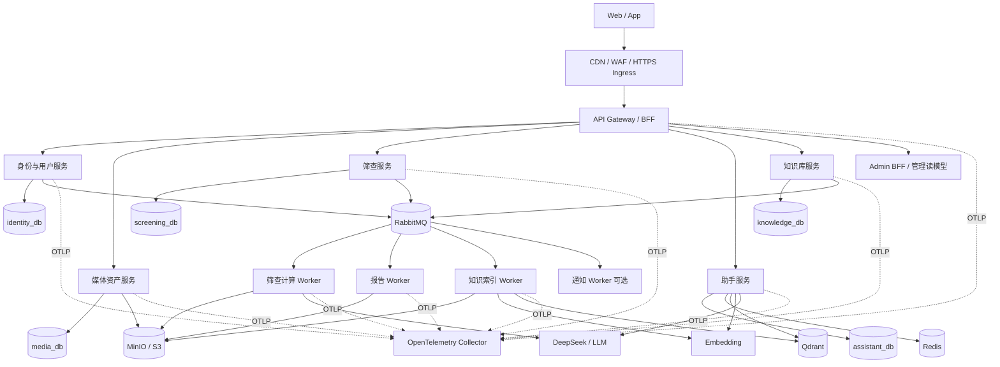
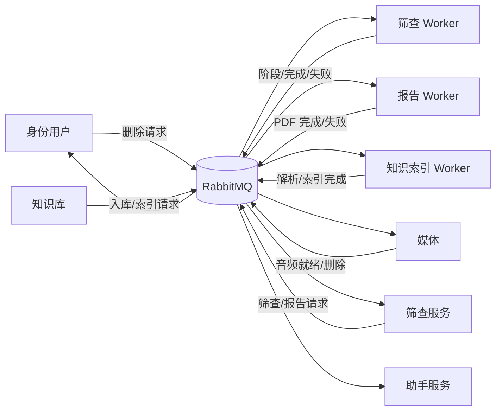
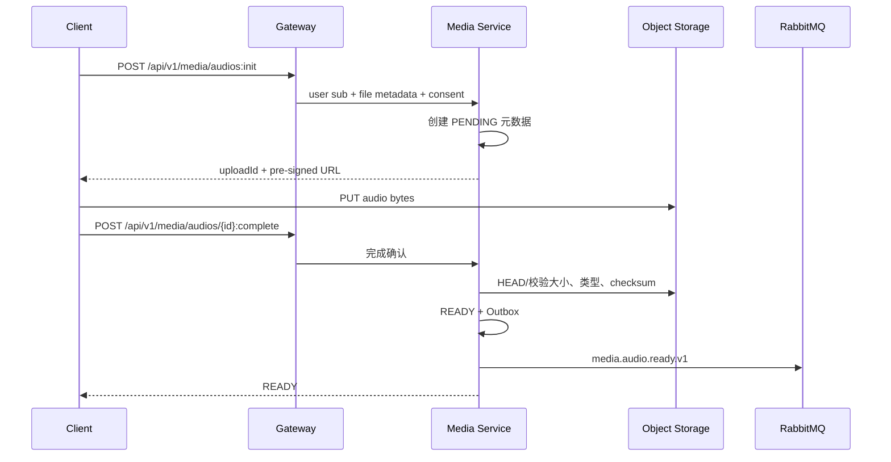
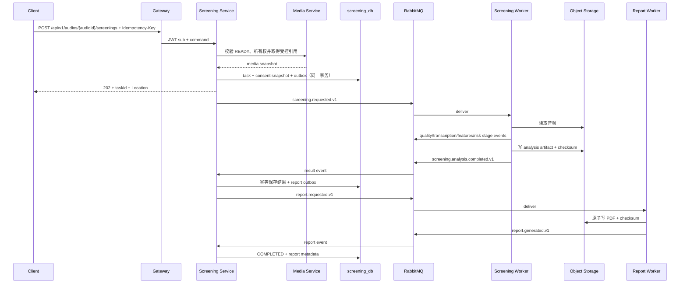
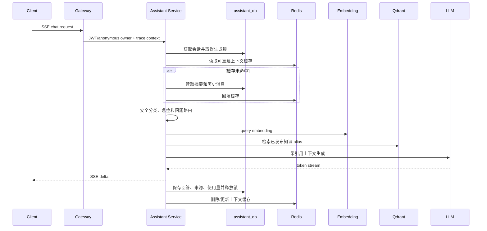
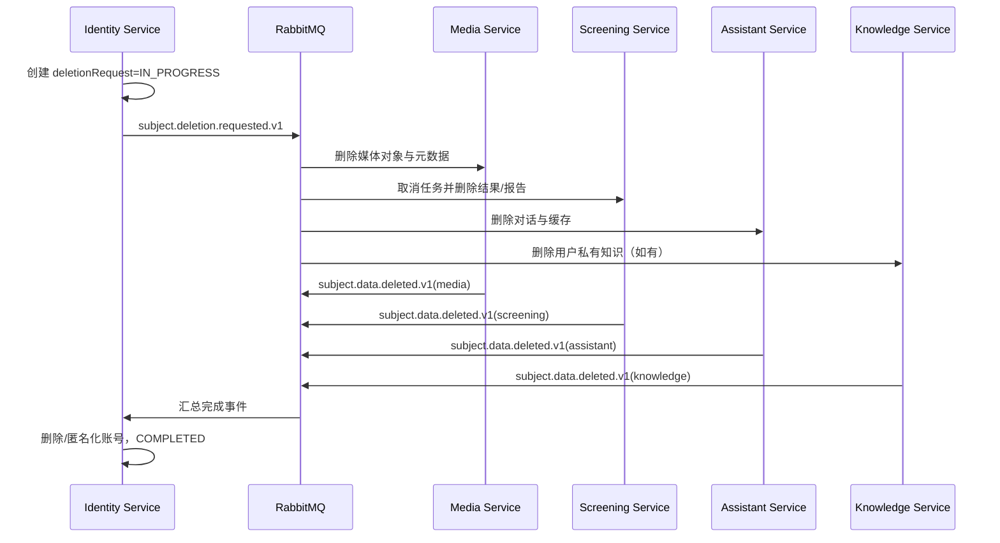
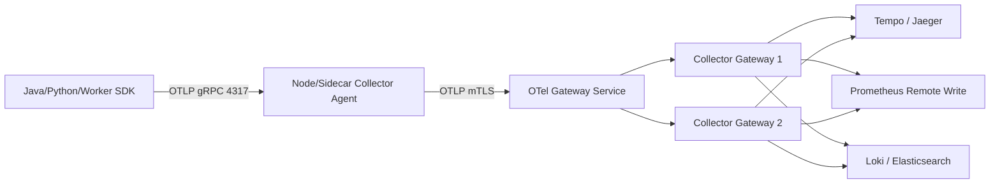

# 阿尔茨海默病语音筛查与知识助手微服务架构改造任务书

> 文档状态：执行前评审稿  
> 版本：1.0  
> 编制日期：2026-08-29  
> 适用范围：`alzheimers-voice-assistant` 全栈、AI Worker、数据存储、中间件、部署与可观测性  
> 术语说明：本文统一使用正确名称 **OpenTelemetry（OTel）**。

## 1. 任务书目的

本任务书用于把当前“Spring Boot 综合后端 + Python 筛查进程 + 本机文件 + 单库”的实现，渐进改造成职责清晰、可独立部署、可横向扩展、可追踪、可恢复的微服务系统。

任务书同时固定以下内容：

1. 目标系统的整体结构与部署单元；
2. 各业务分支的正常、异常、取消和删除逻辑；
3. 服务的数据所有权、同步接口和异步事件；
4. MySQL、Redis、RabbitMQ、对象存储、Qdrant、Embedding 与 LLM 的信号链路；
5. OpenTelemetry Trace、Metrics、Logs 的采集、传播、脱敏和存储方案；
6. 分阶段任务、依赖、交付物、验收标准和回滚条件。

本任务书是实施基线，不要求第一批次同时物理拆出所有服务。实施顺序必须遵循“先模块和数据边界，后独立部署；先可靠链路，后增加服务数量”。

## 2. 建设目标和非目标

### 2.1 建设目标

- 任何 API 实例不保存本地业务状态，可以运行至少两个副本；
- 用户、媒体、筛查、助手、知识库分别拥有自己的数据；
- AI 推理、PDF、Embedding 等长任务不占用 API 请求线程；
- 筛查任务在服务重启、消息重复、用户离线时仍可完成；
- Redis 清空不丢失业务最终状态；
- Qdrant 损坏后可从已审核知识重新构建；
- 所有 HTTP、RabbitMQ、数据库、对象存储和外部模型调用可形成关联 Trace；
- 日志、Trace 和指标中不泄露语音、转录、健康报告、手机号、Token 或 API Key；
- 每个迁移批次可以独立灰度和回滚。

### 2.2 非目标

- 不以“每张表一个服务”为目标；
- 不在首期建设跨地域双活；
- 不引入分布式数据库事务或两阶段提交；
- 不把 RabbitMQ 当同步 RPC 总线；
- 不把 Redis、RabbitMQ 或 Qdrant当业务最终真相源；
- 不一次性把 Python 组合 Worker 拆成五个代码仓库；
- 不建设同时处理筛查报告和知识文献的通用“PDF 服务”。

## 3. 当前基线与必须解决的问题

当前系统已经具备 `screening_task`、Outbox、RabbitMQ、消费幂等、Python 后台 Worker、PDF 后台处理、RAG、多轮会话和 Redis 缓存等基础，不需要推倒重建。

必须解决的结构性问题如下：

| 编号 | 当前问题 | 目标状态 |
| --- | --- | --- |
| B-01 | `AudioController` 同时负责媒体、筛查、结果和 PDF | 按媒体、筛查、报告职责拆分 |
| B-02 | 同步 Python HTTP 筛查与异步 MQ 筛查并存 | 正式链路只保留异步任务模式 |
| B-03 | 音频、PDF、分析产物写本机目录 | 迁移到 MinIO/S3 对象存储 |
| B-04 | 用户、音频、筛查、PDF 通过跨领域外键绑定 | 服务独立 Schema，移除跨服务外键 |
| B-05 | 自研 JWT 与控制器内重复解析用户 | Spring Security/OIDC，JWT `sub` 为稳定用户 ID |
| B-06 | 管理端跨领域直接查询和删除 | Admin BFF 调用领域 API 或查询读模型 |
| B-07 | Qdrant 初始化与在线请求耦合 | 离线索引、审核、版本发布和 alias 切换 |
| B-08 | 仅有零散指标，无法还原跨 HTTP/MQ 链路 | OpenTelemetry 统一 Trace、Metrics、Logs |
| B-09 | 配置存在开发默认凭据和路径 | Secret 管理、启动校验、环境隔离 |
| B-10 | 缺少标准镜像、发布、灰度、回滚 | 容器化、CI/CD、制品签名和渐进发布 |

## 4. 总体设计原则

1. **业务能力决定服务边界**：表和技术语言不能单独决定服务边界。
2. **数据由唯一服务写入**：服务不得查询或更新其他服务数据库。
3. **同步查询、异步长任务**：轻量即时反馈用 HTTP；计算、通知、索引和删除传播用事件。
4. **本地事务 + Outbox**：不直接双写数据库与 MQ，不采用分布式事务。
5. **至少一次 + 幂等**：允许消息重复，通过 Inbox、唯一约束和确定性产物得到正确结果。
6. **对象存储传递大对象**：MQ 仅传 ID、版本、checksum 和受控引用。
7. **业务关联 ID 与 Trace ID 分离**：`taskId`/`conversationId` 可长期查询；Trace ID 只用于可观测性。
8. **自动埋点覆盖技术层，手工 Span 覆盖业务层**。
9. **健康数据最小化**：业务正文不进入 Baggage、指标标签、Span 名称和普通日志。
10. **渐进式绞杀迁移**：由网关逐路由切换，旧实现保留有限回退窗口。

## 5. 目标整体结构

### 5.1 逻辑架构



### 5.2 首期与目标态部署单元

| 部署单元 | 首期形态 | 目标态 | 扩容信号 |
| --- | --- | --- | --- |
| Gateway | 独立进程，2 副本 | 独立服务 | RPS、连接数、p95 |
| Core API | 用户、媒体元数据、筛查控制面的模块化单体 | 逐步拆成 3 个服务 | 各路由延迟和发布频率 |
| Assistant Service | 优先独立 | 独立服务 | SSE 连接、LLM 并发、Token |
| Screening Worker | 组合 Worker | 按质检/转录/特征/风险拆池 | 队列深度、CPU/GPU |
| Report Worker | 独立进程 | 独立 Worker | PDF 队列和处理时延 |
| Knowledge Index Worker | Job/单 Worker | 独立 Worker 池 | 入库队列、Embedding 吞吐 |
| Admin BFF | Core API 内模块 | 独立 BFF/读模型 | 管理查询负载 |

### 5.3 建议仓库结构

```text
services/
  gateway/
  identity-service/
  media-service/
  screening-service-api/
  assistant-service/
  knowledge-service/
  admin-bff/
workers/
  screening-worker/
  report-worker/
  knowledge-index-worker/
contracts/
  openapi/
  asyncapi/
  json-schema/
platform/
  otel-collector/
  kubernetes/
  compose/
  dashboards/
  alerts/
deploy/
  migrations/
docs/
```

迁移过程中可以继续单仓库。公共库只允许放认证客户端、错误模型、OTel、JSON 和测试等技术能力，禁止共享实体、Mapper 和业务 Service。

## 6. 服务目录与职责边界

### 6.1 服务总表

| 服务 | 拥有的核心数据 | 主要同步能力 | 发布事件 | 消费事件 |
| --- | --- | --- | --- | --- |
| Gateway/BFF | 无业务数据库 | 路由、认证、聚合 | 安全审计可选 | 无 |
| 身份与用户服务 | 账号、凭据、角色、资料、删除申请 | 注册、登录、资料、账号管理 | `identity.*`、`subject.deletion.*` | 删除完成事件 |
| 媒体资产服务 | 音频元数据、对象引用、同意快照 | 上传、确认、下载授权、删除 | `media.audio.*` | 删除请求 |
| 筛查服务 | 任务、状态、结果、产物、报告元数据、Outbox/Inbox | 创建、查询、取消、重试、结果读取 | `screening.*`、`report.requested` | Worker、报告和删除事件 |
| 助手服务 | 会话、消息、摘要、模型使用 | 会话、SSE 对话 | `assistant.*` | 用户删除、知识发布 |
| 知识库服务 | 文档、版本、审核、发布版本 | 上传、审核、发布、回滚 | `knowledge.*` | 文档处理结果、删除请求 |
| Admin BFF | 只读投影可选 | 管理查询和领域命令编排 | 管理审计 | 各领域统计事件 |
| 筛查 Worker | 无业务主库；可有运行态 Inbox | 无公网接口 | 阶段、完成、失败事件 | 筛查请求/阶段命令 |
| 报告 Worker | 无业务主库 | 无公网接口 | `report.generated/failed` | `report.requested` |
| 知识索引 Worker | 无业务主库 | 无公网接口 | 解析、索引结果事件 | `knowledge.ingest.requested` |

### 6.2 Gateway/BFF

必须负责：TLS 后的应用路由、JWT/OIDC 验证、CORS、请求大小、粗粒度限流、Trace Context 入口、灰度和 API 版本。

不得负责：资源所有权、筛查状态机、跨库事务、健康数据缓存、把下游失败伪装为成功。

必须删除客户端伪造的内部身份头，只允许 Gateway 写入受信内部头；业务服务仍要验证 Token 或使用服务网格身份。

### 6.3 身份与用户服务

拥有 `identity_db`，包括账号、凭据、角色、用户资料、登录审计和隐私删除申请。JWT 的 `sub` 必须是稳定、不可复用的用户 ID。其他服务不能通过用户名反查用户来完成每次请求认证。

账号认证与个人资料可以先在同一服务内分模块；当认证交给 Keycloak/托管 OIDC 后，本服务保留业务资料与账号映射。

### 6.4 媒体资产服务

拥有 `media_db.audio_asset` 和对象存储中的音频对象。服务生成或校验 object key，禁止接受任意本机绝对路径。数据库只保存元数据、checksum、同意版本和对象引用。

媒体服务只说明“文件是否存在、是否属于用户、是否可用于筛查”，不拥有筛查任务和结果。

### 6.5 筛查服务

拥有任务受理、幂等、状态机、结果、报告元数据和筛查领域 Outbox/Inbox。Python 计算进程不是筛查服务的数据所有者。

`diagnosis_report` 在迁移时改造成语义更准确的 `screening_result`；对外统一使用“风险筛查结果”，不得宣称医学诊断。

### 6.6 助手服务

拥有会话、消息、摘要和使用量。MySQL 是最终真相，Redis 只存可重建上下文、生成锁、限流和预算。助手读取知识库的已发布索引，但不直接修改知识文档和 Qdrant 发布状态。

### 6.7 知识库服务

拥有文献 PDF、版本、解析状态、审核结果和索引发布记录。Qdrant 是由审核知识生成的派生索引。用户在线查询只能访问已发布 alias，不允许首次请求懒构建索引。

### 6.8 报告 Worker

报告 PDF 属于筛查领域的派生产物。Worker 从服务端可信结果生成 PDF，写入对象存储并发出完成事件，不接收浏览器提交的报告正文。首期不建设独立 `pdf_db`。

## 7. 服务关联规则

### 7.1 同步调用矩阵

`A → B` 表示 A 可以调用 B 的受控内部 API。

| 调用方 | 身份用户 | 媒体 | 筛查 | 助手 | 知识库 | Admin BFF |
| --- | ---: | ---: | ---: | ---: | ---: | ---: |
| Gateway | 路由 | 路由 | 路由 | 路由 | 管理路由 | 路由 |
| 身份用户 | — | 禁止 | 禁止 | 禁止 | 禁止 | 禁止 |
| 媒体 | 必要时查账号状态，不走高频路径 | — | 禁止 | 禁止 | 禁止 | 禁止 |
| 筛查 | 默认依赖 JWT 声明 | 校验媒体与获取受控引用 | — | 禁止 | 禁止 | 禁止 |
| 助手 | 默认依赖 JWT 声明 | 禁止 | 只允许受控读取筛查指南，不读取个人结果 | — | 获取发布版本/检索配置 | 禁止 |
| 知识库 | 默认依赖 JWT 声明 | 可复用对象存储抽象，不访问 media_db | 禁止 | 禁止 | — | 禁止 |
| Admin BFF | 调用 | 调用 | 调用 | 调用 | 调用 | — |

约束：

- 同步调用链原则上不超过 Gateway → 领域服务 → 一个内部服务；
- 超过一跳的组合查询放到 BFF 或读模型；
- 所有连接、读取和总时长都要有超时；
- 只有幂等调用允许有限自动重试；
- 禁止服务通过数据库替代 API。

### 7.2 异步依赖关系



## 8. 各分支业务逻辑

### 8.1 注册、登录与资料分支

正常流程：

1. Gateway 对注册和登录做 IP/账号级限流；
2. 身份服务校验输入，注册时在本地事务内创建账号和资料；
3. 登录成功签发 Access Token/Refresh Token，或由 OIDC Provider 签发；
4. Gateway 和业务服务基于 JWKS 验证 Token；
5. 账号禁用、角色变更发布版本化事件；
6. 管理敏感操作记录审计事件。

异常分支：账号锁定、密码错误、Token 过期、角色不足统一使用稳定错误码；日志不记录密码、Token 和完整手机号。

### 8.2 音频上传分支



异常分支：

- 对象缺失、checksum 不符、格式不支持：标记 `REJECTED` 并删除残留；
- 客户端未完成上传：定时清理过期 `PENDING`；
- 对象存储不可用：返回 `503`，禁止回退到应用本机目录；
- 重复完成请求：通过 uploadId 和状态机幂等返回同一结果。

### 8.3 异步筛查主分支



业务规则：

- 创建接口只负责受理，必须返回 `202 Accepted`；
- `(user_id, idempotency_key)` 唯一；同一音频只允许一个有效任务；
- 单用户活动任务数、全局队列深度和模型容量共同决定准入；
- Worker 不写 `screening_db`；
- 每个阶段先检查取消状态和已有产物；
- 产物使用 `{taskId}/{stage}/{version}` 确定性路径；
- PDF 失败不回滚已完成筛查结果。

### 8.4 取消、重试和卡住任务分支

- 用户取消：`ACTIVE → CANCEL_REQUESTED`，发布取消事件；Worker 在昂贵阶段前检查，最终进入 `CANCELLED`；
- 临时错误：进入延迟重试队列，指数退避加抖动；
- 永久错误：进入 `FAILED` 和独立 DLQ，不重复调用模型；
- 人工重试：只允许任务所有者重试 `FAILED`，从最后一个可信 artifact 继续；
- 卡住恢复：Reconciliation Job 检查长时间未更新任务、未发布 Outbox、结果缺 PDF、对象与数据库不一致；
- 用户重复点击：返回同一任务，不产生新消息和新 PDF。

### 8.5 报告读取和下载分支

1. 客户端按 taskId 查询筛查结果；
2. 筛查服务校验 `owner_id == JWT.sub`；
3. 返回结构化结果和报告状态；
4. 下载时生成短时效预签名 URL，或由媒体安全代理流式返回；
5. 下载操作写审计，不暴露真实对象路径；
6. 已完成结果和 PDF 的删除必须走隐私删除流程，不通过普通文件删除绕过审计。

### 8.6 RAG 对话分支



降级分支：

- Redis 不可用：回退 MySQL，采用保守本地并发限制；
- Qdrant/Embedding 不可用：回退审核过的本地 FAQ，并标记检索降级；
- LLM 超时或限额：停止流式响应，保存稳定错误状态；禁止伪造完整回答；
- 客户端断开：尽可能取消下游生成；无法取消时不得无限占用生成锁；
- 高风险/急症问题：优先返回规则化安全提示，不等待普通 RAG 链路。

### 8.7 知识 PDF 入库与发布分支

```text
登记文档和版本
→ 预签名上传对象存储
→ 格式/恶意文件/版权元数据检查
→ 发布 knowledge.ingest.requested.v1
→ 文本提取/OCR
→ 分块和元数据生成
→ 人工审核
→ Embedding
→ 写入新版本 Qdrant collection
→ 离线召回、安全和引用评测
→ 原子切换 alias
→ 发布 knowledge.index.published.v1
→ 助手刷新发布版本缓存
```

失败时保留当前线上 alias，不允许半成品 collection 被在线查询。回滚只需将 alias 切回上一已审核版本。

### 8.8 管理业务分支

Admin BFF 验证管理员角色后调用各领域 API。列表和统计采用分页 API 或事件驱动读模型，不跨库 Join。删除用户、删除音频、重建索引、重放 DLQ 等高风险动作需要二次确认、原因、操作者和审计 ID。

### 8.9 用户隐私删除分支



任何一个服务失败都不能将请求标记完成；协调器必须可重试和显示分服务进度。审计记录只能保留必要、脱敏、不可反推的内容。

## 9. 数据所有权与一致性

### 9.1 Schema 规划

| Schema | 核心表 |
| --- | --- |
| `identity_db` | `account`、`credential`、`user_profile`、`role`、`login_audit`、`deletion_request` |
| `media_db` | `audio_asset`、`upload_session`、`media_outbox_event`、`media_consumed_event` |
| `screening_db` | `screening_task`、`screening_result`、`screening_artifact`、`report_artifact`、`outbox_event`、`consumed_event` |
| `assistant_db` | `conversation`、`message`、`memory_segment`、`model_usage`、`outbox_event` |
| `knowledge_db` | `source_document`、`document_version`、`ingestion_job`、`review_record`、`index_release` |
| `admin_read_db`（可选） | 用户、任务、用量等脱敏只读投影 |

首期允许这些 Schema 位于同一高可用 MySQL 集群，但必须使用不同数据库账号和权限。目标服务不得存在跨 Schema 外键或直接 SQL。

### 9.2 一致性模式

- 服务内强一致：本地数据库事务；
- 数据库与 MQ：Transactional Outbox；
- 消费幂等：Inbox/`consumed_event`、业务唯一键、状态机版本；
- 跨服务流程：Saga/事件协作；
- 读模型：最终一致；
- 对象与元数据：临时对象 + checksum + 原子提交 + Reconciliation；
- 缓存：Cache Aside，数据库为最终真相；
- 向量索引：版本化派生数据，alias 原子发布。

### 9.3 数据迁移原则

1. 新 Schema 建表并通过 Flyway 管理；
2. 全量回填并校验行数、主键、checksum；
3. 必须零停机时用 Outbox/CDC 同步增量，禁止长期应用双写；
4. 影子读对比，但不让影子服务产生外部副作用；
5. Gateway 切换唯一写入方；
6. 旧表只读保留回滚窗口；
7. 稳定且备份可恢复后再单独评审归档旧表。

## 10. 中间件与信号链路

### 10.1 RabbitMQ 拓扑

建议逻辑拓扑：

```text
exchanges
  alz.domain.events      topic, durable
  alz.domain.commands    topic/direct, durable
  alz.retry              topic, durable
  alz.dlx                topic, durable

queues
  screening.request.q
  screening.quality.q
  screening.transcription.q
  screening.features.q
  screening.risk.q
  screening.result.q
  report.request.q
  report.result.q
  knowledge.ingest.q
  knowledge.index.q
  privacy.delete.media.q
  privacy.delete.screening.q
  privacy.delete.assistant.q
  *.retry.q
  *.dlq
```

首期组合 Worker 只需 `screening.request.q`；后续按资源瓶颈启用分阶段队列。生产使用 Quorum Queue、publisher confirm、mandatory publish、手动 ACK、有界 prefetch、独立 retry/DLQ、TLS 和最小权限 vhost。

统一事件信封：

```json
{
  "eventId": "uuid",
  "eventType": "screening.requested.v1",
  "schemaVersion": 1,
  "aggregateType": "screeningTask",
  "aggregateId": "task-id",
  "correlationId": "business-flow-id",
  "causationId": "previous-event-id",
  "occurredAt": "2026-08-29T00:00:00Z",
  "producer": "screening-service",
  "payload": {}
}
```

OTel 的 `traceparent`、`tracestate` 放在 AMQP message headers，不替代 `eventId`、`correlationId` 和 `taskId`。

### 10.2 Redis

Redis 只存可重建数据，使用明确前缀和 TTL：

```text
gw:ratelimit:{principal}:{route}
auth:risk:{accountHash}
assistant:context:{conversationId}
assistant:generation-lock:{conversationId}
assistant:budget:{principal}:{period}
screening:status:{taskId}
screening:admission:queue-depth
```

禁止保存完整语音、完整报告、长期会话真相和唯一任务状态。Redis 故障演练必须证明系统能回退数据库且不会完全放开限流。

### 10.3 对象存储

建议逻辑 Bucket/Prefix：

```text
alz-private-media/audio/{ownerId}/{audioId}/{version}
alz-private-artifacts/screening/{taskId}/{stage}/{version}
alz-private-reports/screening/{taskId}/{version}.pdf
alz-private-knowledge/source/{documentId}/{version}.pdf
alz-private-knowledge/parsed/{documentId}/{version}/...
```

开启服务端加密、版本、生命周期、审计和私有访问。用户下载使用短时效签名 URL；MQ 和日志不包含签名 URL。

### 10.4 Qdrant 与 Embedding

- Qdrant 只接受知识索引 Worker 写入；
- 助手服务只查询已发布 alias；
- collection 名称包含知识版本，不包含用户 PII；
- Embedding 服务不得将输入正文写普通日志；
- 索引写入和发布分离，构建失败不影响当前线上版本；
- 为 collection、模型、维度、分块策略建立兼容性记录；
- 定期快照并验证可从源文档重建。

### 10.5 MySQL

- 使用 Flyway；
- 开启 binlog、备份和时间点恢复；
- 服务独立账号和连接池；
- 慢查询与连接池等待监控；
- Outbox 查询必须有索引和批次上限；
- 敏感列按需要做应用层或数据库层加密；
- 不把 Trace ID 作为业务主键或长期一致性依据。

## 11. OpenTelemetry 全链路追踪方案

### 11.1 建设范围

统一建设三类信号：

| 信号 | 目的 | 典型后端 |
| --- | --- | --- |
| Traces | 还原跨 HTTP、MQ、数据库、对象存储、模型的因果链 | Tempo/Jaeger/兼容 OTLP 平台 |
| Metrics | SLO、容量、队列、资源和业务趋势 | Prometheus + Grafana |
| Logs | 结构化诊断、审计和异常细节 | Loki/ELK/兼容日志平台 |

三类信号必须通过 `service.name`、`deployment.environment.name`、`trace_id`、`span_id` 和稳定业务关联 ID 相互跳转。

### 11.2 Collector 部署结构

开发环境使用单个 Collector；生产采用 Agent + Gateway 两层：



职责：

- Agent：接收本节点 OTLP、补充主机/Kubernetes资源属性、批处理和本地削峰；
- Gateway：统一过滤、脱敏、Tail Sampling、路由到观测后端；
- Trace ID 感知负载均衡：同一 Trace 的 Span 必须进入同一个 Tail Sampling Collector；
- Collector 至少两个副本，配置内存限制、队列、重试和健康检查；
- 应用只上报 OTLP，不直接绑定 Jaeger、Tempo 或商业厂商 SDK。

推荐 Collector Pipeline 结构：

```yaml
receivers:
  otlp:
    protocols:
      grpc: {}
      http: {}

processors:
  memory_limiter: {}
  k8sattributes: {}
  resource: {}
  attributes/remove_sensitive: {}
  redaction: {}
  tail_sampling: {}
  batch: {}

exporters:
  otlp/traces: {}
  prometheusremotewrite: {}
  otlphttp/logs: {}

service:
  pipelines:
    traces: {receivers: [otlp], processors: [memory_limiter, k8sattributes, resource, attributes/remove_sensitive, redaction, tail_sampling, batch], exporters: [otlp/traces]}
    metrics: {receivers: [otlp], processors: [memory_limiter, k8sattributes, resource, batch], exporters: [prometheusremotewrite]}
    logs: {receivers: [otlp], processors: [memory_limiter, k8sattributes, resource, attributes/remove_sensitive, redaction, batch], exporters: [otlphttp/logs]}
```

以上为结构模板，实际组件字段必须锁定 Collector 版本后通过配置测试验证。

### 11.3 上下文传播规范

内部 HTTP 和 RabbitMQ 统一使用 W3C Trace Context：

```text
traceparent
tracestate
```

传播规则：

1. Gateway 对公网传入的 Trace Context 做格式校验和信任边界处理；
2. Java/Python HTTP 客户端自动注入，服务端自动提取；
3. MQ Producer 将当前 Context 注入 AMQP headers；
4. MQ Consumer 在创建 `process <queue>` Span 前提取 headers；
5. 正常单消息处理以消息创建 Context 为父；
6. 重试、批量、扇出和汇聚使用 Span Link 表达多个因果来源；
7. 跨第三方 LLM/搜索接口默认不发送内部 Baggage；是否发送 `traceparent` 单独评审；
8. 不允许用自定义 `X-Trace-Id` 替代标准传播；现有业务 `traceId` 字段迁移为 `correlationId` 或仅作兼容。

业务 ID 与 OTel ID：

| 字段 | 生命周期 | 用途 |
| --- | --- | --- |
| `taskId` | 业务保留期 | 查询筛查任务 |
| `eventId` | 消息审计期 | 消息幂等 |
| `correlationId` | 一个业务流程 | 串联删除、筛查、索引流程 |
| `trace_id` | 可观测保留期 | 跨组件诊断 |
| `span_id` | 单操作 | 定位具体调用 |

### 11.4 Baggage 与敏感数据策略

默认关闭业务 Baggage。确需启用时只允许低敏、低基数、经过白名单审核的值，例如发布渠道或实验组，不允许放入：

- 用户 ID、用户名、手机号、IP 明文；
- audioId 对应的文件名和对象路径；
- 转录文本、报告、对话内容、Prompt、模型输出；
- JWT、Cookie、API Key；
- 风险等级、病史和量表结果。

公网传入 Baggage 一律丢弃。向 DeepSeek、联网搜索等外部服务发请求前清空内部 Baggage。

### 11.5 Java 埋点方案

首选 OpenTelemetry Java Agent 自动覆盖：

- Spring MVC/Security；
- HTTP 客户端；
- JDBC/MySQL；
- Redis/Lettuce；
- RabbitMQ/Spring AMQP；
- JVM、线程池和运行时指标；
- 日志 Trace Context 注入。

在自动 Span 上补充手工业务 Span，禁止重复创建同含义 Span。建议名称：

```text
identity.login
media.upload.initialize
media.upload.complete
screening.task.accept
screening.task.cancel
screening.outbox.publish
screening.result.persist
assistant.turn.prepare
assistant.safety.route
assistant.rag.retrieve
assistant.answer.generate
knowledge.release.publish
report.metadata.persist
privacy.deletion.coordinate
```

首期使用 Java Agent 快速覆盖；只有需要 Native Image、Agent 冲突或启动开销不可接受时，才改为 OpenTelemetry Spring Boot Starter。自定义埋点使用 OTel API/`@WithSpan`，不把 SDK 实现扩散到业务层。

### 11.6 Python 埋点方案

Python Worker 使用 OTel SDK/自动埋点覆盖 HTTP 客户端和支持的库，并手工创建业务阶段 Span：

```text
screening.message.process
screening.audio.fetch
screening.quality.analyze
screening.transcription.run
screening.features.extract
screening.risk.infer
screening.artifact.write
screening.event.publish
knowledge.document.extract
knowledge.chunks.embed
knowledge.qdrant.upsert
report.pdf.render
report.object.commit
```

Pika 自定义消费者必须显式完成 AMQP headers 的 Context extract/inject。异常使用 `record_exception` 和标准 Span status；稳定错误码作为属性，完整音频、Prompt、转录与报告不得成为事件或属性。

### 11.7 Span 命名与属性规范

资源属性至少包含：

```text
service.name
service.namespace=alz
service.version
service.instance.id
deployment.environment.name
cloud.region / k8s.namespace.name / k8s.pod.name（按环境）
```

允许的自定义 Trace 属性：

```text
alz.task.id
alz.event.id
alz.conversation.id
alz.document.id
alz.operation.stage
alz.model.provider
alz.model.name
alz.model.version
alz.retry.attempt
alz.result.status
```

限制：

- Span 名称不得包含 taskId、URL 实参、用户名或文件名；
- `taskId` 等高基数值只进入 Trace/结构化日志，不进入指标标签；
- SQL 语句采集必须关闭参数值或经过脱敏；
- HTTP query/body/header 只按白名单采集；
- 模型 Prompt/Completion 默认不采集；
- 数据库密码、Token 和签名 URL 必须被 Collector 二次剔除。

### 11.8 异步筛查 Trace 结构

```text
HTTP POST /screenings                     SERVER
└─ screening.task.accept                  INTERNAL
   ├─ SELECT media metadata               CLIENT
   ├─ INSERT task + outbox                 CLIENT
   └─ send screening.request.q             PRODUCER
      └─ process screening.request.q       CONSUMER
         ├─ screening.audio.fetch
         ├─ screening.quality.analyze
         ├─ screening.transcription.run
         ├─ screening.features.extract
         ├─ screening.risk.infer
         ├─ screening.artifact.write
         └─ send screening.result.q        PRODUCER
            └─ process screening.result.q  CONSUMER
               ├─ screening.result.persist
               └─ send report.request.q
                  └─ process report.request.q
                     ├─ report.pdf.render
                     ├─ report.object.commit
                     └─ send report.result.q
```

排队时延通过 producer end 到 consumer process start 计算。长时间重试不强求所有重试 Span 都成为严格父子链；重试 process Span 使用原消息创建 Context 和前一次 attempt Span Link，并在属性中记录 attempt。

### 11.9 指标规范

平台指标：

- HTTP RPS、p50/p95/p99、5xx；
- JVM、Python 进程、CPU、内存、GC、线程池、GPU/显存；
- MySQL 连接池、慢查询、事务回滚；
- Redis 命中率、错误和延迟；
- RabbitMQ ready/unacked、oldest message age、redelivery、DLQ；
- Collector 接收、丢弃、队列、导出失败。

业务指标：

```text
alz_screening_tasks_total{status,stage,model_version}
alz_screening_stage_duration_seconds{stage,model_version,outcome}
alz_screening_active_tasks{stage}
alz_screening_admission_rejected_total{reason}
alz_report_generation_total{outcome}
alz_assistant_turns_total{route,outcome,model}
alz_assistant_generation_duration_seconds{model,outcome}
alz_assistant_tokens_total{model,direction}
alz_rag_retrieval_total{source,outcome,index_version}
alz_knowledge_ingestion_total{stage,outcome}
alz_privacy_deletion_requests{status}
```

指标标签禁止使用 userId、taskId、conversationId、audioId、documentId 和错误原文。

### 11.10 日志关联

所有服务输出 JSON 日志，字段至少包含：

```json
{
  "timestamp": "...",
  "level": "INFO",
  "service": "screening-service",
  "trace_id": "...",
  "span_id": "...",
  "correlation_id": "...",
  "task_id": "...",
  "event_id": "...",
  "stage": "TRANSCRIPTION",
  "error_code": null,
  "message": "stage completed"
}
```

`message` 使用模板化短文本，不拼接请求正文、转录、报告、Prompt、外部响应或凭据。审计日志与普通运行日志采用不同索引、权限和保留期。

### 11.11 采样策略

开发/测试可以 100% 采样。生产采用低比例 Head Sampling + Gateway Tail Sampling：

- 错误 Trace：100%；
- 超过 SLO 的慢 Trace：100%；
- 管理高风险、删除、DLQ 重放：100%，但属性严格脱敏；
- 筛查全链路：上线初期 100%，稳定后按容量降低；
- 普通健康检查：过滤或极低比例；
- 普通助手成功请求：按成本和流量采样；
- 采样策略变更必须保留配置版本和变更审计。

Tail Sampling 的等待时间要覆盖常规 HTTP Trace；跨数分钟/小时的异步业务不能只依赖 Tail Sampling 保留，应同时依靠 taskId、eventId、指标和结构化日志查询。

### 11.12 OpenTelemetry 验收标准

- 从一次筛查创建请求可跳转到 MQ Producer、Worker Consumer、模型阶段、结果入库和 PDF；
- RabbitMQ 中可验证 `traceparent` 注入与提取，但业务 payload 不含追踪字段；
- Java 和 Python Span 位于同一 Trace 或通过 Span Link 明确关联；
- Trace 页面可跳转到相同 `trace_id` 的日志；
- 指标页面可通过 Exemplars 跳转到代表性 Trace（观测后端支持时）；
- Collector 或观测后端短暂不可用不阻塞业务请求；
- Collector 压测中无不可解释的 Span 丢失；
- 自动扫描确认 Telemetry 中没有 Token、手机号、转录、报告、Prompt 和签名 URL；
- 一个服务版本发布后，`service.version` 能准确区分新旧实例。

## 12. API 与事件契约

### 12.1 建议外部 API

```text
/api/v1/auth/**
/api/v1/users/me
/api/v1/media/audios/**
/api/v1/screenings/**
/api/v1/assistant/conversations/**
/api/v1/knowledge/**          管理权限
/api/v1/admin/**
```

旧 `/user`、`/audio`、`/assistant` 路径在 Gateway 提供限期兼容映射，并返回 deprecation/sunset 信息。新服务不得继续扩展旧路径。

### 12.2 API 规则

- 使用统一错误信封：`code`、`message`、`traceId`、`timestamp`；
- 响应 `traceId` 只用于报障，不返回内部 Span 信息；
- 创建异步资源返回 `202 + Location + Retry-After`；
- 写接口接受 `Idempotency-Key`；
- 分页统一 cursor 或 page/size 规则；
- 时间统一 ISO-8601 UTC，展示层转换时区；
- 内部 API 与外部 API 使用不同网络入口和认证 audience；
- OpenAPI 在 CI 中执行兼容性检查。

### 12.3 事件契约规则

- AsyncAPI 描述 exchange、routing key、queue 和 payload；
- JSON Schema 必须有 `schemaVersion`；
- 新增字段保持向后兼容，删除/改义使用新事件版本；
- Consumer 支持当前和上一主版本的迁移窗口；
- 契约测试覆盖 Java producer ↔ Python consumer；
- 消息不超过设定上限，正文和二进制只使用对象引用；
- DLQ 重放工具必须校验 Schema、目标环境和幂等键。

## 13. 安全、权限与医疗数据边界

### 13.1 身份与服务间认证

- 外部用户使用 OIDC/OAuth2；
- Gateway 验证 issuer、audience、签名、有效期和必要 scope；
- 服务仍校验资源所有权和领域角色；
- 服务间采用 mTLS/Workload Identity 或独立 client credentials；
- 内部 API 不暴露公网；
- Secret 由 KMS/Secret Manager 注入，不写镜像、配置默认值和日志。

### 13.2 数据保护

- 音频、转录、健康资料、筛查结果、助手对话按敏感数据处理；
- 数据库、对象存储、备份、MQ 持久化磁盘静态加密；
- 生产网络全链路 TLS；
- 明确保留期、合法处理目的、用户同意版本和删除流程；
- 对象下载最短权限和时效；
- 第三方模型只发送完成业务所需的最少数据；
- 所有模型调用记录 provider、model/version、耗时和稳定状态，不记录正文。

### 13.3 审计事件

必须审计：管理员登录、角色变更、用户禁用、敏感资料读取、音频/报告下载、数据删除、DLQ 重放、索引发布/回滚、配置和采样策略变更。审计存储只追加、独立权限、不可由普通业务管理员修改。

## 14. 韧性、限流、熔断与降级

| 依赖故障 | 系统行为 | 禁止行为 |
| --- | --- | --- |
| MySQL | 写请求失败，Readiness 降级 | 写入 Redis 冒充成功 |
| Redis | 回退 MySQL和保守本地限流 | 完全放开流量 |
| RabbitMQ | Outbox 有界积压，超过阈值拒绝新长任务 | 丢弃任务或无限接受 |
| 对象存储 | 停止上传/产物提交，任务可重试 | 写应用本地磁盘继续运行 |
| Qdrant | 回退审核本地知识 | 未标记地编造引用 |
| Embedding | 停止新索引，查询按既定降级 | 写入维度不一致向量 |
| LLM | 分类重试/熔断，返回明确状态 | 伪造筛查结论 |
| Report Worker | 结果可用、PDF 延迟重试 | 将任务整体回滚失败 |
| OTel Collector | SDK 有界缓冲并丢弃 Telemetry，业务继续 | 阻塞业务线程等待导出 |

限流分三层：Gateway 的 IP/账号/路由令牌桶、领域服务的业务准入、Worker 的有界并发与 MQ prefetch。熔断配置在真实下游调用方；超时、重试、熔断和 Bulkhead 必须协同配置，避免重试风暴。

## 15. 分阶段工作分解结构（WBS）

优先级定义：`P0` 为后续阶段阻塞项，`P1` 为首轮生产必需，`P2` 为增强项。没有达到阶段退出条件不得大规模进入下一阶段。

### 阶段 M0：架构冻结与基线

目标：得到可测量现状、正式边界和兼容契约。

| ID | 优先级 | 任务 | 交付物 | 验收 |
| --- | --- | --- | --- | --- |
| M0-01 | P0 | 建立 identity/media/screening/assistant/knowledge 模块边界 | 包结构、依赖规则 | 架构测试阻止跨模块 Mapper/实体引用 |
| M0-02 | P0 | 盘点全部 API、表、文件和消息 | 资产清单、归属表 | 每项存在唯一 owner |
| M0-03 | P0 | 固定 v1 OpenAPI 和 AsyncAPI | `contracts/` 基线 | CI 能做 Schema 和兼容性校验 |
| M0-04 | P0 | 建立性能与容量基线 | RPS、p95、任务耗时、资源报告 | 可重复运行且有原始结果 |
| M0-05 | P0 | 建立安全数据分类 | 字段、日志、保留期矩阵 | 语音/健康/身份数据均有等级和责任人 |
| M0-06 | P1 | 创建 ADR 机制 | ADR 模板和首批决策 | 关键边界有可追溯结论 |

退出条件：模块边界、数据所有权、API/事件基线、敏感数据分类均通过评审。

### 阶段 M1：生产基础与无状态化

目标：在拆服务前消除本机状态和手工部署。

| ID | 优先级 | 任务 | 交付物 | 验收 |
| --- | --- | --- | --- | --- |
| M1-01 | P0 | 引入 ObjectStorageService 抽象 | MinIO/S3 适配器 | 两个 API 实例可读同一对象 |
| M1-02 | P0 | 迁移音频、artifact、PDF 到对象存储 | 迁移程序、校验报告 | 数量、大小、SHA-256 一致 |
| M1-03 | P0 | 引入 Flyway | 版本化迁移 | 空库和存量库均可自动升级 |
| M1-04 | P0 | 移除生产默认密钥和密码 | 启动校验、Secret 清单 | 缺少 Secret 时生产启动失败 |
| M1-05 | P1 | Java/Python/前端标准镜像 | Dockerfile、SBOM | 镜像可重复构建并通过漏洞阈值 |
| M1-06 | P1 | 建设 CI/CD | 测试、扫描、签名、部署、回滚 | 测试环境一键部署和回滚 |
| M1-07 | P1 | 拆分 API 与 Worker 启动角色 | Spring Profile/容器命令 | API 进程不消费 PDF/长任务 |

退出条件：应用节点可替换，本机目录清空不影响业务，数据库迁移和镜像交付自动化。

### 阶段 M2：OpenTelemetry 可观测性底座

目标：先具备观察能力，再开始跨服务迁移。

| ID | 优先级 | 任务 | 交付物 | 验收 |
| --- | --- | --- | --- | --- |
| M2-01 | P0 | 部署开发与测试 Collector | Collector 配置、Compose/K8s 资源 | OTLP Trace/Metrics/Logs 可查询 |
| M2-02 | P0 | 接入 Java Agent | 启动配置、版本锁定 | HTTP/JDBC/Redis/AMQP 自动 Span 完整 |
| M2-03 | P0 | 接入 Python OTel | requirements、初始化模块 | Worker 阶段 Span 可查询 |
| M2-04 | P0 | 实现 RabbitMQ W3C Context 注入/提取 | Java/Python 传播组件和测试 | Java Producer 到 Python Consumer 关联成功 |
| M2-05 | P1 | 增加业务 Span | 埋点规范、关键 Span | 筛查和 RAG 业务阶段可区分 |
| M2-06 | P0 | 结构化日志关联 | JSON 日志和字段规范 | 日志含正确 trace_id/span_id |
| M2-07 | P0 | Telemetry 脱敏 | Collector filter/redaction、扫描测试 | 禁止字段扫描结果为零 |
| M2-08 | P1 | 建设 Dashboard 与告警 | 服务、MQ、模型、Collector 看板 | 故障演练可触发并定位告警 |
| M2-09 | P1 | 生产 Collector Agent+Gateway | HA 部署、Tail Sampling | 单实例故障不影响业务和持续采集 |

退出条件：一条现有异步筛查可以跨 Java、RabbitMQ、Python、数据库和 PDF 被完整追踪，且无敏感正文。

### 阶段 M3：认证标准化与 Gateway

目标：建立统一入口和服务拆分所需的身份契约。

| ID | 优先级 | 任务 | 交付物 | 验收 |
| --- | --- | --- | --- | --- |
| M3-01 | P0 | 迁移到 Spring Security/OIDC | Resource Server 配置 | issuer/audience/expiry/role 测试通过 |
| M3-02 | P0 | JWT `sub` 改为稳定 userId | Token 兼容和迁移方案 | 服务不再按 username 每请求查用户 |
| M3-03 | P0 | 建设 Gateway 路由 | Gateway 服务、路由表 | 新旧路由均可灰度 |
| M3-04 | P1 | Gateway 限流和请求边界 | Redis 令牌桶、大小限制 | 压测下返回稳定 429/413 |
| M3-05 | P0 | 业务授权下沉 | ownership/RBAC 测试 | 绕过 Gateway 也不能越权 |
| M3-06 | P1 | 服务间身份 | mTLS或 client credentials | 内部 API 拒绝匿名调用 |
| M3-07 | P1 | Token/头部安全 | Header 白名单 | 伪造内部身份头测试失败 |

退出条件：所有外部流量经 Gateway；Token 不依赖单体用户查询；资源所有权仍由领域服务强制执行。

### 阶段 M4：筛查链路统一异步化

目标：消除正式同步筛查和客户端生成报告链路。

| ID | 优先级 | 任务 | 交付物 | 验收 |
| --- | --- | --- | --- | --- |
| M4-01 | P0 | 默认启用异步筛查 | 配置和迁移开关 | 创建任务稳定返回 202 |
| M4-02 | P0 | 下线同步诊断计算 | Deprecated/Sunset 与前端迁移 | 正式流量不调用同步 Python API |
| M4-03 | P0 | 下线 `/audio/pdf/save` | 服务端可信报告生成 | 客户端无法提交正文生成 PDF |
| M4-04 | P0 | 完善 Outbox/Inbox | 并发锁、唯一键、重试 | 发布和消费崩溃测试不丢不重 |
| M4-05 | P0 | 状态机与取消/重试 | 状态转换表和实现 | 非法转换被拒绝 |
| M4-06 | P1 | Reconciliation Job | 修复任务、产物、PDF | 人工制造不一致可自动修复/告警 |
| M4-07 | P1 | RabbitMQ 生产拓扑 | Quorum、retry、DLQ | 节点故障和消息重放测试通过 |
| M4-08 | P1 | 筛查准入控制 | 用户/队列/容量规则 | 队列超限时有界拒绝 |

退出条件：用户离线、服务重启和重复消息情况下任务仍能正确完成；旧同步链路无生产流量。

### 阶段 M5：抽取助手服务

目标：用低跨域依赖服务验证完整微服务交付模式。

| ID | 优先级 | 任务 | 交付物 | 验收 |
| --- | --- | --- | --- | --- |
| M5-01 | P0 | 建 `assistant_db` 与独立账号 | Flyway 迁移 | 仅助手服务可写入 |
| M5-02 | P0 | 迁移会话、消息、摘要 | 回填和增量方案 | 数量、顺序、owner 一致 |
| M5-03 | P0 | 抽取 Assistant API/SSE | 独立服务镜像 | Gateway 灰度路由可回滚 |
| M5-04 | P1 | Redis 缓存和生成锁标准化 | key/TTL/故障策略 | Redis 清空不丢会话 |
| M5-05 | P1 | LLM/RAG Bulkhead、熔断、预算 | 策略和指标 | 429/timeout 故障演练通过 |
| M5-06 | P1 | RAG/LLM OTel 手工 Span | Trace 和成本指标 | 不记录 Prompt/Completion |

退出条件：助手独立部署、扩缩容、发布和回滚；旧后端不访问 assistant 表。

### 阶段 M6：抽取媒体资产服务

目标：建立音频唯一所有者和统一对象访问边界。

| ID | 优先级 | 任务 | 交付物 | 验收 |
| --- | --- | --- | --- | --- |
| M6-01 | P0 | 建 `media_db.audio_asset` | Schema 和映射 | owner、checksum、consent 完整 |
| M6-02 | P0 | 实现预签名上传/完成确认 | Media API | 大文件不经过 Java 堆 |
| M6-03 | P0 | 迁移历史 `audio_record` | 回填工具 | 记录和对象一一对应 |
| M6-04 | P0 | 实现所有权和受控引用 API | 内部 API | 越权和路径穿越测试通过 |
| M6-05 | P1 | 发布 media 事件 | Outbox/AsyncAPI | ready/deleted 至少一次且幂等 |
| M6-06 | P1 | 清理 PENDING/孤儿对象 | Lifecycle Job | 失败上传不会永久占空间 |
| M6-07 | P1 | Gateway 切换媒体路由 | 灰度规则 | 可逐用户/比例切换和回滚 |

退出条件：Core API、筛查服务和 Worker 不再依赖本地音频目录或直接读取 `audio_record`。

### 阶段 M7：抽取筛查控制面

目标：筛查任务、结果和报告成为独立领域服务。

| ID | 优先级 | 任务 | 交付物 | 验收 |
| --- | --- | --- | --- | --- |
| M7-01 | P0 | 建 `screening_db` | Flyway 和独立账号 | 跨服务外键为零 |
| M7-02 | P0 | 迁移 task/result/artifact/report | 数据迁移程序 | 行数、状态、checksum 一致 |
| M7-03 | P0 | 抽取 Screening API | 独立服务 | 创建/查/取消/重试契约兼容 |
| M7-04 | P0 | 接入 Media 内部 API | 超时、熔断、快照 | Media 不可用时有明确 503 |
| M7-05 | P0 | Worker 禁止写业务库 | 权限与代码检查 | Worker DB 凭据中无 screening 写权限 |
| M7-06 | P1 | Report Worker 事件闭环 | report 事件与幂等 | 重复消费只有一份可信 PDF |
| M7-07 | P1 | 分离高负载 Worker 池 | 部署与队列 | 依据压测决定而非预先全拆 |
| M7-08 | P1 | Gateway 切换筛查路由 | 灰度和回滚 | 新旧结果影子比对通过 |

退出条件：旧后端不再访问筛查领域表；筛查服务和 Worker 可分别扩容与发布。

### 阶段 M8：知识库服务与索引治理

目标：将知识源管理、审核、索引构建与在线助手分离。

| ID | 优先级 | 任务 | 交付物 | 验收 |
| --- | --- | --- | --- | --- |
| M8-01 | P0 | 建 `knowledge_db` | 文档/版本/审核/发布 Schema | 状态机和 owner 明确 |
| M8-02 | P0 | 实现文档安全入库 | 上传、扫描、解析队列 | 非法 PDF 不进入解析 |
| M8-03 | P0 | 实现审核工作流 | Admin UI/API、审计 | 未审核文档不可发布 |
| M8-04 | P0 | 索引版本与 alias 发布 | Index Worker | 构建失败不影响线上 alias |
| M8-05 | P1 | 离线 RAG 评测 | 数据集、阈值和报告 | 召回、引用、安全达到门槛 |
| M8-06 | P1 | 助手刷新发布版本 | 事件消费 | alias 切换后无进程重启 |
| M8-07 | P1 | Qdrant 备份恢复 | Snapshot/重建 Runbook | 能从知识源恢复 |

退出条件：在线查询只使用已审核发布版本；可以无停机发布和回滚知识索引。

### 阶段 M9：用户服务、管理读模型与隐私删除

目标：完成跨域数据治理和管理能力解耦。

| ID | 优先级 | 任务 | 交付物 | 验收 |
| --- | --- | --- | --- | --- |
| M9-01 | P0 | 建 `identity_db` | 账号/资料/审计 Schema | 用户 ID 稳定且不可复用 |
| M9-02 | P0 | 抽取用户与资料 API | 独立服务 | 其他服务不读 user 表 |
| M9-03 | P0 | 实现隐私删除 Saga | 协调器、事件、进度 API | 部分失败可重试，不错误完成 |
| M9-04 | P1 | 建管理读模型 | 事件投影 | 管理统计不跨库 Join |
| M9-05 | P1 | Admin BFF 领域编排 | 独立或模块化 BFF | 管理命令有 RBAC 和审计 |
| M9-06 | P1 | 删除跨服务外键和旧表访问 | 权限、架构测试 | 违规访问 CI 失败 |

退出条件：所有核心服务达到数据库独占；用户删除、管理查询和审计走正式跨域流程。

### 阶段 M10：高可用、灾备与上线

目标：验证生产 SLO、恢复和运维能力。

| ID | 优先级 | 任务 | 交付物 | 验收 |
| --- | --- | --- | --- | --- |
| M10-01 | P0 | 多副本和 HPA | K8s 资源/伸缩策略 | 单 Pod 故障无用户中断 |
| M10-02 | P0 | MySQL/Redis/RabbitMQ HA | 托管或集群方案 | 故障切换演练通过 |
| M10-03 | P0 | 备份、PITR、对象恢复 | Runbook 和演练报告 | 满足评审后的 RPO/RTO |
| M10-04 | P0 | 全链路压测 | 容量模型 | 无失控队列、OOM、连接池耗尽 |
| M10-05 | P0 | 混沌/故障演练 | 场景和结果 | 依赖故障符合降级矩阵 |
| M10-06 | P1 | 灰度发布与自动回滚 | Canary、指标门禁 | 错误/延迟超阈值自动停止 |
| M10-07 | P0 | 安全与隐私验收 | 渗透、越权、Telemetry 扫描 | 高危问题为零 |
| M10-08 | P1 | 运维交接 | Dashboard、告警、Runbook、值班表 | 非开发人员可按手册恢复 |

退出条件：容量、可用性、恢复、安全、追踪和回滚全部完成演练并签字。

## 16. 测试与验收矩阵

### 16.1 契约和功能

- OpenAPI 向后兼容测试；
- AsyncAPI/JSON Schema producer-consumer 契约测试；
- Java ↔ Python 事件交叉测试；
- 每个资源的 owner 和 RBAC 测试；
- Idempotency-Key 重复、并发和过期测试；
- 状态机合法/非法迁移测试；
- SSE 中断、恢复和生成锁测试；
- PDF、知识索引和对象 checksum 测试。

### 16.2 可靠性

- 数据库提交后、Outbox 发布前终止进程；
- Consumer 落产物后、ACK 前终止；
- 同一消息重复 2～10 次；
- RabbitMQ、Redis、Qdrant、对象存储、LLM 分别中断；
- Worker OOM/崩溃/GPU 不可用；
- PDF 临时文件写入中断；
- Collector 和观测后端不可用；
- 删除 Saga 任一消费者失败。

### 16.3 性能与容量

- 登录、列表、状态查询和上传初始化的 RPS/p95；
- 10、50、100 用户同时提交筛查；
- Whisper/特征/LLM/PDF 各阶段独立吞吐；
- RabbitMQ oldest message age 和恢复速率；
- SSE 并发连接、首 Token 和完整响应时延；
- Qdrant 检索 p95、Embedding 吞吐；
- Collector 每秒 Span/Metric/Log 处理和丢弃量；
- MySQL 连接池、Redis 连接、Java 线程池和 GPU 峰值。

### 16.4 安全与隐私

- 横向越权、角色越权、对象 ID 枚举；
- 路径穿越、恶意 WAV/PDF、超大文件；
- JWT 伪造、过期、错误 audience、内部头伪造；
- Prompt Injection 和知识污染；
- Secret、日志、Trace、Metrics、DLQ 敏感内容扫描；
- 预签名 URL 过期和跨用户访问；
- 删除完成后的数据库、缓存、对象、索引和备份策略核查。

## 17. 发布、灰度与回滚

每个服务迁移采用统一绞杀步骤：

```text
新 Schema/服务就绪
→ 全量回填
→ 增量同步或短维护窗口
→ 影子读比对
→ 1% Gateway 灰度
→ 10% / 30% / 100%
→ 旧写入关闭，旧库只读
→ 观察窗口
→ 归档评审
```

灰度门禁至少包含：

- HTTP 5xx 和 p95；
- 业务成功率；
- Outbox、MQ backlog、DLQ；
- 数据比对差异；
- Collector 丢弃；
- DB 连接池和资源水位；
- 越权/审计异常。

回滚原则：

- 路由先回滚，数据库结构只做向前兼容迁移；
- 不使用 `git reset` 或回滚 SQL 删除新数据；
- 旧服务只能在确认仍能理解新旧数据时恢复写入；
- 产生新格式数据后通过补偿迁移回滚，不做不可验证的反向脚本；
- 知识索引通过 alias 回滚；
- 消息消费者回滚必须兼容当前和上一事件版本。

## 18. 完成定义（Definition of Done）

一个微服务只有同时满足以下条件才算完成抽取：

- 代码和数据库有唯一 owner；
- 无跨服务表、Mapper、实体依赖；
- 外部和内部 API 有 OpenAPI；
- 发布/消费事件有 AsyncAPI 和 JSON Schema；
- 有独立镜像、配置、Secret、健康检查和资源限制；
- 至少两个无状态 API 副本可运行；
- 有 Trace、Metrics、Logs、Dashboard 和告警；
- 有超时、限流、Bulkhead、熔断和降级测试；
- 有幂等、故障恢复和数据迁移测试；
- 有安全、越权和敏感数据检查；
- 有发布、回滚、备份和恢复 Runbook；
- 旧路径、旧表和旧进程有明确下线计划。

## 19. 角色与责任

| 角色 | 主要责任 |
| --- | --- |
| 架构负责人 | 服务边界、ADR、契约和阶段门禁 |
| Java 负责人 | Gateway、领域 API、Outbox/Inbox、Spring Security、Java OTel |
| Python/算法负责人 | Worker、模型版本、artifact、Python OTel、GPU 容量 |
| 数据负责人 | Schema、Flyway、迁移、备份、数据质量 |
| 平台/SRE | K8s、MQ、Redis、对象存储、Qdrant、Collector、告警、灾备 |
| 安全/隐私负责人 | 数据分类、同意、审计、删除、Telemetry 脱敏 |
| 测试负责人 | 契约、可靠性、性能、安全和验收报告 |
| 产品/医学审核 | 筛查用语、免责声明、知识审核和风险响应 |

每个 WBS 任务进入迭代前必须补齐实际负责人、计划时间、依赖和验收人。本任务书不在团队规模未知时虚构工期。

## 20. 必须形成的 ADR

1. ADR-001：首期模块化单体与目标微服务边界；
2. ADR-002：OIDC Provider 选型和 Token 生命周期；
3. ADR-003：对象存储产品、Bucket 与加密策略；
4. ADR-004：RabbitMQ exchange/queue/retry/DLQ 规范；
5. ADR-005：数据库 Schema 隔离和迁移方式；
6. ADR-006：OpenTelemetry Java Agent 与 Starter 选择；
7. ADR-007：Collector Agent+Gateway、后端和采样策略；
8. ADR-008：Qdrant collection 版本与 alias 发布；
9. ADR-009：用户隐私删除 Saga 和保留期；
10. ADR-010：Kubernetes、托管中间件和 RPO/RTO。

## 21. 需要在实施前确认的决策

| 决策 | 推荐默认值 | 不确认的影响 |
| --- | --- | --- |
| 部署环境 | Kubernetes；小规模过渡可 Compose/VM | 服务发现、Collector 和 HA 方案无法冻结 |
| 身份方案 | 标准 OIDC，优先成熟 Provider | Token 和服务间权限无法定型 |
| 对象存储 | MinIO/S3 兼容 | 多实例媒体和 Worker 无法落地 |
| 观测后端 | OTel + Prometheus/Grafana + Tempo + Loki | Dashboard、采样和保留成本无法评估 |
| 数据保留期 | 产品、医学、隐私共同确认 | 生命周期和删除验收无标准 |
| RPO/RTO | 根据业务级别正式签署 | HA 和备份投入无法评估 |
| LLM 数据边界 | 明确允许发送字段和供应商条款 | 无法通过隐私评审 |
| 首批拆分 | Assistant → Media → Screening → Identity | 并行拆分会显著放大迁移风险 |

## 22. 最终交付物清单

- 目标架构图、服务目录、数据所有权矩阵；
- OpenAPI、AsyncAPI、JSON Schema；
- 各服务独立 Schema 和 Flyway；
- 数据迁移、校验和补偿工具；
- Java/Python/前端/Worker 镜像；
- Gateway、Kubernetes/Compose、Secret 模板；
- RabbitMQ、Redis、MinIO/S3、Qdrant 部署与 Runbook；
- OTel Collector Agent/Gateway 配置；
- Java/Python 埋点库和传播测试；
- Dashboard、告警、日志字段和采样策略；
- 功能、契约、可靠性、性能、安全、隐私测试报告；
- 灰度、回滚、备份、恢复、DLQ 重放、删除 Saga Runbook；
- ADR、发布记录和运维交接材料。

## 23. 官方技术依据

- [OpenTelemetry Java 零代码埋点](https://opentelemetry.io/docs/zero-code/java/)
- [OpenTelemetry Spring Boot Starter](https://opentelemetry.io/docs/zero-code/java/spring-boot-starter/)
- [OpenTelemetry Python 埋点](https://opentelemetry.io/docs/languages/python/instrumentation/)
- [OpenTelemetry Context Propagation](https://opentelemetry.io/docs/concepts/context-propagation/)
- [OpenTelemetry Messaging Span Semantic Conventions](https://opentelemetry.io/docs/specs/semconv/messaging/messaging-spans/)
- [OpenTelemetry Collector 部署模式](https://opentelemetry.io/docs/collector/deploy/)
- [OpenTelemetry Collector Gateway 模式](https://opentelemetry.io/docs/collector/deploy/gateway/)
- [OpenTelemetry 敏感数据处理](https://opentelemetry.io/docs/security/handling-sensitive-data/)
- [OpenTelemetry Collector Processors](https://opentelemetry.io/docs/collector/components/processor/)

## 24. 实施结论

本项目目标不是把当前单体机械切成更多进程，而是形成以下闭环：

```text
唯一数据所有者
+ 清晰同步接口
+ 版本化异步事件
+ 对象存储大对象
+ Outbox/Inbox 幂等
+ 业务准入与故障降级
+ OpenTelemetry 全链路可见
+ 可灰度、可回滚、可恢复
```

推荐实施主线固定为：

```text
边界与契约
→ 无状态化和对象存储
→ OpenTelemetry
→ Gateway/OIDC
→ 统一异步筛查
→ Assistant
→ Media
→ Screening
→ Knowledge
→ Identity/Admin/删除 Saga
→ 高可用与正式上线
```

任何阶段如果尚未做到数据独占、可观测、幂等和回滚，不应仅为了“微服务数量”继续拆分。

