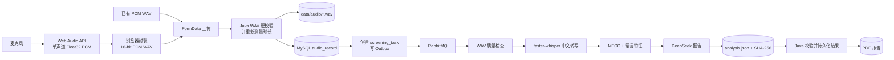

# 阿尔茨海默病语音助手——音频系统完整说明书

> 文档依据当前仓库源码整理，基线日期：2026-08-31。  
> 本文描述“代码现在实际怎样运行”，并把已实现功能、兼容入口、外部依赖和待改进项明确区分。  
> 本系统输出属于认知风险筛查提示，不是阿尔茨海默病诊断，也不能排除疾病。

## 1. 文档范围与结论摘要

本文覆盖本系统内所有直接涉及音频的环节：

- 浏览器麦克风授权、录音、PCM 采样、WAV 编码、计时和试听；
- 本地音频选择、用户上传、管理员批量上传；
- 文件格式、大小、时长、采样率、声道和位深校验；
- 用户音频、管理员音频、分析产物和数据库元数据的存储；
- 登录用户和管理员的音频播放、下载与删除；
- Python WAV 质量检查、PCM 解码、响度/静音/削波计算；
- faster-whisper 中文转写、VAD、文本清洗；
- librosa MFCC 声学特征和 jieba 语言特征；
- DeepSeek 筛查报告生成；
- 同步筛查、RabbitMQ 异步筛查及外部 `/detect` 兼容入口；
- 启动配置、GPU 配置、模型加载、性能、日志、测试和故障排查；
- 当前实现的安全边界、数据生命周期和已知缺口。

当前实现最重要的事实如下：

1. 浏览器录音不是 WebM/Opus，而是采集单声道 `Float32` PCM 后，由 JavaScript 手工编码成单声道、16-bit、未压缩 PCM WAV。
2. 用户上传只接受可解析的 RIFF/WAVE 未压缩 PCM，最大 25 MB、1～300 秒、8～48 kHz、1～2 声道、8/16/24/32 bit。
3. 系统没有通用的服务端音频格式转换或重采样模块；MP3、WebM、AAC 等不会自动转成 WAV。
4. Python 质量检查计算时长、采样率、声道、RMS dBFS、削波比例和静音比例；默认认为少于 20 秒的录音质量不合格。
5. AI 筛查使用 faster-whisper 中文转写、13 维 MFCC 时间均值、4 个语言统计特征，再由 DeepSeek 生成文字报告。
6. 当前 AI 引擎固定返回 `risk_level=INCONCLUSIVE`、`risk_score=null`。它没有实现经过临床验证的 AD 概率分类器。
7. 当前启动页面实际使用 RabbitMQ 异步筛查入口；同步 `/audio/diagnosis/{audioId}` 仍保留，但不是主要前端链路。
8. `/user/detect` 和 `/admin/detect` 依赖仓库外部的 `POST /detect` 服务，本仓库不包含其模型、预处理或特征算法，不能把它当成本仓库已实现的分类器。
9. `start.ps1` 会启动 Python 服务并做 CUDA 可用性探测，但 `/health` 不加载 Whisper；Whisper 模型目前仍在每个 Python 进程第一次转写时惰性加载。
10. 音频二进制保存在本机目录，不存入 MySQL；MySQL 保存文件名、归属、时长、同意记录、任务和报告元数据。
11. 名称中的“语音助手”目前不代表系统具有语音播报或语音对话：代码没有 TTS、`speechSynthesis`、浏览器 `SpeechRecognition` 或聊天语音输入；语音只用于录音筛查。

## 2. 代码入口与运行时边界

### 2.1 实际由 `start.ps1` 提供的前端

Spring Boot 直接提供：

```text
backend/src/main/resources/static/index.html
backend/src/main/resources/static/app.js
backend/src/main/resources/static/app.css
```

根目录的 `frontend/` 是另一份前端源码副本。当前两份 `app.js` 并不完全同步：Spring Boot 静态资源版已经使用异步筛查任务，`frontend/app.js` 仍保留较旧的同步筛查行为。因此，排查 `start.ps1` 启动后的网页时，应以 `backend/src/main/resources/static/` 为准。

### 2.2 音频相关主要代码

| 层次 | 文件 | 职责 |
|---|---|---|
| 浏览器 | `backend/src/main/resources/static/app.js` | 录音、WAV 编码、上传、试听、下载、筛查任务提交 |
| 浏览器页面 | `backend/src/main/resources/static/index.html` | 录音控件、WAV 选择、播放器、检测与管理界面 |
| 用户音频 API | `backend/src/main/java/com/alz/controller/AudioController.java` | 上传、列表、读取、删除、筛查和报告 |
| 旧检测 API | `UserController.java`、`AdminController.java` | 把文件转发给外部 `/detect` 服务 |
| 上传校验 | `AudioUploadValidator.java` | RIFF/WAVE、PCM、大小、时长、采样参数硬校验 |
| 存储路径 | `StoragePaths.java` | 目录标准化和防路径穿越 |
| MIME | `AudioMediaTypes.java` | 播放/下载响应类型判断 |
| 元数据 | `AudioServiceImpl.java`、`AudioMapper.java` | `audio_record` 的保存、查询和归属检查 |
| 同步 Python 客户端 | `PythonServiceImpl.java` | 调用 `127.0.0.1:5000/api/diagnosis` |
| Python HTTP API | `screening-service/app/main.py` | 受控路径解析、质量检查和引擎调用 |
| 音质算法 | `screening-service/app/quality.py` | PCM 解码、RMS、削波、静音比例 |
| ASR/特征/LLM | `screening-service/app/ad_diagnose.py` | Whisper、MFCC、语言特征、DeepSeek |
| 筛查引擎 | `ad_diagnose_engine.py`、`engine.py` | AI 引擎与 quality-only 安全降级 |
| 异步 Worker | `screening-service/app/workers/combined.py` | RabbitMQ 消费、顺序处理、重试和结果发布 |
| 分析产物 | `screening-service/app/artifacts/store.py` | 原子写入 `analysis.json` 和 SHA-256 |
| Java 异步任务 | `backend/.../screening/` | 任务、Outbox、状态投影、结果验签和 PDF |
| 数据库 | `deploy/mysql/init.sql` | 音频、筛查任务、产物、报告元数据表 |
| 启动 | `start.ps1`、`.env.example` | 目录、Python、Whisper、GPU、RabbitMQ 配置 |

## 3. 全链路架构

### 3.1 当前主链路：录音、上传、异步筛查



用户在网页关闭后，异步任务仍可以继续。前端每 5 秒轮询一次任务列表，显示转写、特征、LLM、结果持久化和 PDF 生成进度。

### 3.2 系统内三种“检测/筛查”入口

| 入口 | 实现状态 | 输入方式 | 算法来源 | 当前前端用途 |
|---|---|---|---|---|
| `POST /audio/screening/{audioName}` | 已实现，当前主链路 | 已存储的用户 WAV 文件名 | 本仓库 RabbitMQ Worker + Whisper/MFCC/DeepSeek | “风险分析”“AI 辅助检测” |
| `GET /audio/diagnosis/{audioName}` | 已实现，兼容同步入口 | Java 向 Python 传本机绝对路径 | 本仓库 `5000/api/diagnosis` | 当前静态前端不作为主链路 |
| `POST /user/detect`、`POST /admin/detect` | 仅实现转发层 | Java 以 multipart 把文件发给外部服务 | 仓库外部 `8000/detect`，算法未知 | “Python 检测”兼容按钮 |

不要把这三条链路的结果含义混在一起。尤其是外部 `/detect` 返回的 `ad_probability`、`normal_probability`，其模型和预处理不在本仓库内，本文无法为其算法正确性背书。

## 4. 浏览器录音

### 4.1 录音前置条件

- 用户必须先登录。
- 用户必须勾选当前知情同意。
- 浏览器必须支持 `navigator.mediaDevices.getUserMedia`。
- 麦克风 API 通常要求安全上下文；`http://localhost` 可用，远程部署应使用 HTTPS。
- 用户拒绝权限、设备占用或无麦克风时，页面显示浏览器异常信息，并允许改为上传已有 WAV。

前端建议用户根据图片自然连续讲述 30～90 秒。这个建议与 Python 默认的最短质量门槛 20 秒相容。

系统另提供 `GET /assistant/screening-guide` 文本指引，建议先取得本人同意、选择安静环境、确认麦克风，并记录听力、情绪、睡眠、饮酒、感染和用药变化等干扰因素。指引列出自然表达、图片叙述、延迟复述三类采集任务，但当前录音页面实际只提供三张图片的看图讲述，上传时的 `taskType` 仍统一保存为 `NATURAL_SPEECH`；页面尚未实现三种任务的独立流程和元数据分类。

### 4.2 采集过程

开始录音时执行：

```javascript
navigator.mediaDevices.getUserMedia({ audio: { channelCount: 1 } })
```

随后创建：

- 一个浏览器默认采样率的 `AudioContext`；
- 一个 `MediaStreamAudioSourceNode`；
- 一个 `ScriptProcessorNode(4096, 1, 1)`；
- 一个内存中的 `Float32Array[]` 分块列表。

每次 `onaudioprocess` 回调读取输入缓冲区第 0 声道，并复制为新的 `Float32Array`。录音期间所有原始样本都保存在浏览器内存中。

说明：

- `channelCount: 1` 是约束请求，前端最终始终只取第 0 声道。
- 采样率没有写死为 16 kHz，而是使用当前 `AudioContext.sampleRate`，常见值为 44.1 kHz 或 48 kHz。
- 前端没有执行降采样、重采样、降噪、回声消除后处理、响度归一化或静音裁剪。
- 浏览器自身可能根据设备和浏览器实现进行音频采集处理，但代码没有显式配置这些处理。
- `ScriptProcessorNode` 已是 Web Audio 的弃用接口；当前还能运行，但后续更适合迁移至 `AudioWorklet`。

### 4.3 停止与资源释放

停止录音时按以下顺序处理：

1. 停止页面计时器；
2. 用墙钟差值计算一个仅供界面显示的时长；
3. 断开处理节点和源节点；
4. 停止麦克风的全部媒体轨道；
5. 读取 `AudioContext.sampleRate`；
6. 关闭 `AudioContext`；
7. 合并所有 Float32 分块；
8. 编码为 WAV Blob；
9. 创建临时 Object URL 供 `<audio>` 试听。

重新生成试听文件时，旧 Object URL 会被 `URL.revokeObjectURL` 释放。

### 4.4 浏览器生成的 WAV 格式

`encodeWav()` 手工写入标准 44 字节 RIFF/WAVE 头，然后写入小端 16-bit PCM：

| 字段 | 值 |
|---|---|
| Container | RIFF/WAVE |
| `fmt` 长度 | 16 |
| Audio format | 1，即线性 PCM |
| 声道 | 1 |
| 采样率 | 当前 `AudioContext.sampleRate` |
| Byte rate | `sampleRate × 2` |
| Block align | 2 |
| 位深 | 16 bit |
| 数据编码 | little-endian signed PCM |
| MIME | `audio/wav` |

Float32 样本会先裁剪到 `[-1, 1]`，负值乘 32768，非负值乘 32767，再写为 `Int16`。这一步是“PCM 数值量化并封装成 WAV”，不是改变采样率的转码。

### 4.5 录音端现有限制

- 没有自动到时停止；虽然服务端拒绝超过 5 分钟的用户文件，浏览器仍可继续录音并持续占用内存。
- 录音全部驻留内存，长录音会同时占用 Float32 分块、合并数组和 WAV Blob 的空间。
- 未做实时音量提示、静音提示、削波提示或设备测试，质量问题要到筛查阶段才发现。
- `ScriptProcessorNode` 主线程回调在高负载页面上可能丢帧。
- 没有 AudioWorklet、分片上传或断点续传。

## 5. 本地文件选择与前端预检

用户文件输入框配置：

```html
accept="audio/wav,.wav"
```

前端只检查文件名是否以 `.wav` 结尾。选择成功后：

- 使用临时 `<audio>` 元数据读取大致时长；
- 使用 Object URL 提供本地试听；
- 把原始 `File` 直接作为上传对象，不在浏览器内重新编码。

`accept` 和扩展名检查只是用户体验约束，不是安全校验。真正格式校验在 Java 后端完成。

## 6. 用户音频上传

### 6.1 请求

接口：

```http
POST /audio/upload
Authorization: Bearer <JWT>
Content-Type: multipart/form-data
```

表单字段：

| 字段 | 来源 | 服务端用途 |
|---|---|---|
| `file` | 录音 Blob 或用户选择的 File | 必填音频 |
| `duration` | 浏览器估计 | 接收但忽略，不作为可信值 |
| `imageName` | 当前图片任务 | 保存到音频元数据 |
| `consentAccepted` | 固定为 `true` | 必须明确同意 |
| `consentVersion` | `voice-screening-consent-v1` | 必须等于服务端当前版本 |
| `taskType` | `NATURAL_SPEECH` | 必须是当前支持的任务类型 |

服务端刻意忽略客户端 `duration`，用音频帧数重新计算时长，从而避免伪造。

### 6.2 用户 WAV 硬校验顺序

`AudioUploadValidator` 执行：

1. 文件对象存在且非空；
2. 文件大小不超过 25 MiB；
3. 前 4 字节必须是 `RIFF`；
4. 第 8～11 字节必须是 `WAVE`；
5. Java Sound 必须能解析为音频流；
6. 编码必须为 `PCM_SIGNED` 或 `PCM_UNSIGNED`；
7. 采样率必须为 8,000～48,000 Hz；
8. 声道数必须为 1 或 2；
9. 位深必须为 8、16、24 或 32 bit；
10. 帧数和帧率必须为正；
11. 根据 `frameLength / frameRate` 计算时长；
12. 时长必须为 1～300 秒。

因此，把任意数据改名为 `.wav`，或只伪造 HTTP MIME 类型，都不能通过校验。

### 6.3 大小配置的两层含义

仓库内同时存在：

- `application.yml`：单文件 25 MB、请求 26 MB；
- `AdminMultipartConfig`：显式创建 `MultipartConfigElement`，单文件 200 MB、总请求 500 MB。

显式 Bean 通常会取代 Spring Boot 的自动 Multipart 配置，因此 Servlet 接收层可能采用 200/500 MB；但普通用户上传仍会被 `AudioUploadValidator` 明确限制为 25 MiB。管理员上传没有调用该校验器，通常受 200/500 MB 配置限制。两个配置并存容易造成运维误解，后续应统一。

### 6.4 文件命名与落盘事务补偿

普通用户原始文件名不会作为服务端文件名。服务端生成：

```text
{userId}_{yyyyMMdd_HHmmss}_{UUID}.wav
```

例如：

```text
12_20260831_153010_4d31434f-4135-46dd-a7b0-71515ad21d94.wav
```

生成 UUID 可降低重名覆盖和可猜测性。文件保存成功后写入 `audio_record`；若文件传输或数据库保存发生异常，控制器会尝试删除已生成的目标文件，避免留下无元数据的普通用户音频。

## 7. 音频格式支持与格式转换

### 7.1 实际支持矩阵

| 场景 | 接受/产生格式 | 是否转码 |
|---|---|---|
| 浏览器直接录音 | 产生 PCM WAV，单声道 16-bit | Float32 PCM 量化并封装为 WAV，不重采样 |
| 普通用户上传 | 只接受 RIFF/WAVE 未压缩 PCM | 不转码 |
| Python 质量检查 | 只处理未压缩 PCM WAV | 不转码 |
| librosa MFCC | 读取上传 WAV，`sr=None` | 不重采样；默认把多声道混为单声道 |
| faster-whisper | 接收 WAV 路径 | 解码细节由 faster-whisper/PyAV 内部完成，业务代码无显式转码 |
| 管理员上传 | UI 允许 `audio/*`、`.wav`、`.webm`，后端不做音频格式校验 | 不转码 |
| 音频播放响应 | WAV/MP3/WebM/OGG/M4A/AAC/FLAC 可映射 MIME | 仅设置响应 MIME，不转码 |
| 外部 `/detect` | 未知 | 由仓库外部服务决定 |

### 7.2 `AudioMediaTypes` 不是转码器

播放接口根据扩展名设置：

- `.wav/.wave` → `audio/wav`
- `.mp3` → `audio/mpeg`
- `.webm` → `audio/webm`
- `.ogg/.oga` → `audio/ogg`
- `.m4a/.mp4` → `audio/mp4`
- `.aac` → `audio/aac`
- `.flac` → `audio/flac`
- 未知格式 → 尝试 `Files.probeContentType`，否则 `application/octet-stream`

这只影响浏览器如何解释响应体，不会改变文件内容。

### 7.3 当前没有的能力

当前代码没有调用 FFmpeg，也没有 pydub、soundfile 或独立转码服务。因此没有：

- MP3/WebM/M4A/AAC/FLAC 转 WAV；
- 固定转成 16 kHz；
- 立体声显式下混；
- 音量归一化；
- 静音剪切；
- 降噪；
- 音频切片或拼接；
- 编码质量修复。

如果管理员上传 WebM 后再把它送入本仓库的 WAV 质量检查，将无法被 `wave` 模块处理。管理员 UI 的宽格式选择范围不代表筛查算法支持这些格式。

## 8. 存储设计

### 8.1 目录

默认目录均位于项目根目录：

```text
data/
├─ audio/                  普通用户 PCM WAV
├─ admin_audio/            管理员样本文件
├─ screening-artifacts/    异步筛查 analysis.json、Worker PID 文件
├─ pdf/                    筛查 PDF
└─ runtime/logs/           Python API、Worker 等运行日志
```

环境变量：

| 变量 | 默认值 | 用途 |
|---|---|---|
| `AUDIO_STORAGE_DIR` | `data/audio` | 普通用户音频 |
| `ADMIN_AUDIO_STORAGE_DIR` | `data/admin_audio` | 管理员音频 |
| `SCREENING_ARTIFACT_DIR` | `data/screening-artifacts` | 异步分析 JSON |
| `PDF_STORAGE_DIR` | `data/pdf` | PDF 报告 |
| `AUDIO_ROOT` | 启动时设为用户音频目录 | Python 允许访问的音频根目录 |

`start.ps1` 会把相对路径解析到项目目录下，并在启动前创建这些目录。

### 8.2 路径安全

`StoragePaths`：

- 把根目录转为绝对、标准化路径；
- 拒绝空文件名；
- 拒绝绝对文件名；
- 拒绝多级路径和父目录路径；
- 对 `resolve().normalize()` 的结果再次确认必须仍在根目录且直接位于根目录下；
- 筛查任务目录要求 UUID 形式的 36 字符 ID。

Python HTTP API也会把请求路径 `resolve()` 后确认其位于 `AUDIO_ROOT` 内。异步 Worker 只接受纯文件名，并再次检查路径没有逃逸 `AUDIO_ROOT`。

### 8.3 MySQL 存什么、不存什么

音频二进制不进入 MySQL。`audio_record` 保存：

- `id`
- `user_id`
- `file_path`：实际是服务端文件名，不是任意完整路径
- `duration`：服务端测得的整数秒
- `upload_time`
- `image_name`
- `consent_version`
- `consent_time`
- `task_type`

`file_path` 有唯一索引。普通用户音频与文件系统通过该文件名关联。

异步筛查还涉及：

- `screening_task`：音频记录、任务状态、阶段、进度、幂等键、模型版本、重试次数；
- `screening_task_artifact`：产物类型、受控 URI、SHA-256、内容版本；
- `diagnosis_report`：转写、报告、质量结论、特征提示、模型版本；
- `pdf_report`：PDF 文件名、哈希、大小和任务关联；
- Outbox/已消费事件表：保证任务消息可靠投递和幂等消费。

### 8.4 当前存储属性

- 使用本机文件系统，不是对象存储。
- 多个 Java/Python 节点若不共享同一文件系统，会出现“数据库有记录但处理节点找不到音频”。
- 代码没有实现文件级静态加密、对象锁、生命周期归档或自动音频过期。
- 操作系统账户权限和磁盘加密决定静态文件的基础保护能力。
- 音频属于敏感健康数据，生产环境应使用受控目录、最小权限、加密磁盘/对象存储和备份访问审计。

## 9. 播放与下载

### 9.1 普通用户

接口：

```http
GET /audio/file/{fileName}
Authorization: Bearer <JWT>
```

Java 在返回文件前验证 `fileName + 当前用户 ID` 是否存在于 `audio_record`，防止读取其他用户音频。响应设置：

- 检测后的音频 MIME；
- `Content-Length`；
- `Content-Disposition: inline`；
- 文件完整字节流。

### 9.2 为什么前端先 Fetch 再播放

受保护音频需要 JWT。前端使用 `fetch` 携带 `Authorization`，读取完整 Blob，创建 Object URL，再赋给 `<audio>`：

```text
JWT fetch → Blob → URL.createObjectURL → <audio>.play()
```

切换播放文件时会撤销旧 URL。下载同样先取 Blob，再创建临时 `<a download>` 触发保存。

当前实现没有 Range 请求/206 分段传输逻辑，前端会先把整个文件读入 Blob。25 MB 上限使普通用户文件尚可控，但大管理员文件可能带来明显内存和等待开销。

### 9.3 管理员播放

- 普通用户音频：`GET /admin/audio/file/{filename}`；
- 管理员样本：`GET /admin/audios/admin/file/{filename}`。

两个控制器均受 `ADMIN` 角色保护，并使用受控目录解析文件名。

## 10. Python 音频质量与预处理

### 10.1 文件级检查

`WavQualityAnalyzer` 默认要求：

| 条件 | 默认阈值/要求 |
|---|---|
| 文件存在 | 必须 |
| 文件大小 | 不超过 50 MiB |
| WAV 压缩类型 | `NONE`，即未压缩 PCM |
| 声道 | 1 或 2 |
| 位宽 | 1、2、3、4 字节，即 8/16/24/32 bit |
| 采样率 | 正数；低于 8 kHz记质量问题 |
| 帧数 | 大于 0 |
| 建议最短时长 | 20 秒 |
| 最长时长 | 300 秒 |

普通用户上游已经限制为 25 MiB、1～300 秒、8～48 kHz，所以 Python 的 50 MiB 上限主要是二次防线。

### 10.2 PCM 解码

质量分析以每次 8192 帧分块读取。样本归一化至大致 `[-1, 1]`：

| 位深 | 解码方式 |
|---|---|
| 8 bit | 无符号字节，`(value - 128) / 128` |
| 16 bit | 有符号整数，`value / 32768` |
| 24 bit | 小端 3 字节，手工符号扩展，`value / 8388608` |
| 32 bit | 有符号整数，`value / 2147483648` |

双声道样本按 WAV 的交错顺序共同参与全局统计；质量模块没有先下混成单声道，也没有分别报告左右声道质量。

### 10.3 质量指标公式

设归一化样本为 `x_i`、样本总数为 `N`：

```text
RMS = sqrt(sum(x_i²) / N)
RMS_dBFS = 20 × log10(max(RMS, 1e-12))
clipping_ratio = count(|x_i| >= 0.99) / N
silence_ratio = count(|x_i| <= 0.01) / N
duration = frame_count / sample_rate
```

输出保留：

- 时长、RMS dBFS：3 位小数；
- 削波比例、静音比例：6 位小数。

### 10.4 不通过规则

任意规则触发都会加入 `quality_issues`：

| 规则 | 提示 |
|---|---|
| 时长 `< 20 s` | 录音时长不足 20 秒 |
| 时长 `> 300 s` | 录音时长超过 300 秒 |
| 采样率 `< 8000 Hz` | 采样率过低 |
| RMS dBFS `< -45` | 录音音量过低 |
| 削波比例 `> 1%` | 存在明显削波失真 |
| 静音比例 `> 80%` | 静音比例过高 |

`passed = issues 为空`。

需要注意：上传层允许 1 秒以上音频，但质量层默认要求 20 秒。因此 1～19.999 秒的文件可以成功上传，却会在筛查时标记为质量不通过。当前实现实际形成了这套“两层门槛”，页面和接口调用方应理解这一差异。

### 10.5 “质量不通过”是否停止 AI

当前 `DeepSeekVoiceDiagnosisEngine` 不会因为 `quality.passed=false` 而停止后续流程。它仍会进行 Whisper、MFCC、语言特征和 DeepSeek 调用，然后把质量问题附加到 `feature_highlights`。

这意味着：

- 低质量音频仍消耗 ASR/GPU 和 LLM API；
- 报告可能基于不可靠的转写；
- 最终应通过 `quality_passed`、`quality_issues` 和 `REVIEW_REQUIRED` 明确提示人工复核。

若希望质量门禁真正节省资源，应在引擎调用前短路，此行为当前尚未实现。

## 11. Whisper 语音转写

### 11.1 模型加载

`get_whisper_model()` 使用 `@lru_cache(maxsize=1)`：

- 每个 Python 进程首次调用时创建一个模型；
- 同一进程后续任务复用模型；
- Python HTTP API进程和每个 RabbitMQ Worker 是不同进程，各自持有一份模型；
- 多 Worker 模式会分别占用内存或显存。

默认配置：

| 变量 | 默认值 |
|---|---|
| `WHISPER_MODEL_SIZE` | `large-v2` |
| `WHISPER_DEVICE` | `cpu` |
| `WHISPER_DEVICE_INDEX` | `0` |
| CPU `WHISPER_COMPUTE_TYPE` | `int8` |
| CUDA 默认计算类型 | `float16`（由 `start.ps1` 设置） |
| `WHISPER_BEAM_SIZE` | `10` |
| `HF_ENDPOINT` | `https://huggingface.co` |

### 11.2 转写参数

```python
model.transcribe(
    audio_path,
    language="zh",
    beam_size=10,
    vad_filter=True,
    vad_parameters={"min_silence_duration_ms": 500},
)
```

- 强制中文识别，不做语言自动选择；
- 开启 VAD，至少 500 ms 的静音可用于语音段切分；
- 把所有 segment 文本直接连接；
- 若安装 `zhconv`，转为简体中文；
- 用正则把连续空白压成单个空格并去除首尾空白。

VAD 是 Whisper 转写阶段的语音活动过滤，不等同于前面质量模块的“静音比例”统计，也不会修改磁盘上的源 WAV。

### 11.3 首次任务为什么慢

Whisper 模型是惰性加载。第一次转写可能包括：

- 从 Hugging Face 下载模型；
- 从磁盘读取大模型；
- CTranslate2 初始化；
- CUDA DLL、cuBLAS、cuDNN 和显存初始化；
- 首次推理内核预热。

之后同一进程复用缓存，所以通常更快。如果启动多个 Worker，每个 Worker 的第一次任务都可能分别经历加载。

## 12. MFCC 声学特征

代码：

```python
y, sr = librosa.load(audio_path, sr=None)
mfcc = librosa.feature.mfcc(y=y, sr=sr, n_mfcc=13)
features = mfcc.mean(axis=1)
```

行为：

- `sr=None`：保留文件原始采样率，不统一重采样；
- `librosa.load` 默认 `mono=True`：双声道会下混成单声道供 MFCC 使用；
- 计算 13 维 MFCC；
- 对每一维在全部时间帧上求均值；
- 最终得到 13 个浮点数；
- 送给 LLM 时四舍五入到 4 位小数；
- `analysis.json` 当前不保存完整 MFCC 数组，只保存“已提取 MFCC”等文字提示。

除 `n_mfcc=13` 外，FFT 长度、hop length、窗函数、Mel 参数等采用安装版本的 librosa 默认值。若要做可复现实验，应把这些参数显式固定并记录版本。

时间均值会丢失语速变化、停顿时序、局部发音异常等信息。当前代码也没有提取 jitter、shimmer、F0、共振峰、语速、停顿段统计、谱质心或 OpenSMILE 特征。

## 13. 文本与语言特征

转写后用 jieba 分词。仅过滤空白 token，计算：

| 特征 | 计算方式 |
|---|---|
| `avg_word_length` | 清洗后文本字符数 / 分词数 |
| `ttr` | 唯一分词数 / 总分词数 |
| `avg_sentence_length` | 总分词数 / 句子数 |
| `modal_particle_freq` | 指定语气/填充词数量 / 总分词数 |

句子按以下符号切分：

```text
。 ！ ？ ； … 换行
```

填充词/语气词集合：

```text
啊、呀、吧、呢、嘛、呃、嗯、这个、那个
```

空文本时四个特征都返回 `0.0`。

这些是简单统计量，强烈受录音长度、ASR 错误、方言、教育程度、话题、图片任务和 jieba 分词结果影响。TTR 或填充词频率不能单独作为 AD 证据。

## 14. DeepSeek 报告生成与结果含义

### 14.1 输入

发送给 DeepSeek 的提示词包含：

- 完整转写文本；
- 13 维 MFCC 均值；
- 平均词长；
- TTR；
- 平均句长；
- 填充词/语气词频率；
- 明确的“只能用于筛查、不得确诊”约束。

输出要求包括概述、特征分析、筛查提示和建议。

### 14.2 配置

| 变量 | 默认值 |
|---|---|
| `DEEPSEEK_API_KEY` | 无，必须配置才启用 AI 引擎 |
| `DEEPSEEK_BASE_URL` | `https://api.deepseek.com` |
| `DEEPSEEK_SCREENING_MODEL` | `deepseek-v4-flash` |
| `DEEPSEEK_SCREENING_MAX_TOKENS` | `1500` |
| `DEEPSEEK_SCREENING_TEMPERATURE` | `0.7` |

该调用是普通非流式 Chat Completions 请求。语音筛查页面不会逐字流式显示转写或报告；前端只显示后台任务阶段，任务完成后一次性显示结果。

知识助手页面中可选的 DeepSeek、Kimi、GLM、千问及其浏览器本地 API Key 只作用于 RAG 文本问答，不会传给 Python 音频筛查进程。音频筛查当前只使用进程环境中的 `DEEPSEEK_API_KEY` 和 `DEEPSEEK_SCREENING_MODEL`。此外，硬编码的引擎版本 `deepseek-whisper-mfcc-v1` 没有包含实际 Whisper 型号和 DeepSeek 型号；更换底层模型后若不同时更新版本字符串，报告审计将无法从 `model_version` 精确还原配置。

### 14.3 风险字段

`DeepSeekVoiceDiagnosisEngine` 当前固定：

```text
risk_level = INCONCLUSIVE
risk_score = null
model_version = deepseek-whisper-mfcc-v1
```

DeepSeek生成的是解释性文字，不是本地二分类概率模型。因此：

- 不应从报告语气自行映射出“患病概率”；
- `diagnosis_report.screening_status` 通常为 `REVIEW_REQUIRED`；
- 异步任务仍会在技术流程结束后显示 `COMPLETED`，这里的“完成”只表示处理和 PDF 已完成，不表示医学结论确定。

### 14.4 无 API Key 时的行为

当工厂为 `app.ad_diagnose_engine:create_engine`：

- `SCREENING_REQUIRE_AI=false` 且无 Key：使用 `QualityOnlyEngine`，只给出质量结论，风险仍为无法判定；
- `SCREENING_REQUIRE_AI=true` 且无 Key：拒绝创建引擎/停止启动，避免悄悄输出仅质量报告；
- `start.ps1` 在完整 DeepSeek 模式下会把 `SCREENING_REQUIRE_AI` 设为 `true`。

## 15. RabbitMQ 异步筛查

### 15.1 创建任务

当前页面使用：

```http
POST /audio/screening/{audioName}
Idempotency-Key: <浏览器生成的 UUID>
Authorization: Bearer <JWT>
```

服务端确认：

- 异步筛查已启用；
- 音频属于当前用户；
- 音频具有当前同意版本和任务类型；
- 磁盘文件存在；
- 同一音频没有已有任务或报告；
- 用户活动任务数未达到默认上限 2；
- 幂等键合法。

`screening_task` 和 `screening.requested.v1` Outbox 事件在同一数据库事务内写入。

### 15.2 Worker 内处理顺序

当前 `CombinedScreeningWorker` 在单个任务内顺序执行：

```text
解析并约束音频路径
→ 发布 TRANSCRIBING（20%）
→ WAV 质量检查
→ Whisper 转写
→ 发布 FEATURES（50%）
→ MFCC + 语言特征
→ 发布 LLM（70%）
→ DeepSeek 报告
→ 原子写 analysis.json
→ 发布 analysis.completed（80%）
→ Java 保存报告
→ PDF 生成（90%）
→ COMPLETED（100%）
```

Worker 设置 `prefetch_count=1` 且手动 ACK。一个 Worker 同时处理一个消息；多个 Worker 可并行处理多个用户任务。

### 15.3 分析产物

路径：

```text
data/screening-artifacts/{taskId}/analysis.json
```

内容包括：

- transcription
- report
- risk_level / risk_score
- quality_passed / quality_issues / quality_metrics
- feature_highlights
- model_version

写入过程：

1. 序列化为排序键、紧凑 UTF-8 JSON；
2. 写入 `analysis.json.tmp`；
3. `flush + fsync`；
4. `os.replace` 原子替换最终文件；
5. 计算并返回 SHA-256。

Java 只接受当前任务的受控 artifact URI，并在解析前重新计算 SHA-256。校验通过后才把结果持久化到数据库。

### 15.4 幂等、重试和失败

- 已存在有效 `analysis.json` 时，Worker 可直接复用并重新发布完成事件；
- 如果旧产物是 `quality-only-v1`、当前 Worker 已有 AI 引擎，会丢弃旧产物并重新分析；
- 无效输入属于永久错误，不重试；
- 其他异常按 `SCREENING_WORKER_MAX_RETRIES` 重试，默认 3 次；
- 重试延迟默认 10 秒；
- 超限后进入失败/死信处理；
- Java 消费者用已消费事件表保证幂等。

## 16. 同步筛查兼容入口

接口：

```http
GET /audio/diagnosis/{audioName}
```

流程：

1. 校验音频属于当前用户；
2. Java 把受控音频绝对路径放入 JSON：`{"audio_path":"..."}`；
3. 调用 `PYTHON_DIAGNOSIS_URL`，默认 `http://127.0.0.1:5000/api/diagnosis`；
4. Python 再确认路径位于 `AUDIO_ROOT`；
5. 执行质量检查和筛查引擎；
6. Java 校验返回字段并保存报告；
7. 一次性返回结果。

Java 默认连接超时 3 秒、读取超时 120 秒。首次 Whisper 加载、长音频 CPU 转写或 LLM 变慢时，可能超过 120 秒并报告“连接失败或处理超时”。异步任务更适合耗时处理。

该入口不是文件上传：Java 与 Python 必须看到同一个本机/共享文件路径。如果二者分开部署但目录没有共享，调用会失败。

## 17. 外部 `/detect` 兼容功能

### 17.1 用户检测

`POST /user/detect` 接收：

```json
{"fileName":"服务端音频文件名.wav"}
```

Java 从 `data/audio` 解析该文件，作为 multipart `file` 转发到：

```text
http://localhost:8000/detect
```

前端期望返回：

```json
{
  "label": "...",
  "ad_probability": 0.0,
  "normal_probability": 0.0
}
```

### 17.2 管理员检测

管理员把 `data/admin_audio` 中的文件转发到：

```text
http://fastapi:8000/detect
```

此主机名适用于特定容器网络；`start.ps1` 的本机启动方式只检查 `localhost:8000`。原生 Windows 启动时两者配置并不一致。

### 17.3 重要边界和风险

- 本仓库没有 8000 端口服务源码；无法说明其格式转换、特征、模型和训练数据。
- `start.ps1` 不启动该服务，只在端口未监听时警告。
- 用户 `/user/detect` 当前没有像 `/audio/file` 那样先调用 `belongsToUser`，只按受控目录解析文件名。已登录用户若知道其他用户的服务端文件名，存在把他人文件送去检测的越权风险，应补充归属校验。
- 两个转发接口都新建默认 `RestTemplate`，没有显式连接/读取超时。
- 管理员上传不校验音频内容，外部服务必须自行处理错误格式。

## 18. 管理员音频上传与管理

接口：

```http
POST /admin/audios/upload
Content-Type: multipart/form-data
files: <多个文件>
```

当前行为：

- 页面可选择 `audio/*`、`.wav`、`.webm`；
- 后端逐个处理非空文件；
- 仅用 `Path.of(originalName).getFileName()` 去除客户端目录部分；
- 保留原始基本文件名，保存到 `data/admin_audio`；
- 同名文件可能被覆盖；
- 不调用 `AudioUploadValidator`；
- 不检测 RIFF/WAVE、MIME、时长、采样率、声道或位深；
- 元数据以 `userId=0`、`duration=0`、`imageName=管理员` 写入 `audio_record`；
- 单个文件失败时打印异常并继续其他文件，响应可能只列出成功文件。

管理员有两种删除路径：

- `/admin/audio/{id}`：尝试删除磁盘文件并删除 `audio_record`；
- `/admin/audios/admin/{filename}`：只删除管理员目录中的文件，不删除对应 `audio_record`。

这两个删除入口行为不一致，可能产生孤立元数据。生产使用前应统一为事务化的数据删除服务。

## 19. 删除与数据生命周期

### 19.1 普通用户删除

```http
DELETE /audio/{audioName}
```

流程：

1. 确认当前用户拥有音频；
2. 如果存在活动筛查任务，返回 409，要求先取消；
3. 删除用户 WAV；
4. 删除关联 PDF 文件；
5. 删除诊断报告记录；
6. 删除 PDF 元数据；
7. 删除 `audio_record`；
8. 数据库外键级联删除对应筛查任务和 artifact 元数据。

当前缺口：`ScreeningDataDeletionService` 没有删除磁盘上的：

```text
data/screening-artifacts/{taskId}/analysis.json
```

所以用户删除录音后，包含转写和报告的分析产物可能残留。应在删除音频前收集任务 ID，并安全删除对应任务产物目录，或给 ArtifactStore 增加统一删除接口。

### 19.2 报告保留

每个用户最多保留 10 条 `diagnosis_report`。保存第 11 条时删除最旧报告及其 PDF，但不会因此删除原音频。音频本身没有自动保留期限。

### 19.3 Object URL

浏览器试听和受保护播放产生的 Object URL 只存在于当前页面内存。代码在替换资源或下载后进行释放，不会把音频 Blob 保存到 localStorage/sessionStorage。

## 20. `start.ps1` 与音频运行环境

### 20.1 启动内容

脚本会：

- 读取 `.env` 中的音频、Python、Whisper、GPU 和异步筛查配置；
- 创建用户音频、管理员音频、筛查产物和 PDF 目录；
- 选择 `PYTHON_EXE`，否则优先使用 `D:\Professional software\anaconda3\envs\mock\python.exe`；
- 必要时根据 `screening-service/requirements.txt` 创建项目 `.venv`；
- 将 `AUDIO_ROOT` 设置为 `AUDIO_STORAGE_DIR`；
- 后台启动 `python -m app.main`，监听 `127.0.0.1:5000`；
- 在异步模式下检查 RabbitMQ，并启动一个或多个 `app.workers.combined`；
- 把 Python API和 Worker 日志写到 `data/runtime/logs`；
- 检查可选的 8000 `/detect` 服务，但不会启动它。

### 20.2 GPU

当 `WHISPER_DEVICE=cuda` 时，启动脚本会：

- 检查 GPU 设备索引；
- 检查 CTranslate2 可见 GPU；
- 检查当前 compute type 是否支持；
- 尝试配置 CUDA DLL 搜索路径；
- 可安装/使用 `nvidia-cublas-cu12`、`nvidia-cudnn-cu12`；
- 根据 `GPU_STARTUP_FAILURE_POLICY=fail|cpu` 决定停止还是明确回退 CPU；
- 多 Worker 时从基础 GPU 索引起给各 Worker 分配索引。

这只是环境和运行时探测，不等于已经把 Whisper 大模型载入内存。

### 20.3 当前是否预热音频模型

当前没有真正的 Whisper 音频预热：

- `app.main` 创建 Flask 应用时只创建引擎对象；
- `ad_diagnose` 在第一次 `transcribe_audio()` 时才被导入；
- `/health` 只报告配置，不调用 `get_whisper_model()`；
- `start.ps1` 的健康检查不会加载 Whisper；
- 每个异步 Worker 同样在收到第一条任务后才加载模型。

因此“第一次提问/第一次筛查慢，后面快”在音频链路上是预期现象。真正预热应新增一个只加载模型的受控入口或 Worker 启动钩子；若还希望预热推理内核，可对随代码提供的短静音/测试 WAV 运行一次转写。预热需考虑：

- 每个进程都要单独预热；
- 多 GPU Worker 要在各自设备上下文预热；
- 不能用用户敏感音频做启动探针；
- 启动就绪条件应等模型加载成功后再通过；
- 首次模型下载可能很久，必须有明确进度和超时。

### 20.4 Python 依赖

音频相关主要依赖：

| 包 | 用途 |
|---|---|
| `faster-whisper` | 中文 ASR 和 VAD |
| `librosa` | 音频加载和 MFCC |
| `numpy` | 特征数组和数值处理 |
| `jieba` | 中文分词 |
| `zhconv` | 可选/已列入依赖的简体转换 |
| `openai` | 调用兼容 OpenAI API 的 DeepSeek |
| `pika` | RabbitMQ Worker |
| Python 标准库 `wave` | PCM WAV 质量检查 |

## 21. 音频 API 清单

### 21.1 用户接口

| 方法与路径 | 作用 | 音频数据方向 |
|---|---|---|
| `POST /audio/upload` | 上传并校验 PCM WAV | 浏览器 → Java → 文件系统 |
| `GET /audio/my` | 查询当前用户音频元数据 | MySQL → 浏览器 |
| `GET /audio/file/{name}` | 播放或下载自己的音频 | 文件系统 → Java → 浏览器 |
| `DELETE /audio/{name}` | 删除音频及关联结果 | 删除文件和数据库记录 |
| `POST /audio/screening/{name}` | 创建异步筛查任务 | 音频文件名 → RabbitMQ |
| `GET /audio/diagnosis/{name}` | 同步筛查兼容入口 | Java 传路径 → Python |
| `GET /audio/diagnosis/check/{name}` | 查询是否已有报告 | MySQL 查询 |
| `GET /audio/report/my` | 查询筛查报告 | MySQL → 浏览器 |
| `POST /user/detect` | 旧外部分类服务转发 | 文件系统 → 外部 8000 |

异步任务还可通过 `/api/v1/screenings` 创建、查询、列表、取消和重试。

### 21.2 管理员接口

| 方法与路径 | 作用 |
|---|---|
| `GET /admin/audios/full` | 查询普通用户音频元数据 |
| `GET /admin/audio/file/{filename}` | 播放普通用户音频 |
| `DELETE /admin/audio/{id}` | 按记录 ID 删除音频 |
| `POST /admin/audios/upload` | 批量上传管理员样本 |
| `GET /admin/audios/admin` | 列出管理员目录文件 |
| `GET /admin/audios/admin/file/{filename}` | 播放管理员样本 |
| `DELETE /admin/audios/admin/{filename}` | 按文件名删除管理员样本文件 |
| `POST /admin/detect` | 转发管理员样本到外部 8000 服务 |

## 22. 常见错误与排查

### 22.1 不能开始录音

检查：

- 是否勾选知情同意；
- 浏览器地址是否为 localhost 或 HTTPS；
- 浏览器站点权限是否允许麦克风；
- 麦克风是否被其他程序独占；
- `navigator.mediaDevices.getUserMedia` 是否存在；
- 系统默认输入设备是否正常。

### 22.2 上传提示“仅支持 RIFF/WAVE”

文件很可能只是扩展名为 `.wav`，实际是 WebM/MP3，或 WAV 头损坏。当前系统不会自动转码，应先在可信工具中转为未压缩 PCM WAV。

### 22.3 上传成功但质量不通过

上传层最低 1 秒，质量层最低 20 秒。另检查：

- 音量是否过低（RMS `< -45 dBFS`）；
- 静音是否超过 80%；
- 是否有超过 1% 样本接近满幅导致削波；
- 采样率是否低于 8 kHz。

### 22.4 第一次筛查很慢

查看：

```text
data/runtime/logs/screening-api.out.log
data/runtime/logs/screening-api.err.log
data/runtime/logs/screening-worker-*.out.log
data/runtime/logs/screening-worker-*.err.log
```

重点确认：

- 日志是否出现 `Loading faster-whisper model ...`；
- 模型是否正在首次下载；
- CPU 是否在跑 `large-v2 + int8`；
- CUDA 设备和 compute type 是否正确；
- 是否为多个 Worker 各自首次加载；
- DeepSeek网络请求是否耗时；
- RabbitMQ 任务是否排队。

### 22.5 异步筛查返回 503

需要同时满足：

```dotenv
SCREENING_ASYNC_ENABLED=true
```

并保证 RabbitMQ 已启动、Java Outbox 发布器和 Python Worker 正常工作。

### 22.6 `/user/detect` 或 `/admin/detect` 失败

本仓库没有外部 8000 服务。检查是否另行启动实现 `POST /detect` 的服务，并注意用户入口使用 `localhost:8000`、管理员入口使用 `fastapi:8000` 的地址差异。

### 22.7 能查到记录但音频无法播放

检查：

- `AUDIO_STORAGE_DIR` 是否与历史启动时一致；
- 数据库 `file_path` 对应文件是否仍存在；
- 当前用户是否拥有该记录；
- 文件是否为空；
- JWT 是否过期；
- 管理员文件是否错误地放在用户目录，或反之。

## 23. 测试覆盖

现有自动测试覆盖：

- 有效 PCM WAV 的接受和服务端时长计算；
- 伪造 `.wav` 扩展名的拒绝；
- 少于 1 秒用户上传的拒绝；
- 可用 WAV 的质量通过；
- 高静音比例的质量失败；
- 过短录音的质量失败；
- Python API拒绝 `AUDIO_ROOT` 外路径；
- quality-only 模式返回 `INCONCLUSIVE`；
- `SCREENING_REQUIRE_AI` 的安全降级/拒绝策略；
- 存储路径穿越防护；
- 音频 MIME 映射；
- 异步任务、artifact SHA-256 和消息监听器行为；
- 上传必须具有当前知情同意版本。

仍建议补充：

- 8/24/32 bit PCM、双声道和 8/48 kHz 边界测试；
- 25 MiB 和 300 秒边界；
- 畸形 WAV chunk、超长头部和截断 data chunk；
- 录音端 WAV 编码字节级测试；
- `/user/detect` 归属越权测试；
- 管理员格式、重名、孤立记录和批量失败测试；
- 音频删除后 artifact 文件也消失的测试；
- Whisper 预热和多 Worker 显存容量测试；
- Range 播放和大文件内存测试。

## 24. 当前实现风险与改进优先级

### P0：隐私和授权

1. 给 `/user/detect` 增加 `audioService.belongsToUser(fileName, userId)`。
2. 普通用户删除时同步删除 `screening-artifacts/{taskId}`，避免转写和报告残留。
3. 统一管理员删除逻辑，确保文件、`audio_record`、任务、报告和产物一致删除。
4. 对生产音频存储启用加密、访问审计、备份权限和明确保留期。

### P1：格式和质量

1. 管理员上传也使用内容校验，并明确支持格式。
2. 如需多格式输入，新增隔离的 FFmpeg 转码层，统一输出单声道 16 kHz/16-bit PCM WAV，并保留原始文件/转换文件的哈希和版本。
3. 统一 Spring Multipart 配置，去除 25/26 MB 与 200/500 MB 的歧义。
4. 质量不通过时在进入 Whisper/LLM 前短路，或要求用户明确继续。
5. 录音页增加实时音量、静音、削波提示和 5 分钟自动停止。

### P1：性能和稳定性

1. 在 Python API和每个 Worker 启动时预加载 Whisper，并把模型就绪纳入健康检查。
2. 使用 `AudioWorklet` 替换 `ScriptProcessorNode`。
3. 为长文件播放实现 Range/206，避免浏览器先加载完整 Blob。
4. 根据显存容量限制 Worker 数量，防止每个进程复制 `large-v2` 导致 OOM。
5. 给外部 `/detect` 客户端增加统一配置、超时、熔断和错误映射。

### P2：算法可复现与临床边界

1. 显式固定 librosa 的 FFT、hop、窗、Mel、中心填充参数和软件版本。
2. 将原始质量指标、MFCC/语言特征版本化保存，支持审计；同时限制敏感数据访问。
3. 如果要输出风险概率，必须使用独立训练、锁定版本、外部验证和校准的模型，而不是从 LLM 报告推断概率。
4. 评估设备、方言、年龄、性别、教育程度和录音环境的性能差异。
5. 将任务“技术完成”与“可给出风险结论”在 UI 中使用不同状态展示。

## 25. 运维核对清单

上线或排障前逐项确认：

- [ ] 浏览器通过 HTTPS 或 localhost 访问，麦克风权限正常；
- [ ] 普通用户文件是 RIFF/WAVE 未压缩 PCM；
- [ ] `AUDIO_STORAGE_DIR` 与 Python `AUDIO_ROOT` 指向同一真实目录；
- [ ] 音频目录不是 Web 静态目录，不能绕过鉴权直接下载；
- [ ] 目录仅授予 Java/Python 服务账户必要权限；
- [ ] `SCREENING_ENGINE_FACTORY=app.ad_diagnose_engine:create_engine`；
- [ ] `SCREENING_REQUIRE_AI` 与 Key 策略符合预期；
- [ ] Whisper 模型、设备、索引、compute type 已核对；
- [ ] 异步模式下 RabbitMQ、Outbox、Java 监听器和 Python Worker 全部健康；
- [ ] 每个 Worker 的内存/显存可容纳一份 Whisper 模型；
- [ ] `data/runtime/logs` 纳入容量管理但避免泄露敏感内容；
- [ ] 音频、转写、artifact、报告和备份具有一致的删除策略；
- [ ] 外部 `/detect` 未部署时隐藏或禁用旧检测按钮；
- [ ] 对用户明确展示“筛查不是诊断”的边界。

## 26. 维护时必须同步更新的内容

以下任一项发生变化时，应同步更新本文：

- WAV 接受范围、文件大小或时长限制；
- 浏览器采样、位深、声道、编码方式；
- 新增 FFmpeg/转码/重采样/降噪；
- 音质阈值或指标；
- Whisper 模型、语言、beam、VAD 参数；
- MFCC 或语言特征定义；
- 风险模型、概率含义、阈值或临床验证状态；
- 音频目录、对象存储或加密方式；
- 上传、播放、下载、删除和保留策略；
- RabbitMQ 阶段、Worker 并发或 artifact 格式；
- 外部 `/detect` 服务被纳入仓库或被移除；
- Whisper 启动预热被实现。

---

本文档只根据当前仓库可见代码说明系统行为。对于仓库外部的 `8000/detect` 服务、浏览器/操作系统驱动内部音频增强、以及云厂商内部模型处理，必须另行取得对应源码、配置和合规说明后再补充。
